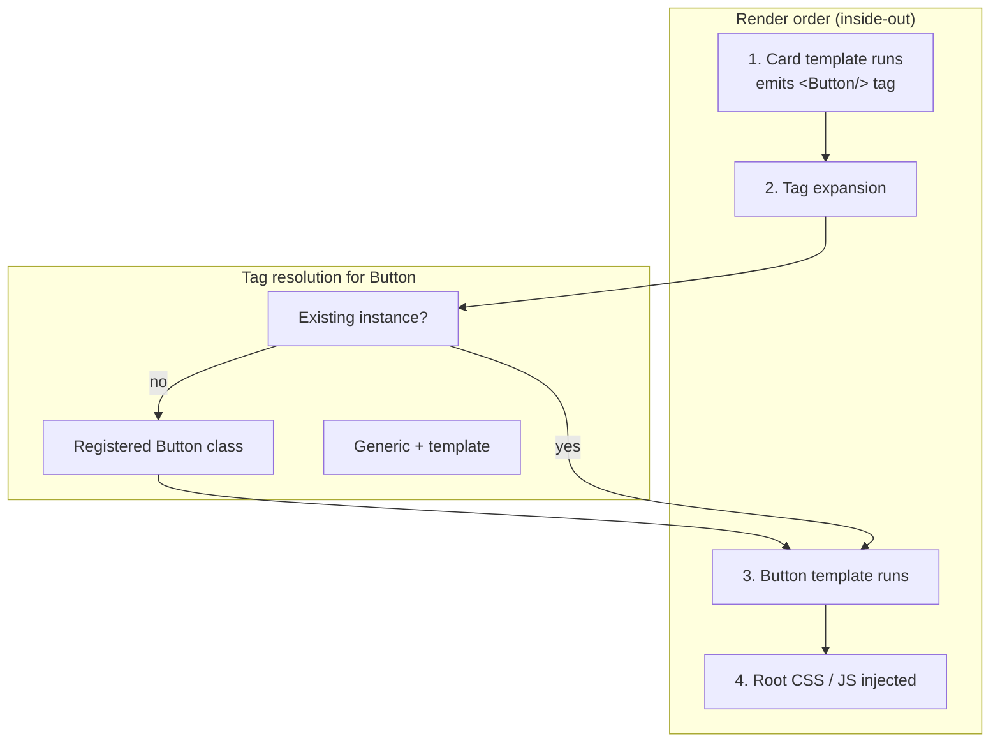

# PyJinHx

Build reusable, type-safe UI components for template-based web apps in Python. PyJinHx combines Pydantic models with co-located Jinja templates — compose in Python, with PascalCase tags in templates, or in HTML strings.

- **Template discovery** — templates live next to component classes
- **Composability** — nest via Pydantic fields or PascalCase tags in templates
- **Assets** — co-located JS/CSS collected at the root render
- **Reactivity** — dependency-aware out-of-band swaps for HTMX apps
- **Type safety** — Pydantic validates component fields

## Installation

```bash
pip install pyjinhx
```

## Example

Two levels: **Card → Button**. Card is built in Python; Button is declared as a PascalCase tag in `card.html`.

### Components

```python
# components/ui/button.py
from pyjinhx import BaseComponent


class Button(BaseComponent):
    id: str
    text: str
    variant: str = "default"
```

```python
# components/ui/card.py
from pyjinhx import BaseComponent


class Card(BaseComponent):
    id: str
    title: str
    button_text: str = "Sign up"
```

### Templates

```html
<!-- components/ui/button.html -->
<button id="{{ id }}" class="btn btn-{{ variant }}">{{ text }}</button>
```

```html
<!-- components/ui/card.html -->
<div id="{{ id }}" class="card">
  <h2>{{ title }}</h2>
  <Button id="cta" text="{{ button_text }}" variant="primary"/>
</div>
```

### Render

```python
from pyjinhx import Renderer
from components.ui.card import Card

Renderer.set_default_environment("./components")

html = Card(id="hero", title="Get Started", button_text="Sign up").render()
```

## Render order & tag resolution

When `Card.render()` runs:

1. **Card template** — Jinja runs first; it outputs a `<Button .../>` tag (not final HTML yet).
2. **Tag expansion** — PascalCase tags in template output are resolved and rendered next.
3. **Button** — tag attrs become `Button` fields (Pydantic validation); `button.html` runs.
4. **Assets** — co-located JS/CSS are collected once at the root render and injected last (CSS before HTML, JS after).

When `<Button id="cta" text="..." variant="primary"/>` is expanded:

| Priority | Rule | In this example |
|----------|------|-----------------|
| 1 | Existing instance with same class + `id` | — (none yet) |
| 2 | Registered class matching the tag name | `Button` instantiated from attrs |
| 3 | Template only (no class) | — |

Inner tag content becomes the `content` field. See [PascalCase tags](docs/guide/tags.md) for details.



You can also start from an HTML string — `Renderer.render("<Card ...><Button .../></Card>")` — same order and tag rules.

## Reactivity

Declare what state each component depends on. After a mutation, render the **primary** response with `dirtied` and `mounted`; PyJinHx appends out-of-band swaps for other mounted regions whose dependencies overlap.

```python
from typing import ClassVar
from pyjinhx import ReactiveComponent


class Counter(ReactiveComponent):
    remaining: int
    reacts_to: ClassVar[set[str]] = {"todos"}

    @classmethod
    def load(cls) -> "Counter":
        return cls(id="counter", remaining=db.remaining())


@app.post("/todos/toggle")
def toggle(request):
    db.toggle_all()
    return Counter.render(dirtied={"todos"}, mounted=request)
```

The client reports mounted regions via the `X-PJX-Mounted` header; `pjx.js` is injected automatically on layout components. Instance-keyed components use bare stems in `reacts_to` (e.g. `{"todo"}` → `"todo:<key>"`).

Details: [reactivity guide](docs/reactivity.md). Runnable demo: [examples/reactive_todo/](examples/reactive_todo/).

## JS & CSS collection

Place kebab-case asset files next to the component class (auto-collected at the root render):

```
components/ui/
├── card.py
├── card.html
├── card.css      # Card → card.css
└── button.js     # Button → button.js
```

| Class | JS / CSS file |
|-------|----------------|
| `Button` | `button.js`, `button.css` |
| `ActionButton` | `action-button.js`, `action-button.css` |

Each asset is included once per render session. Output order: `<style>` tags, HTML, then `<script>` tags. Pass extra paths via `js=[...]` and `css=[...]` on the component. Disable inlining with `Renderer.set_default_inline_js(False)` / `set_default_inline_css(False)`.

Details: [asset collection guide](docs/guide/assets.md). Optional UI kit: [pyjinhx.builtins](docs/guide/builtins.md).

## FastAPI + HTMX (reactive)

Mark the page shell with `base_layout=True` so the client runtime (`pjx.js`) is injected once. A toggle route returns the row as the primary swap; the counter updates out-of-band because both declare `reacts_to={"todos"}`.

```python
# components/todo_row.py
from typing import ClassVar

from pyjinhx import BaseComponent, ReactiveComponent


class TodoRow(ReactiveComponent):
    title: str
    done: bool = False
    reacts_to: ClassVar[set[str]] = {"todos"}

    @classmethod
    def load(cls, key: int) -> "TodoRow":
        todo = db.get(key)
        return cls(id=f"row-{key}", title=todo.text, done=todo.done)


class TodoCounter(ReactiveComponent):
    remaining: int
    reacts_to: ClassVar[set[str]] = {"todos"}

    @classmethod
    def load(cls) -> "TodoCounter":
        return cls(id="counter", remaining=db.remaining())


class TodoList(BaseComponent):
    items: list[TodoRow] = []


class TodoApp(BaseComponent, base_layout=True):
    todo_list: TodoList | None = None
    counter: TodoCounter | None = None
```

```html
<!-- todo_list.html -->
<ul id="{{ id }}">
  {{ item }}
</ul>
```

```html
<!-- todo_row.html -->
<li>
  <button hx-post="/rows/{{ key }}/toggle"
          hx-target="closest [data-pjx-id]" hx-swap="outerHTML">toggle</button>
  <span>{{ title }}</span>
</li>
```

```html
<!-- todo_counter.html -->
<span>{{ remaining }} left</span>
```

```html
<!-- todo_app.html -->
<!doctype html>
<html lang="en">
  <head>
    <script src="https://unpkg.com/htmx.org@2.0.3"></script>
  </head>
  <body>
    <h1>Todos</h1>
    {{ todo_list }}
    {{ counter }}
  </body>
</html>
```

```python
from fastapi import FastAPI, Request
from fastapi.responses import HTMLResponse
from pyjinhx import Registry, Renderer

Renderer.set_default_environment("./components")
app = FastAPI()


@app.get("/", response_class=HTMLResponse)
def index():
    with Registry.request_scope():
        return str(
            TodoApp(
                id="todo-app",
                todo_list=TodoList(
                    id="todo-list",
                    items=[TodoRow.load(t.id) for t in db.all()],
                ),
                counter=TodoCounter.load(),
            ).render()
        )


@app.post("/rows/{todo_id}/toggle", response_class=HTMLResponse)
def toggle_row(request: Request, todo_id: int):
    with Registry.request_scope():
        db.toggle(todo_id)
        return TodoRow.render(todo_id, dirtied={"todos"}, mounted=request)
```

Run the full app: `uv run uvicorn examples.reactive_todo.app:app --reload` — see [examples/reactive_todo/README.md](examples/reactive_todo/README.md).

More: [components](docs/guide/components.md) · [nesting](docs/guide/nesting.md) · [FastAPI integration](docs/integrations/fastapi.md) · [HTMX integration](docs/integrations/htmx.md)
