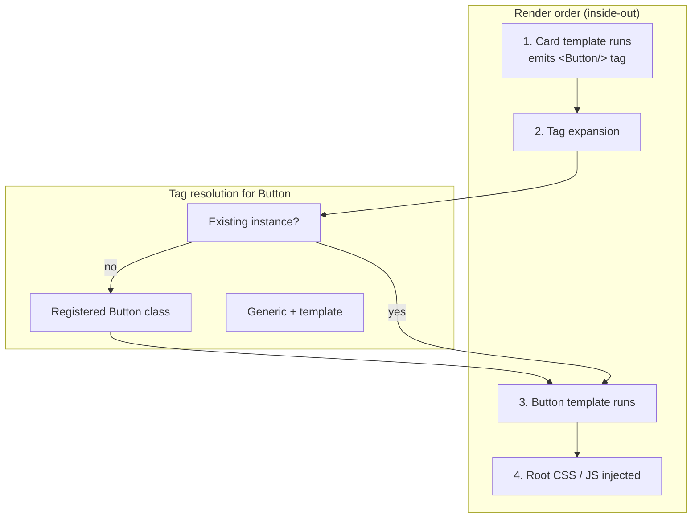

# PyJinHx

Build reusable, type-safe UI components for template-based web apps in Python. PyJinHx combines Pydantic models with co-located Jinja templates — compose in Python, with PascalCase tags in templates, or in HTML strings.

- **Template discovery** — templates live next to component classes
- **Composability** — nest via Pydantic fields or PascalCase tags in templates
- **Assets** — co-located JS/CSS collected at the root render
- **Reactivity** — dependency-aware out-of-band swaps for HTMX apps
- **Type safety** — Pydantic validates component fields

## Installation

```bash
pip install pyjinhx
```

## Package layout

Import from the top level only — `from pyjinhx import BaseComponent, ReactiveComponent, setup, ...`. Internal module paths are not a stable API.

| Area | Modules |
|--------|------|
| Render engine (tiers 1–2) | `base`, `renderer`, `assets`, `tags`, `finder`, `registry` |
| Reactivity (tier 3+) | `reactive`, `client`, `cache`, `mutations`, `keys`, `context`, `dev` |
| Setup | `config` — `setup()`, `PyJinhxSettings`, lifespan helpers |
| `pyjinhx/integrations/` | FastAPI wiring, Redis invalidation backend |
| `pyjinhx/builtins/` | Optional UI kit |
| `pyjinhx/runtime/` | Client runtime (`pjx.js`) |

See [usage tiers](docs/guide/usage-tiers.md) for which layers to adopt when.

## Development

Structural audits: invoke the **`code-audit-sweep`** skill (`.cursor/skills/code-audit-sweep/`) to run read-only architecture reviews before large PRs. Individual lenses (`indirection-audit`, `module-placement-audit`, etc.) can be run alone. Dry-run baselines: [VALIDATION.md](.cursor/skills/code-audit-sweep/VALIDATION.md).

## Example

Two levels: **Card → Button**. Card is built in Python; Button is declared as a PascalCase tag in `card.html`.

### Components

```python
# components/ui/button.py
from pyjinhx import BaseComponent


class Button(BaseComponent):
    id: str
    text: str
    variant: str = "default"
```

```python
# components/ui/card.py
from pyjinhx import BaseComponent


class Card(BaseComponent):
    id: str
    title: str
    button_text: str = "Sign up"
```

### Templates

```html
<!-- components/ui/button.html -->
<button id="{{ id }}" class="btn btn-{{ variant }}">{{ text }}</button>
```

```html
<!-- components/ui/card.html -->
<div id="{{ id }}" class="card">
  <h2>{{ title }}</h2>
  <Button id="cta" text="{{ button_text }}" variant="primary"/>
</div>
```

### Render

```python
from pyjinhx import Renderer
from components.ui.card import Card

Renderer.set_default_environment("./components")

html = Card(id="hero", title="Get Started", button_text="Sign up").render()
```

## Render order & tag resolution

When `Card.render()` runs:

1. **Card template** — Jinja runs first; it outputs a `<Button .../>` tag (not final HTML yet).
2. **Tag expansion** — PascalCase tags in template output are resolved and rendered next.
3. **Button** — tag attrs become `Button` fields (Pydantic validation); `button.html` runs.
4. **Assets** — co-located JS/CSS are collected once at the root render and injected last (CSS before HTML, JS after).

When `<Button id="cta" text="..." variant="primary"/>` is expanded:

| Priority | Rule | In this example |
|----------|------|-----------------|
| 1 | Existing instance with same class + `id` | — (none yet) |
| 2 | Registered class matching the tag name | `Button` instantiated from attrs |
| 3 | Template only (no class) | — |

Inner tag content becomes the `content` field. See [PascalCase tags](docs/guide/tags.md) for details.



You can also start from an HTML string — `Renderer.render("<Card ...><Button .../></Card>")` — same order and tag rules.

## Reactivity

Declare what state each component depends on. After a mutation, return `Cls.render()`; PyJinHx appends out-of-band swaps for other mounted regions whose dependencies overlap.

```python
from enum import Enum
from typing import ClassVar

from pyjinhx import ReactiveComponent


class StateKey(str, Enum):
    TODOS = "todos"


class Counter(ReactiveComponent):
    remaining: int
    reacts_to: ClassVar[set[StateKey]] = {StateKey.TODOS}

    @classmethod
    def load(cls) -> "Counter":
        return cls(remaining=db.remaining())  # id defaults to "counter"


@app.post("/todos/toggle")
def toggle():
    db.toggle_all()
    return Counter.render()
```

Wire `setup(app, ...)` once — lifespan and registry middleware handle cache scope, optional invalidation, `LoadContext`, and `ClientBackend` for header auto-resolution. Mutation routes call `Cls.render(*args)` with no framework kwargs; `pjx.js` is injected on root full-page renders unless `X-PJX-Mounted` is already present.

**Reactive ergonomics:** use `StateKey` enums for typed keys; `@mutates` on store methods to accumulate pending dirtied keys for the next reactive `render()`; `PjxLoad` on one model field per keyed component for `data-pjx-load` round-trip; `LoadContext.bind()` / `LoadContext.current()` to inject dependencies into `load()`; `enable_reactive_dev()` and `dependency_graph()` for guardrails and debugging.

**Reactive design decisions:**
- **Three identities:** `data-pjx-id` (HTMX swap target), `data-pjx-load` (round-trip `load()` arg from a `PjxLoad` field), and state keys in `reacts_to` / `@mutates` (pub-sub only).
- **Pub-sub OOB:** every mounted region whose `reacts_to` intersects pending mutations may OOB-reload via `load(manifest.load)`; the trigger region and primary are excluded via `X-PJX-Trigger` + primary id.
- **`depends_on()`:** optional runtime narrowing for load-cache indexing; `oob_swaps` matches on static `reacts_to` only.
- **`state_hash()`:** canonical sorted JSON from `model_dump(mode="json")` with `id` excluded by default (`state_hash_exclude` to omit more fields). Override `state_hash()` for custom hashing.

**Load cache scope** (default `CacheScope.REQUEST`): `load()` results are cached within each HTTP request via `LoadCache`. Use `LoadCache.invalidate()` to evict entries; `MutationTracker` accumulates dirtied keys from `@mutates` for the next reactive render. Use `Registry.request_scope()` on every request for instance registry isolation (included in `setup(app, ...)`). For cross-request caching per worker, pass `cache_scope=CacheScope.PROCESS` to `setup()` and pair with an `InvalidationBackend` + `InvalidationHub` ([Redis reference](pyjinhx/integrations/redis.py), `pip install pyjinhx[redis]`).

**API shape:** reactive internals expose class methods directly (`LoadCache`, `MutationTracker`, `InvalidationHub`, `MountedManifest`, `LoadedAssets`) — no thin module-level wrapper functions.

Details: [usage tiers](docs/guide/usage-tiers.md) · [reactivity guide](docs/reactivity.md) · [Build an App](docs/getting-started/build-an-app.md) · [examples/reactive_todo/](examples/reactive_todo/).

## JS & CSS collection

Place kebab-case asset files next to the component class (auto-collected at the root render):

```
components/ui/
├── card.py
├── card.html
├── card.css      # Card → card.css
└── button.js     # Button → button.js
```

| Class | JS / CSS file |
|-------|----------------|
| `Button` | `button.js`, `button.css` |
| `ActionButton` | `action-button.js`, `action-button.css` |

Each asset is included once per render session. Output order: `<style>` tags, HTML, then `<script>` tags (inline mode). Pass extra paths via `js=[...]` and `css=[...]` on the component.

**Asset delivery modes** (`AssetMode.INLINE`, `REFERENCE`, `NONE`):

- **INLINE** (default): zero-config demos — assets are inlined as `<style>` / `<script>` blocks.
- **REFERENCE**: production — emits `<link href="...">` / `<script src="...">` from a per-render manifest; configure `Renderer.set_asset_url_resolver()`.
- **NONE**: no asset tags.

Reactive partial responses (when `mounted` is set) and OOB swaps never emit assets. Full-page layout renders emit them once. For boosted navigation in REFERENCE mode, enable client asset dedup so root renders skip URLs the browser already has (`X-PJX-Assets` via `ClientBackend` in middleware, or `render(client=request)`).

```python
from pyjinhx import AssetMode, Renderer

Renderer.set_default_js_mode(AssetMode.REFERENCE)
Renderer.set_default_css_mode(AssetMode.REFERENCE)
Renderer.set_asset_url_resolver(lambda path: f"/static/{path.split('/')[-1]}")
Renderer.set_default_asset_dedup(True)
```

Details: [asset collection guide](docs/guide/assets.md). Optional UI kit: [pyjinhx.builtins](docs/guide/builtins.md).

## FastAPI + HTMX (reactive)

Root full-page renders inject the client runtime (`pjx.js`) automatically unless the request already sent `X-PJX-Mounted`. A toggle route returns the row as the primary swap; the counter updates out-of-band because both declare `reacts_to={StateKey.TODOS}`.

```python
# components/todo_row.py
from enum import Enum
from typing import ClassVar

from pyjinhx import BaseComponent, ReactiveComponent


class StateKey(str, Enum):
    TODOS = "todos"


class TodoRow(ReactiveComponent):
    title: str
    done: bool = False
    reacts_to: ClassVar[set[StateKey]] = {StateKey.TODOS}

    @classmethod
    def load(cls, key: int) -> "TodoRow":
        todo = db.get(key)
        return cls(id=f"row-{key}", title=todo.text, done=todo.done)


class TodoCounter(ReactiveComponent):
    remaining: int
    reacts_to: ClassVar[set[StateKey]] = {StateKey.TODOS}

    @classmethod
    def load(cls) -> "TodoCounter":
        return cls(id="counter", remaining=db.remaining())


class TodoList(BaseComponent):
    items: list[TodoRow] = []


class TodoApp(BaseComponent):
    todo_list: TodoList | None = None
    counter: TodoCounter | None = None
```

```html
<!-- todo_list.html -->
<ul id="{{ id }}">
  {{ item }}
</ul>
```

```html
<!-- todo_row.html -->
<li>
  <button hx-post="/rows/{{ key }}/toggle"
          hx-target="closest [data-pjx-id]" hx-swap="outerHTML">toggle</button>
  <span>{{ title }}</span>
</li>
```

```html
<!-- todo_counter.html -->
<span>{{ remaining }} left</span>
```

```html
<!-- todo_app.html -->
<!doctype html>
<html lang="en">
  <head>
    <script src="https://unpkg.com/htmx.org@2.0.3"></script>
  </head>
  <body>
    <h1>Todos</h1>
    {{ todo_list }}
    {{ counter }}
  </body>
</html>
```

```python
from fastapi import FastAPI
from fastapi.responses import HTMLResponse
from pyjinhx import FastAPIClientBackend, Registry, Renderer
from starlette.middleware.base import BaseHTTPMiddleware

Renderer.set_default_environment("./components")
app = FastAPI()


class RegistryScopeMiddleware(BaseHTTPMiddleware):
    async def dispatch(self, request, call_next):
        with Registry.request_scope(client_backend=FastAPIClientBackend(request)):
            return await call_next(request)


app.add_middleware(RegistryScopeMiddleware)


@app.get("/", response_class=HTMLResponse)
def index():
    return str(
        TodoApp(
            id="todo-app",
            todo_list=TodoList(
                id="todo-list",
                items=[TodoRow.load(t.id) for t in db.all()],
            ),
            counter=TodoCounter.load(),
        ).render()
    )


@app.post("/rows/{todo_id}/toggle", response_class=HTMLResponse)
def toggle_row(todo_id: int):
    db.toggle(todo_id)
    return TodoRow.render(todo_id)
```

Run the full app: `uv run uvicorn examples.reactive_todo.app:app --reload` — see [examples/reactive_todo/README.md](examples/reactive_todo/README.md).

More: [components](docs/guide/components.md) · [nesting](docs/guide/nesting.md) · [public API index](docs/reference/public-api.md) · [FastAPI integration](docs/integrations/fastapi.md) · [HTMX integration](docs/integrations/htmx.md)
