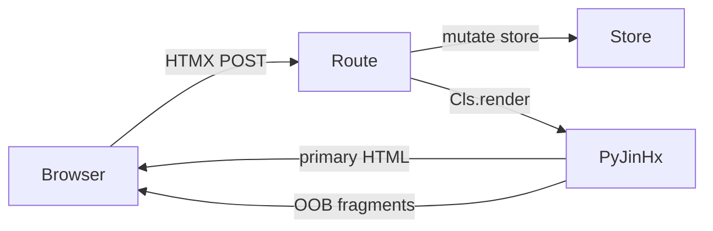

# Build an App (step by step)

This guide walks a complete path from zero to a **reactive FastAPI + HTMX app** with PyJinHx. Each step shows *what* to do and a **Why?** panel explaining *why it exists*.

When you're done you will have used:

- `BaseComponent` and `ReactiveComponent`
- Template discovery and nesting via typed child fields
- Co-located JS/CSS and asset delivery modes
- `Registry.request_scope`, `@mutates`, and `PjxContext`
- Reactive `render()` with `ClientBackend` wired in middleware
- Load-cache scopes and optional invalidation fan-out

Runnable reference: [`examples/reactive_todo/`](https://github.com/paulomtts/pyjinhx/tree/master/examples/reactive_todo).

---

## What you are building

A small todo app:

1. **Full page** on `GET /` — layout, list, counter.
2. **Partial updates** on `POST` — toggle a row; counter updates out-of-band.
3. **No manual swap wiring** — components declare dependencies; routes call `render()`.



---

## Step 0 — Install and project layout

```bash
uv add pyjinhx fastapi uvicorn httpx python-multipart
```

```
my_app/
├── app.py                   # FastAPI routes
├── store.py                 # mutations + @mutates
├── keys.py                  # reactive key enums
├── components/
│   ├── todo_counter.py
│   ├── todo_counter.html
│   ├── todo-counter.js
│   ├── todo_list.py
│   ├── todo_list.html
│   ├── todo_panel.py
│   ├── todo_panel.html
│   ├── todo_item_row.py
│   ├── todo_item_row.html
│   ├── todo_app.py
│   └── todo_app.html
└── pyproject.toml
```

???+ question "Why this layout?"
    PyJinHx discovers templates **next to** component classes. Keeping `components/` as the template root lets `Renderer.set_default_environment("./components")` resolve every `.html` file without manual paths. Separating `store.py` from components mirrors how a real app keeps domain logic out of UI classes.

---

## Step 1 — Your first component

`components/todo_counter.py`:

```python
from pyjinhx import BaseComponent


class TodoCounter(BaseComponent):
    id: str
    remaining: int = 0
```

`components/todo_counter.html`:

```html
<span id="{{ id }}">{{ remaining }} left</span>
```

Smoke test in a shell:

```python
from pyjinhx import Renderer
from components.todo_counter import TodoCounter

Renderer.set_default_environment("./components")
print(TodoCounter(id="counter", remaining=3).render())
```

???+ question "Why BaseComponent and a stable id?"
    `BaseComponent` is a **Pydantic model** — fields are validated at construction time. The `id` is the stable DOM identity: HTMX targets, registry lookups, and reactive `data-pjx-id` stamping all depend on it. Omitted ids auto-generate a `pjx-<n>` value; reactive components additionally default to the kebab-cased class name. Explicit ids matter when you need a stable swap target across requests.

???+ question "Why set_default_environment?"
    The renderer needs one search root for templates (and co-located assets). You set it once at startup (module import or app factory), not per render.

---

## Step 2 — Compose in Python

`components/todo_list.py`:

```python
from pyjinhx import BaseComponent


class TodoList(BaseComponent):
    id: str
    items: list[BaseComponent] = []
```

`components/todo_list.html`:

```html
<ul id="{{ id }}">
  {{ item }}
</ul>
```

Build the tree in Python:

```python
from components.todo_counter import TodoCounter
from components.todo_list import TodoList

page = TodoList(
    id="todo-list",
    items=[TodoCounter(id="counter", remaining=3)],
)
print(page.render())
```

???+ question "Why compose in Python?"
    Python composition gives you **type checking and explicit structure** — IDE autocomplete on fields, Pydantic validation on nested components. Use this when the page structure is decided server-side (typical for app shells and data-heavy views).

    See also: [Nesting](../guide/nesting.md).

---

## Step 3 — A panel with typed child fields

`components/todo_panel.py`:

```python
from pyjinhx import BaseComponent

from components.todo_counter import TodoCounter


class TodoPanel(BaseComponent):
    id: str
    counter: TodoCounter
```

`components/todo_panel.html`:

```html
<div id="{{ id }}" class="panel">
  {{ counter }}
</div>
```

Build it in Python; the template decides where the child renders:

```python
TodoPanel(id="panel", counter=TodoCounter(id="counter", remaining=3)).render()
```

???+ question "Why typed child fields?"
    The panel declares **which child it holds** as a typed Pydantic field; the template owns **where it goes** — `{{ counter }}` renders the nested component in place. This is the same style the runnable `examples/reactive_todo` app uses. PyJinHx also supports `<PascalCase/>` tags for template-driven composition — see [PascalCase tags](../guide/tags.md).

---

## Step 4 — Co-located assets

Add `components/todo-counter.js` next to `todo_counter.py` (asset filenames are the **kebab-cased** class name):

```javascript
console.log("todo counter ready");
```

On the **root** render, PyJinHx collects JS/CSS once and injects it (inline by default):

```python
TodoPanel(id="panel", counter=TodoCounter(id="counter", remaining=2)).render()
# → <style>...</style> HTML <script>...</script>
```

???+ question "Why co-located assets?"
    Components carry their own behavior and styling. Collecting at the **root render** avoids duplicate script tags when nested components share assets. Reactive partials and OOB swaps **never** emit assets — only full layout renders do.

    Production: use `AssetMode.NONE` and serve a pre-built bundle. See [Asset collection](../guide/assets.md).

---

## Step 5 — FastAPI shell

`app.py`:

```python
from fastapi import FastAPI
from fastapi.responses import HTMLResponse
from pyjinhx import Renderer

from components.todo_counter import TodoCounter
from components.todo_panel import TodoPanel

Renderer.set_default_environment("./components")
app = FastAPI()


@app.get("/", response_class=HTMLResponse)
def index():
    return TodoPanel(id="panel", counter=TodoCounter(id="counter", remaining=3)).render()
```

Run: `uvicorn app:app --reload`

???+ question "Why FastAPI + HTMLResponse?"
    PyJinHx renders `Markup` (safe HTML strings). FastAPI's `HTMLResponse` accepts that directly. Any WSGI/ASGI framework works — PyJinHx is not tied to FastAPI.

    See: [FastAPI integration](../integrations/fastapi.md).

---

## Step 6 — Request scope (registry + cache hygiene)

Per-route wrapping works for demos:

```python
from pyjinhx import Registry


@app.get("/", response_class=HTMLResponse)
def index():
    with Registry.request_scope():
        return TodoPanel(id="panel", counter=TodoCounter(id="counter", remaining=3)).render()
```

For a real app, use **`setup(app, ...)`** so lifespan and middleware are wired automatically:

```python
from pyjinhx import setup

app = FastAPI()
setup(app, context_factory=lambda request: AppLoadContext(store=store))  # AppLoadContext defined in Step 12
```

See [Configuration API](../api/config.md) and [FastAPI integration](../integrations/fastapi.md).

---

## Step 7 — HTMX partial responses

HTMX is the transport for reactivity. PyJinHx auto-injects a vendored copy on
reactive root renders, so you don't need to add it yourself — but you can load
your own in the layout to pin a version or add extensions (the injected copy
self-guards against double-loading):

```html
<script src="https://unpkg.com/htmx.org@2.0.3"></script>
```

Opt out of auto-injection with `setup(app, inject_htmx=False)`.

Return a **fragment** from a mutation route:

```python
@app.post("/counter/bump", response_class=HTMLResponse)
def bump():
    return TodoCounter(id="counter", remaining=2).render()
```

!!! note
    Middleware from Step 6 already wraps each request — no per-route `request_scope()` needed.

Template button:

```html
<button hx-post="/counter/bump" hx-target="#counter" hx-swap="outerHTML">
  Bump
</button>
```

???+ question "Why HTMX?"
    PyJinHx owns **HTML composition**; HTMX owns **transport and swap**. You keep server-rendered components and avoid a client-side state tree. PyJinHx does not replace HTMX — they meet at the route return value.

    See: [HTMX integration](../integrations/htmx.md).

---

## Step 8 — Reactive components

Upgrade the counter. It names the state it derives from with a `Keys` enum and
reads from a `store` module — **we define both `keys.py` and `store.py` in Step 9**;
for now just note that `Keys.TODOS` and `store` are imported from there:

```python
from pyjinhx import ReactiveComponent

from keys import Keys
import store


class TodoCounter(ReactiveComponent, react={Keys.TODOS}):
    remaining: int = 0

    @classmethod
    def load(cls) -> "TodoCounter":
        return cls(id="counter", remaining=store.remaining())
```

Define the page shell as a normal `BaseComponent` — no special marker required:

```python
class TodoApp(BaseComponent):
    ...
```

???+ question "Why ReactiveComponent?"
    Reactive components declare **what state they derive from** (the `react` class keyword) and **how to rebuild** (`load()`). After a mutation, you return one primary fragment; PyJinHx appends OOB swaps for other mounted regions whose dependencies overlap — you don't list every widget in every route.

    Root full-page renders inject `pjx.js` automatically unless the request already carries `X-PJX-Mounted`. That runtime sends the manifest on every HTMX request so the server knows what's on screen.

    See: [Reactivity](../reactivity.md).

---

## Step 9 — Keys, mutations, and render()

Centralize reactive key strings in a `MutationKey` enum so `react=`, `@mutates`, and
`dirtied` all share one vocabulary (no stray raw strings to typo). `keys.py`:

```python
from pyjinhx import MutationKey


class Keys(MutationKey):
    TODOS = "todos"
```

`store.py`:

```python
from pyjinhx import mutates

from keys import Keys

_todos: dict[int, dict] = {}
_next_id = 1


def remaining() -> int:
    return sum(1 for t in _todos.values() if not t["done"])


def get(todo_id: int) -> object:
    return type("Todo", (), _todos[todo_id])()


@mutates(Keys.TODOS)
def add(text: str) -> None:
    global _next_id
    _todos[_next_id] = {"text": text, "done": False}
    _next_id += 1


@mutates(Keys.TODOS)
def toggle(todo_id: int) -> None:
    _todos[todo_id]["done"] = not _todos[todo_id]["done"]
```

Route (the `TodoItemRow` it renders is the instance-keyed row **we define in Step 10**):

```python
@app.post("/rows/{todo_id}/toggle", response_class=HTMLResponse)
def toggle_row(todo_id: int):
    store.toggle(todo_id)
    return TodoItemRow.render(todo_id)
```

???+ question "Why @mutates and ClientBackend?"
    - **`@mutates`** — after a store change, invalidate the `load()` cache and accumulate pending state keys for the next reactive `render()`.
    - **`ClientBackend`** (wired via `setup()`) — supplies `X-PJX-Mounted`, `X-PJX-Trigger`, and `X-PJX-Assets` so OOB swaps run without framework kwargs on `render()`.

    `render()` on the **class** auto-calls `load()` — routes never call `load()` manually.

---

## Step 10 — Instance-keyed rows

```python
from typing import Annotated
from pyjinhx import PjxKey

class TodoItemRow(ReactiveComponent, react={Keys.TODOS}):
    todo_id: Annotated[int, PjxKey()]
    title: str = ""
    done: bool = False

    @classmethod
    def load(cls, todo_id: int | str) -> "TodoItemRow":
        resolved_id = int(todo_id)  # cache wrapper passes the key as a string
        todo = store.get(resolved_id)
        return cls(
            id=f"row-{resolved_id}",
            todo_id=resolved_id,
            title=todo.text,
            done=todo.done,
        )
```

The `load()` key arrives as a **string** from the cache wrapper (the manifest serialises to JSON), so annotate `int | str` and convert inside `load()`.

Template (note `data-pjx-loading` — covered in Step 11):

```html
<li data-pjx-loading="skeleton">
  <button hx-post="/rows/{{ todo_id }}/toggle"
          hx-target="closest [data-pjx-id]" hx-swap="outerHTML">toggle</button>
  <span>{{ title }}</span>
</li>
```

???+ question "Why PjxKey and load(cls, todo_id)?"
    A parameter after `cls` makes the type **instance-keyed**. `PjxKey` stamps `data-pjx-load` for OOB round-trip. Use the same field in templates (`{{ todo_id }}`). `react={Keys.TODOS}` is pub-sub — all mounted rows with matching state keys may OOB-reload when todos change.

---

## Step 11 — Loading states (in-flight indicators)

While a reactive region's OOB update is in flight, it can show a built-in indicator.
You opt in **in the template** by adding `data-pjx-loading` to any element — the
component root or something inside it. No route or Python changes:

```html
<!-- todo_item_row.html: shimmer the whole row while it reloads -->
<li data-pjx-loading="skeleton"> ... </li>

<!-- clear_button.html: spin just this button -->
<button data-pjx-loading="spinner">Clear completed ({{ completed }})</button>
```

Two built-in styles ship: `"skeleton"` (silhouette shimmer) and `"spinner"` (dimmed
overlay with a circular indicator). `pjx.js` reads each reactive root's `react` keys
and lights the matching `data-pjx-loading` elements on every mounted region a
mutation touches — the swap target *and* its OOB dependents.

???+ question "Why template-driven, and how do I theme it?"
    Indicators are purely a client affordance — no server reactive semantics change, and
    nothing fires unless an element opts in. Both styles read overridable `--pjx-*` CSS
    variables (e.g. `--pjx-skeleton-color`, `--pjx-spinner-color`, `--pjx-spinner-speed`)
    you can set on `:root` or any wrapper. Any other value (`data-pjx-loading="pulse"`)
    just applies `.pjx-loading--pulse` for you to style.

    See: [Reactivity → Loading indicators](../reactivity.md#loading-indicators-in-flight).

---

## Step 12 — PjxContext (avoid globals in load())

The context is just a **plain frozen dataclass** — `PjxContext.current()` is duck-typed, so you don't need to subclass anything for this manual pattern (the annotation-injected `ctx:` parameter style does require a `PjxContext` subclass annotation):

```python
from dataclasses import dataclass
from pyjinhx import PjxContext


@dataclass(frozen=True)
class AppLoadContext:
    store: object


def _store():
    ctx = PjxContext.current()
    return ctx.store if isinstance(ctx, AppLoadContext) else store
```

Pass a factory to `setup()` (Step 6):

```python
setup(app, context_factory=lambda request: AppLoadContext(store=store))
```

???+ question "Why PjxContext?"
    `load()` must rebuild components from the current world. Passing a database handle or store through a **request-scoped context** avoids hidden globals and makes tests inject a fake store. Optional `load(cls, *, ctx=...)` is supported if you prefer explicit parameters.

---

## Step 13 — Load cache scope and invalidation

You don't pick a cache scope — it follows the backend. By default (no `invalidation_backend`),
`load()` results cache within each HTTP request, which is multi-worker safe.

| Setup | Behavior |
|-------|----------|
| no backend (default) | Per-request caching — multi-worker safe without Redis |
| `invalidation_backend` set | Cross-request caching per worker, with evictions fanned out across workers |

Multi-worker fan-out (also enables cross-request caching):

```python
import os

from pyjinhx import PjxSettings, setup
from pyjinhx.integrations.redis import RedisInvalidationBackend

setup(
    app,
    settings=PjxSettings(
        invalidation_backend=RedisInvalidationBackend(os.environ["REDIS_URL"]),
    ),
)
```

???+ question "Why cache at all?"
    A single page may call `TodoCounter.load()` many times during composition and OOB walks. Caching `(class, load_arg) → component snapshot` avoids repeated store/DB work. **Invalidation** (`@mutates` or `LoadCache.invalidate`) evicts entries when state changes — cache is a performance layer, not the source of truth.

    If toggles feel stale, check that `@mutates` dirtied a key your rows actually
    declare via `react=`. Rows here use **pub-sub** on `{Keys.TODOS}` — every mounted
    row reloads when `todos` changes, and hash-gating skips the unchanged ones. (For
    per-instance keys like `"todo:42"` instead of a shared stem, see
    [Reactivity → Instance-keyed regions](../reactivity.md#instance-keyed-regions-rows).)

---

## Step 14 — Production assets

Build a single CSS and JS bundle from all component assets and serve them as static files. Set
both modes to `NONE` so components don't duplicate what the bundle already ships.

```python
from pyjinhx import AssetMode, Renderer
from pyjinhx.finder import Finder

# Build bundles at startup — see guide/assets.md "One-bundle deployment"
CSS_PATHS, JS_PATHS = Finder("app/components").all_assets()
Renderer.set_default_js_mode(AssetMode.NONE)
Renderer.set_default_css_mode(AssetMode.NONE)
```

Link `bundle.css` and `bundle.js` in your layout `<head>`. Full-page renders then emit only
the HTML — no inline asset tags.

```python
TodoApp(...).render()  # assets come from the bundle, not inline tags
```

---

## Step 15 — Dev guardrails (optional)

```python
from pyjinhx.dev import enable_reactive_dev, dependency_graph, format_dependency_graph

enable_reactive_dev()  # warnings: missing mounted, unconsumed @mutates, etc.
print(format_dependency_graph())
```

???+ question "Why enable_reactive_dev?"
    Reactivity bugs are often silent (missing `ClientBackend`, wrong `react` keys, `depends_on()` outside the `react` superset). Dev mode turns those into log warnings or strict exceptions during development.

---

## Step 16 — Built-in UI kit (optional)

```python
import pyjinhx.builtins  # register templates
from pyjinhx.builtins import PJXAlert, PJXCard, PJXModal
```

???+ question "Why builtins?"
    Optional ready-made components (PJXAlert, PJXCard, PJXModal, PJXTable, …) with co-located CSS/JS. Use when you want a consistent kit without building every primitive. Your app components follow the same `BaseComponent` rules.

    See: [Built-in UI components](../guide/builtins.md).

---

## Checklist — full app wiring

The per-step **Why?** panels above cover the *why*; this is the at-a-glance *what*.

| Tier | Pieces |
|------|--------|
| **Required** | `set_default_environment` · `Registry.request_scope()` middleware · root full-page render · `ReactiveComponent` (`react={...}` + `load()`) · `@mutates(Keys.…)` on mutations · `setup()` (wires `FastAPIClientBackend`) · `PjxKey` on keyed rows |
| **Auto-provided** | HTMX (vendored, inlined on reactive root renders — disable with `setup(inject_htmx=False)`) |
| **Recommended** | `PjxContext` · `data-pjx-loading` indicators · `enable_reactive_dev()` in dev |
| **Production** | `AssetMode.NONE` + pre-built bundle (`Finder.all_assets()`) · `InvalidationBackend` for multi-worker `PROCESS` cache |

---

## Where to go next

- [Quick Start](quickstart.md) — minimal single component
- [Reactivity](../reactivity.md) — deep dive on OOB swaps and hash gating
- [FastAPI](../integrations/fastapi.md) · [HTMX](../integrations/htmx.md)
- [API: Renderer](../api/renderer.md) · [Registry](../api/registry.md)
- Live demo: `uv run uvicorn examples.reactive_todo.app:app --reload`
