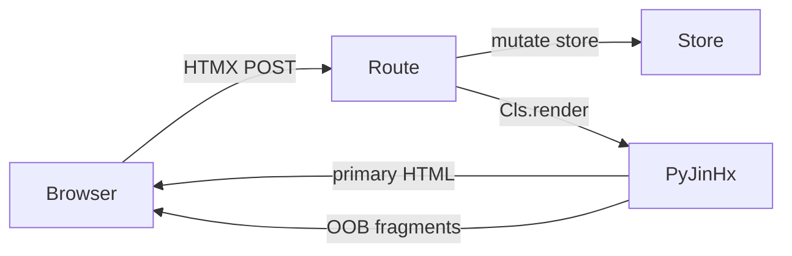

# Build an App (step by step)

This guide walks a complete path from zero to a **reactive FastAPI + HTMX app** with PyJinHx. Each step shows *what* to do and a **Why?** panel explaining *why it exists*.

When you're done you will have used:

- `BaseComponent` and `ReactiveComponent`
- Template discovery, nesting, and PascalCase tags
- Co-located JS/CSS and asset delivery modes
- `Registry.request_scope`, `@mutates`, and `LoadContext`
- Reactive `render()` with `ClientBackend` wired in middleware
- Load-cache scopes and optional invalidation fan-out

Runnable reference: [`examples/reactive_todo/`](https://github.com/paulomtts/pyjinhx/tree/master/examples/reactive_todo).

---

## What you are building

A small todo app:

1. **Full page** on `GET /` — layout, list, counter.
2. **Partial updates** on `POST` — toggle a row; counter updates out-of-band.
3. **No manual swap wiring** — components declare dependencies; routes call `render()`.



---

## Step 0 — Install and project layout

```bash
uv add pyjinhx fastapi uvicorn httpx python-multipart
```

```
my_app/
├── app.py                 # FastAPI routes
├── store.py               # mutations + @mutates
├── keys.py                # reactive key enums
├── components/
│   ├── todo_app.py
│   ├── todo_app.html
│   ├── todo_row.py
│   ├── todo_row.html
│   ├── todo_counter.py
│   └── todo_counter.html
└── pyproject.toml
```

???+ question "Why this layout?"
    PyJinHx discovers templates **next to** component classes. Keeping `components/` as the template root lets `Renderer.set_default_environment("./components")` resolve every `.html` file without manual paths. Separating `store.py` from components mirrors how a real app keeps domain logic out of UI classes.

---

## Step 1 — Your first component

`components/todo_counter.py`:

```python
from pyjinhx import BaseComponent


class TodoCounter(BaseComponent):
    id: str
    remaining: int = 0
```

`components/todo_counter.html`:

```html
<span id="{{ id }}">{{ remaining }} left</span>
```

Smoke test in a shell:

```python
from pyjinhx import Renderer
from components.todo_counter import TodoCounter

Renderer.set_default_environment("./components")
print(TodoCounter(id="counter", remaining=3).render())
```

???+ question "Why BaseComponent and a required id?"
    `BaseComponent` is a **Pydantic model** — fields are validated at construction time. The `id` is the stable DOM identity: HTMX targets, registry lookups, and reactive `data-pjx-id` stamping all depend on it. Without an `id`, the library cannot reliably find or swap a region later.

???+ question "Why set_default_environment?"
    The renderer needs one search root for templates (and co-located assets). You set it once at startup (module import or app factory), not per render.

---

## Step 2 — Compose in Python

`components/todo_list.py`:

```python
from pyjinhx import BaseComponent


class TodoList(BaseComponent):
    id: str
    items: list[BaseComponent] = []
```

`components/todo_list.html`:

```html
<ul id="{{ id }}">
  {{ item }}
</ul>
```

Build the tree in Python:

```python
from components.todo_counter import TodoCounter
from components.todo_list import TodoList

page = TodoList(
    id="todo-list",
    items=[TodoCounter(id="counter", remaining=3)],
)
print(page.render())
```

???+ question "Why compose in Python?"
    Python composition gives you **type checking and explicit structure** — IDE autocomplete on fields, Pydantic validation on nested components. Use this when the page structure is decided server-side (typical for app shells and data-heavy views).

    See also: [Nesting](../guide/nesting.md).

---

## Step 3 — Compose with PascalCase tags in templates

`components/todo_panel.py`:

```python
from pyjinhx import BaseComponent


class TodoPanel(BaseComponent):
    id: str
    remaining: int = 0
```

`components/todo_panel.html`:

```html
<div id="{{ id }}" class="panel">
  <TodoCounter id="counter" remaining="{{ remaining }}"/>
</div>
```

???+ question "Why PascalCase tags?"
    Tags let **templates own layout** while Python owns data. The parent template emits `<TodoCounter .../>`; PyJinHx expands it using the registered `TodoCounter` class — attrs become constructor fields. Resolution order: existing instance with same class+id → registered class → template-only fallback.

    See: [PascalCase tags](../guide/tags.md).

---

## Step 4 — Co-located assets

Add `components/todo_counter.js` next to `todo_counter.py`:

```javascript
console.log("todo counter ready");
```

On the **root** render, PyJinHx collects JS/CSS once and injects it (inline by default):

```python
TodoPanel(id="panel", remaining=2).render()
# → <style>...</style> HTML <script>...</script>
```

???+ question "Why co-located assets?"
    Components carry their own behavior and styling. Collecting at the **root render** avoids duplicate script tags when nested components share assets. Reactive partials and OOB swaps **never** emit assets — only full layout renders do.

    Production: switch to `AssetMode.REFERENCE` and a URL resolver. See [Asset collection](../guide/assets.md).

---

## Step 5 — FastAPI shell

`app.py`:

```python
from fastapi import FastAPI
from fastapi.responses import HTMLResponse
from pyjinhx import Renderer

from components.todo_panel import TodoPanel

Renderer.set_default_environment("./components")
app = FastAPI()


@app.get("/", response_class=HTMLResponse)
def index():
    return TodoPanel(id="panel", remaining=3).render()
```

Run: `uvicorn app:app --reload`

???+ question "Why FastAPI + HTMLResponse?"
    PyJinHx renders `Markup` (safe HTML strings). FastAPI's `HTMLResponse` accepts that directly. Any WSGI/ASGI framework works — PyJinHx is not tied to FastAPI.

    See: [FastAPI integration](../integrations/fastapi.md).

---

## Step 6 — Request scope (registry + cache hygiene)

Wrap each request:

```python
from pyjinhx import Registry


@app.get("/", response_class=HTMLResponse)
def index():
    with Registry.request_scope():
        return TodoPanel(id="panel", remaining=3).render()
```

Better: middleware so every route is covered:

```python
from starlette.middleware.base import BaseHTTPMiddleware


from pyjinhx import client_backend_from_request


class RegistryScopeMiddleware(BaseHTTPMiddleware):
    async def dispatch(self, request, call_next):
        with Registry.request_scope(
            client_backend=client_backend_from_request(request),
        ):
            return await call_next(request)


app.add_middleware(RegistryScopeMiddleware)
```

???+ question "Why Registry.request_scope?"
    Every component instance registers itself on construction. Without a per-request scope, instances from request A can **leak into request B** and shadow template variables. The same scope also initializes the optional **request-tier** load cache when you use `CacheScope.REQUEST`.

    Default load cache is **`CacheScope.PROCESS`** (cross-request per worker) — see Step 12.

    See: [Component registry](../guide/registry.md).

---

## Step 7 — HTMX partial responses

Load HTMX in your layout template:

```html
<script src="https://unpkg.com/htmx.org@2.0.3"></script>
```

Return a **fragment** from a mutation route:

```python
@app.post("/counter/bump", response_class=HTMLResponse)
def bump():
    with Registry.request_scope():
        return TodoCounter(id="counter", remaining=2).render()
```

Template button:

```html
<button hx-post="/counter/bump" hx-target="#counter" hx-swap="outerHTML">
  Bump
</button>
```

???+ question "Why HTMX?"
    PyJinHx owns **HTML composition**; HTMX owns **transport and swap**. You keep server-rendered components and avoid a client-side state tree. PyJinHx does not replace HTMX — they meet at the route return value.

    See: [HTMX integration](../integrations/htmx.md).

---

## Step 8 — Reactive components

Upgrade the counter:

```python
from typing import ClassVar
from pyjinhx import ReactiveComponent


class TodoCounter(ReactiveComponent):
    remaining: int = 0
    reacts_to: ClassVar[set[str]] = {"todos"}

    @classmethod
    def load(cls) -> "TodoCounter":
        return cls(id="counter", remaining=store.remaining())
```

Define the page shell as a normal `BaseComponent` — no special marker required:

```python
class TodoApp(BaseComponent):
    ...
```

???+ question "Why ReactiveComponent?"
    Reactive components declare **what state they derive from** (`reacts_to`) and **how to rebuild** (`load()`). After a mutation, you return one primary fragment; PyJinHx appends OOB swaps for other mounted regions whose dependencies overlap — you don't list every widget in every route.

    Root full-page renders inject `pjx.js` automatically unless the request already carries `X-PJX-Mounted`. That runtime sends the manifest on every HTMX request so the server knows what's on screen.

    See: [Reactivity](../reactivity.md).

---

## Step 9 — Keys, mutations, and render()

`keys.py`:

```python
from pyjinhx.keys import StateKey


class Keys(StateKey):
    TODOS = "todos"
    TODO = "todo"
```

`store.py`:

```python
from pyjinhx import mutates, mutation_scope
from pyjinhx.keys import dirty_keys

from .keys import Keys


@mutates(Keys.TODOS)
def add(text: str) -> None:
    ...


def toggle(todo_id: int) -> None:
    with mutation_scope(*dirty_keys(Keys.TODO, todo_id, Keys.TODOS)):
        ...
```

Route:

```python
@app.post("/rows/{todo_id}/toggle", response_class=HTMLResponse)
def toggle_row(todo_id: int):
    store.toggle(todo_id)
    return TodoItemRow.render(todo_id)
```

???+ question "Why @mutates, dirty_keys, and ClientBackend?"
    - **`@mutates` / `mutation_scope`** — after a store change, invalidate the `load()` cache and accumulate `dirtied` keys for the next reactive render.
    - **`dirty_keys("todo", id, "todos")`** — instance-keyed rows need **both** the row key (`todo:42`) and collection keys (`todos`). Invalidating only `"todo"` is not enough for cache entries stored under `todo:42`.
    - **`ClientBackend`** (wired in middleware) — supplies `X-PJX-Mounted` automatically after mutations so OOB swaps run without `mounted=request` on every route.

    `render()` on the **class** auto-calls `load()` — routes never call `load()` manually.

---

## Step 10 — Instance-keyed rows

```python
class TodoItemRow(ReactiveComponent):
    title: str = ""
    done: bool = False
    reacts_to: ClassVar[set[str]] = {Keys.TODO}

    @classmethod
    def load(cls, key: int) -> "TodoItemRow":
        todo = store.get(key)
        return cls(id=f"todo-row-{key}", title=todo.text, done=todo.done)
```

Template:

```html
<li>
  <button hx-post="/rows/{{ key }}/toggle"
          hx-target="closest [data-pjx-id]" hx-swap="outerHTML">toggle</button>
  <span>{{ title }}</span>
</li>
```

???+ question "Why load(cls, key) and id=f\"todo-row-{key}\"?"
    A parameter after `cls` makes the type **instance-keyed** — many rows, each with its own reactive identity. Give each row a **unique `id`** so the instance registry and DOM stamps don't collide (otherwise every row would register as the same key).

    `reacts_to = {Keys.TODO}` uses the instance stem; the library expands it to `todo:<key>` for cache and dependency matching.

---

## Step 11 — LoadContext (avoid globals in load())

```python
from dataclasses import dataclass
from pyjinhx.load_context import get_load_context


@dataclass(frozen=True)
class AppLoadContext:
    store: object


def _store():
    ctx = get_load_context()
    return ctx.store if isinstance(ctx, AppLoadContext) else store
```

Middleware:

```python
with Registry.request_scope(load_context=AppLoadContext(store=store)):
    ...
```

???+ question "Why LoadContext?"
    `load()` must rebuild components from the current world. Passing a database handle or store through a **request-scoped context** avoids hidden globals and makes tests inject a fake store. Optional `load(cls, *, ctx=...)` is supported if you prefer explicit parameters.

---

## Step 12 — Load cache scope and invalidation

Default: **`CacheScope.PROCESS`** — `load()` results cache across requests within one worker (fewer store hits).

| Scope | When to use |
|-------|-------------|
| `PROCESS` | Single worker, or multi-worker **with** invalidation fan-out |
| `REQUEST` | Multi-worker **without** Redis; cache dies every request |
| `NONE` | Debugging; always hit the store |

Multi-worker fan-out (optional):

```python
from pyjinhx import (
    CacheScope,
    set_invalidation_backend,
    set_load_cache_scope,
    start_invalidation_listener,
)
# copy examples/reactive_todo/redis_invalidation.py into your project

set_load_cache_scope(CacheScope.PROCESS)
set_invalidation_backend(RedisInvalidationBackend(os.environ["REDIS_URL"]))
start_invalidation_listener()  # app lifespan
```

???+ question "Why cache at all?"
    A single page may call `TodoCounter.load()` many times during composition and OOB walks. Caching `(class, key) → component snapshot` avoids repeated store/DB work. **Invalidation** (`@mutates`, `render(dirtied=...)`, or manual `invalidate()`) evicts entries when state changes — cache is a performance layer, not the source of truth.

    If toggles feel stale, check that mutations dirtied the **instance key** (`todo:42`), not just the stem (`todo`).

---

## Step 13 — Production assets

```python
from pyjinhx import AssetMode, Renderer

Renderer.set_default_js_mode(AssetMode.REFERENCE)
Renderer.set_default_css_mode(AssetMode.REFERENCE)
Renderer.set_asset_url_resolver(lambda path: f"/static/{path.split('/')[-1]}")
Renderer.set_default_asset_dedup(True)  # hx-boost: skip already-loaded URLs
```

Full-page route with boosted navigation:

```python
TodoApp(...).render()  # client headers from middleware ClientBackend
```

???+ question "Why REFERENCE mode?"
    Inline `<script>` blocks are fine for demos but awkward in production (CSP, caching, size). REFERENCE emits `<link>` / `<script src>` URLs. Client dedup (`X-PJX-Assets`) avoids re-downloading assets on boosted full-page swaps.

---

## Step 14 — Dev guardrails (optional)

```python
from pyjinhx import enable_reactive_dev, dependency_graph, format_dependency_graph

enable_reactive_dev()  # warnings: missing mounted, unconsumed @mutates, etc.
print(format_dependency_graph())
```

???+ question "Why enable_reactive_dev?"
    Reactivity bugs are often silent (missing `mounted=`, wrong keys, `load_reads` not covered by `reacts_to`). Dev mode turns those into log warnings or strict exceptions during development.

---

## Step 15 — Built-in UI kit (optional)

```python
import pyjinhx.builtins  # register templates
from pyjinhx.builtins import Alert, Button, Card
```

???+ question "Why builtins?"
    Optional ready-made components (Alert, Modal, Panel, …) with co-located CSS/JS. Use when you want a consistent kit without building every primitive. Your app components follow the same `BaseComponent` rules.

    See: [Built-in UI components](../guide/builtins.md).

---

## Checklist — full app wiring

| Piece | Required for reactive HTMX app |
|-------|--------------------------------|
| `Renderer.set_default_environment(...)` | Yes |
| `Registry.request_scope()` middleware | Yes |
| Root full-page render (auto `pjx.js` unless `X-PJX-Mounted` present) | Yes |
| HTMX in layout | Yes |
| `ReactiveComponent` + `reacts_to` + `load()` | Yes |
| `@mutates` / `mutation_scope` + `dirty_keys` for rows | Yes |
| `ClientBackend` in middleware (`client_backend_from_request`) | Yes |
| `LoadContext` | Recommended |
| Assets / REFERENCE mode | Production |
| Invalidation backend | Multi-worker + PROCESS cache |
| `enable_reactive_dev()` | Development |

---

## Where to go next

- [Quick Start](quickstart.md) — minimal single component
- [Reactivity](../reactivity.md) — deep dive on OOB swaps and hash gating
- [FastAPI](../integrations/fastapi.md) · [HTMX](../integrations/htmx.md)
- [API: Renderer](../api/renderer.md) · [Registry](../api/registry.md)
- Live demo: `uv run uvicorn examples.reactive_todo.app:app --reload`
