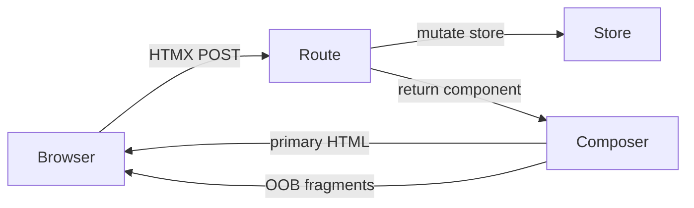

# Build an App (step by step)

This guide walks a complete path from zero to a **reactive FastAPI + HTMX app** with PyJinHx. Each step shows *what* to do and a **Why?** panel explaining *why it exists*.

When you're done you will have used:

- `BaseComponent` and `ReactiveComponent`
- Template discovery and nesting via typed child fields
- Co-located JS/CSS and asset delivery modes
- `request_scope`, `@mutates`, and `AppContext`
- Returning components from routes, composed by `pyjinhx.responses.compose()` through the `IntegrationBackend` (`FastAPIBackend`) that `setup()` wires
- Load-cache scopes and invalidation fan-out

---

## What you are building

A small todo app:

1. **Full page** on `GET /` — layout, list, counter.
2. **Partial updates** on `POST` — toggle a row; counter updates out-of-band.
3. **No manual swap wiring** — components declare dependencies; routes just return one component.


```mermaid
flowchart LR
    Browser -->|HTMX POST| Route
    Route -->|mutate store| Store
    Route -->|return component| Composer
    Composer -->|primary HTML| Browser
    Composer -->|OOB fragments| Browser
```

---

## Step 0 — Install and project layout

```bash
uv add pyjinhx fastapi uvicorn httpx python-multipart
```

```
my_app/
├── app.py                   # FastAPI routes
├── store.py                 # mutations + @mutates
├── keys.py                  # reactive key enums
├── components/
│   ├── todo_counter.py
│   ├── todo_counter.pjx
│   ├── todo_counter.js
│   ├── todo_list.py
│   ├── todo_list.pjx
│   ├── todo_panel.py
│   ├── todo_panel.pjx
│   ├── todo_item_row.py
│   ├── todo_item_row.pjx
│   ├── todo_app.py
│   └── todo_app.pjx
└── pyproject.toml
```

???+ question "Why this layout?"
    PyJinHx discovers templates **next to** component classes. A class named `TodoCounter` renders `todo_counter.pjx` from the directory of the module that defines it — the snake_cased class name, the `.pjx` extension, no search path and no configuration. Co-located assets follow the same stem: `todo_counter.js`, `todo_counter.css`.

    `setup(app, components_root="./components")` is a separate job: it walks that tree once at startup and matches each template stem against the component classes **already imported** into the process, so `<PascalCase/>` tags in templates resolve to those classes. A template whose class nothing has imported yet claims no tag — the tag is not an error, it is re-emitted as literal text. Import every component module before `setup()` runs. Template *lookup* never consults any of this.

    Separating `store.py` from components mirrors how a real app keeps domain logic out of UI classes.

---

## Step 1 — Your first component

`components/todo_counter.py`:

```python
from pyjinhx import BaseComponent


class TodoCounter(BaseComponent):
    id: str
    remaining: int = 0
```

`components/todo_counter.pjx`:

```html
<span id="{{ id }}">{{ remaining }} left</span>
```

Smoke test in a shell — no setup, no scope, because the template path comes off the class:

```python
from components.todo_counter import TodoCounter

print(TodoCounter(id="counter", remaining=3).render())
```

???+ question "Why BaseComponent and a stable id?"
    `BaseComponent` is a **Pydantic model** — fields are validated at construction time. The `id` is the stable DOM identity: HTMX targets, registry lookups, and reactive `data-pjx-id` stamping all depend on it. An omitted `id` auto-generates a process-unique `pjx-<n>` value, which is fine for decorative markup and useless as a swap target — nothing about it is stable across requests. Any region you want to address from HTMX, and every reactive component, needs an explicit `id=`.

    `BaseComponent` is also `extra="forbid"`: a field you did not declare is a validation error, not a silently accepted attribute. If you genuinely want open-ended fields, subclass `OpenComponent` (`from pyjinhx._component import OpenComponent`) instead.

???+ question "Where does the template come from?"
    Nowhere you configure. `TodoCounter` looks for `todo_counter.pjx` beside `components/todo_counter.py` — snake_cased class name, `.pjx` extension. Subclasses inherit a template: if `DangerCounter(TodoCounter)` has no `danger_counter.pjx`, it renders its parent's.

    `setup(app, components_root="./components")` in Step 5 walks the tree for a different reason — registering `<PascalCase/>` tag names — not to resolve this file.

---

## Step 2 — Compose in Python

`components/todo_list.py`:

```python
from pyjinhx import BaseComponent


class TodoList(BaseComponent):
    id: str
    items: list[BaseComponent] = []
```

`components/todo_list.pjx`:

```html
<ul id="{{ id }}">
  {{ item }}
</ul>
```

Build the tree in Python:

```python
from components.todo_counter import TodoCounter
from components.todo_list import TodoList

page = TodoList(
    id="todo-list",
    items=[TodoCounter(id="counter", remaining=3)],
)
print(page.render())
```

???+ question "Why compose in Python?"
    Python composition gives you **type checking and explicit structure** — IDE autocomplete on fields, Pydantic validation on nested components. Use this when the page structure is decided server-side (typical for app shells and data-heavy views).

    See also: [Nesting](../guide/nesting.md).

---

## Step 3 — A panel with typed child fields

`components/todo_panel.py`:

```python
from pyjinhx import BaseComponent

from components.todo_counter import TodoCounter


class TodoPanel(BaseComponent):
    id: str
    counter: TodoCounter
```

`components/todo_panel.pjx`:

```html
<div id="{{ id }}" class="panel">
  {{ counter }}
</div>
```

Build it in Python; the template decides where the child renders:

```python
TodoPanel(id="panel", counter=TodoCounter(id="counter", remaining=3)).render()
```

???+ question "Why typed child fields?"
    The panel declares **which child it holds** as a typed Pydantic field; the template owns **where it goes** — `{{ counter }}` renders the nested component in place. PyJinHx also supports `<PascalCase/>` tags for template-driven composition — see [PascalCase tags](../guide/tags.md).

---

## Step 4 — Co-located assets

Add `components/todo_counter.js` next to `todo_counter.py` — assets use the **same snake_cased stem** as the template, so `TodoCounter` picks up `todo_counter.pjx`, `todo_counter.js` and `todo_counter.css` with no wiring:

```javascript
console.log("todo counter ready");
```

Under `setup(app, ...)` that is all you do: every request's session subscribes the
`accumulate_assets` hook, so a root render collects each rendered component's JS/CSS once
and appends it inline.

Outside an app you subscribe the hook yourself, which is what the middleware does:

```python
from pyjinhx.session import RenderSession, accumulate_assets

session = RenderSession()
session.on_rendered.append(accumulate_assets)

print(TodoPanel(id="panel", counter=TodoCounter(id="counter", remaining=2)).render(session))
# → HTML <style>...</style> <script>...</script>
```

A bare `RenderSession()` has no hooks attached and emits no asset tags at all.

???+ question "Why co-located assets?"
    Components carry their own behavior and styling. Collecting at the **root render** avoids duplicate script tags when nested components share assets.

    Partial responses are not left behind: the response composer looks at which assets this request's fan-out needs, subtracts what the browser reports in `X-PJX-Assets`, and appends the difference as OOB `<style>`/`<script>` fragments. That delta delivery only happens for the kinds the session delivers inline — a session in `AssetMode.LINK` or `AssetMode.NONE` gets nothing, which is correct when a bundle already ships them.

    Production: use `AssetMode.NONE` and serve a pre-built bundle. See [Asset collection](../guide/assets.md).

---

## Step 5 — FastAPI shell

`app.py`:

```python
from fastapi import FastAPI
from pyjinhx import setup

from components.todo_counter import TodoCounter
from components.todo_list import TodoList  # noqa: F401 — imported so its tag registers
from components.todo_panel import TodoPanel

app = FastAPI()
setup(app, components_root="./components")


@app.get("/")
def index():
    return TodoPanel(id="panel", counter=TodoCounter(id="counter", remaining=3))
```

Run: `uvicorn app:app --reload`

!!! note "Import every component module, even the ones `app.py` never names"
    The registry pairs walked templates with classes **already imported** into the
    process, so `<TodoList/>` in a template only resolves because `app.py` imported
    `TodoList`. Add `from components.todo_item_row import TodoItemRow` and
    `from components.todo_app import TodoApp` as Steps 8 and 10 introduce them —
    otherwise their tags come back as literal `<TodoItemRow/>` text in the page.

???+ question "Why return the component instead of `.render()`?"
    Because returning it is what hands the request to `pyjinhx.responses.compose()`, and composition is where everything past "one component's markup" happens: the client runtime is injected on a cold page render, out-of-band fan-out is attached, and the htmx headers are set. `.render()` gives you exactly one component's HTML and nothing else — useful in a shell, not what a route wants.

    You never construct a response object. The `FastAPIBackend` that `setup()` installed turns compose's answer into an `HTMLResponse` for you, so no `response_class=` is needed. A return value pyjinhx does not recognise — a `JSONResponse`, a dict, a `FileResponse` — passes through to FastAPI untouched.

    Redirects are the one exception, and they need no pyjinhx surface either: return your framework's own `RedirectResponse`, and if the request carried `HX-Request` the backend rewrites it to `204` + `HX-Redirect` so htmx navigates instead of swapping the target page's body into your button. Detection is duck-typed on any response with a 3xx status and a `Location` header, it is always on, and a plain browser request still gets the real 3xx.

    Any WSGI/ASGI framework works — PyJinHx is not tied to FastAPI.

    See: [Response composition](../api/responses.md) · [FastAPI integration](../integrations/fastapi.md).

!!! warning "Declare routes after `setup(app, ...)`"
    A handler annotated `-> TodoPanel` on a route registered *before* `setup()` has already been turned into a pydantic response model by FastAPI, and cannot be adapted. Call `setup()` first, or leave the return annotation off.

---

## Step 6 — `setup()` (registry + cache hygiene)

`setup(app, ...)` is the production path. One call wires everything a reactive request needs:

```python
from pyjinhx import setup

app = FastAPI()
setup(
    app,
    components_root="./components",
    context_factory=lambda request: AppLoadContext(store=store),
)  # AppLoadContext defined in Step 12
```

That single call:

- walks `components_root` and, for each `.pjx` it finds, registers the **already-imported** component class whose name snake_cases to that stem under its `<PascalCase/>` tag name — an orphan template (no class, or a class whose module was never imported) claims no tag, and the tag renders as literal text,
- chains a lifespan that configures pyjinhx at startup and tears it down at shutdown,
- adds `PjxScopeMiddleware`, which opens one `request_scope()` per request, parses the pjx headers onto that request's session, and subscribes the three render hooks (asset accumulation, reactive root stamping, instance registration),
- installs the `IntegrationBackend` for your framework — `FastAPIBackend` here — so handlers can return components directly,
- mounts `/static` when you pass `static_root`.

???+ question "Manual alternative — `request_scope()`"
    `request_scope()` is the low-level primitive `setup()`'s middleware calls for you. It takes an optional `session=` and `load_context=` and nothing else — there is no components root to hand it, because template lookup never used one. Reach for it directly only outside FastAPI, in custom wiring, or in a shell/test:

    ```python
    from pyjinhx import setup
    from pyjinhx.session import request_scope

    setup(components_root="./components")  # process config only, no app

    with request_scope():
        print(TodoPanel(id="panel", counter=TodoCounter(id="counter", remaining=3)).render())
    ```

    A bare `request_scope()` gives you the per-request ContextVars and nothing more: no asset accumulation, no reactive root stamping, no instance registration, no header parsing, and no response composition — so reactive fan-out will not happen. Do not nest one inside a route of an already-wired app; it shadows the session the middleware set up and silently drops all of the above.

See [Configuration API](../api/config.md) and [FastAPI integration](../integrations/fastapi.md).

---

## Step 7 — HTMX partial responses

HTMX is the transport for reactivity. PyJinHx auto-injects a vendored copy (alongside
`pjx.js`) whenever a handler returns a component on a request that carries no
`X-PJX-Mounted` header and the session's `js_mode` is `AssetMode.INLINE` — reactivity is
not part of the gate, a plain `BaseComponent` return is enough. So you don't need to add
htmx yourself — but you can load your own in the layout to pin a version or add
extensions (the injected copy self-guards against double-loading):

```html
<script src="https://unpkg.com/htmx.org@2.0.3"></script>
```

There is currently no off-switch: `inject_htmx` is recorded on the settings object but nothing reads it, and the inlined copy is wrapped in `if (!window.htmx)`, so loading your own first already wins.

Return a **fragment** from a mutation route — same rule as the full page, return the component:

```python
@app.post("/counter/bump")
def bump():
    return TodoCounter(id="counter", remaining=2)
```

A route with nothing of its own to swap in returns `None`. That is a real return shape,
not a no-op: the primary is empty, `HX-Reswap: none` is set so htmx leaves the triggering
element alone, and the response is whatever out-of-band updates the mutation implied. You
can also return a plain `str` or `Markup` when you have already built the HTML.

!!! note
    Middleware from Step 6 already wraps each request — no per-route `request_scope()` needed.

Template button:

```html
<button hx-post="/counter/bump" hx-target="#counter" hx-swap="outerHTML">
  Bump
</button>
```

???+ question "Why HTMX?"
    PyJinHx owns **HTML composition**; HTMX owns **transport and swap**. You keep server-rendered components and avoid a client-side state tree. PyJinHx does not replace HTMX — they meet at the route return value.

    See: [HTMX integration](../integrations/htmx.md).

---

## Step 8 — Reactive components

Upgrade the counter. It names the state it derives from with a `Keys` enum and
reads from a `store` module — **we define both `keys.py` and `store.py` in Step 9**;
for now just note that `Keys.TODOS` and `store` are imported from there:

```python
from pyjinhx import ReactiveComponent

from keys import Keys
import store


class TodoCounter(ReactiveComponent, react={Keys.TODOS}):
    remaining: int = 0

    @classmethod
    def load(cls) -> "TodoCounter":
        return cls(remaining=store.remaining())
```

Define the page shell as a normal `BaseComponent` — no special marker required:

```python
class TodoApp(BaseComponent): ...
```

???+ question "Why ReactiveComponent?"
    Reactive components declare **what state they derive from** (the `react` class keyword) and **how to rebuild** (`load()`). `load()` is a **classmethod factory** that returns a freshly populated instance from the current world — the renderer calls it for you when the component is the root of a render or is instantiated from a `<PascalCase/>` tag, so you rarely call it by hand. Writing it as an instance method (`def load(self)`) raises a `TypeError` the moment the class is defined.

    After a mutation you return one component; the composer attaches OOB swaps for other mounted regions whose dependencies overlap — you don't list every widget in every route.

    A component that renders as a reactive root gets four attributes spliced onto its root tag: `data-pjx-id`, `data-pjx-type` (the snake_case tag name), `data-pjx-hash`, and — when the class declares a `PjxKey` field — `data-pjx-load`. Those are what the client manifest is built from.

    Root full-page renders inject `pjx.js` automatically unless the request already carries `X-PJX-Mounted`. That runtime sends the manifest on every HTMX request so the server knows what's on screen.

    See: [Reactivity](../reactivity.md).

---

## Step 9 — Keys, mutations, and the response

Centralize reactive key strings in a `MutationKey` enum so `react=`, `@mutates`, and
`dirty()` all share one vocabulary (no stray raw strings to typo). `keys.py`:

```python
from pyjinhx import MutationKey


class Keys(MutationKey):
    TODOS = "todos"
```

`store.py`:

```python
from dataclasses import dataclass
from itertools import count

from pyjinhx import mutates

from keys import Keys

_ids = count(1)
_todos: dict[int, "Todo"] = {}


@dataclass
class Todo:
    id: int
    text: str
    done: bool = False


def remaining() -> int:
    return sum(1 for t in _todos.values() if not t.done)


def get(todo_id: int) -> Todo:
    # A plain dict lookup: the KeyError it raises on a deleted todo is the
    # signal a load() is expected to let out. See Step 10.
    return _todos[todo_id]


@mutates(Keys.TODOS)
def add(text: str) -> Todo:
    todo = Todo(id=next(_ids), text=text)
    _todos[todo.id] = todo
    return todo


@mutates(Keys.TODOS)
def toggle(todo_id: int) -> Todo:
    _todos[todo_id].done = not _todos[todo_id].done
    return _todos[todo_id]
```

Route (the `TodoItemRow` it returns is the instance-keyed row **we define in Step 10**):

```python
@app.post("/rows/{todo_id}/toggle")
def toggle_row(todo_id: int):
    store.toggle(todo_id)
    return TodoItemRow(todo_id=todo_id, id=f"row-{todo_id}")
```

The route names one region — the row it just changed. The counter is nowhere in this
handler and still updates, because `store.toggle` dirtied `Keys.TODOS` and the counter
declared `react={Keys.TODOS}`.

???+ question "Why @mutates, and who actually does the work?"
    - **`@mutates`** — records the state keys a call dirtied onto the current request. That is *all* it does; it evicts nothing itself.
    - **`compose()`** — reads those keys at response time, evicts the matching `load()` cache entries, then walks the client's manifest to decide which mounted regions need re-rendering. Eviction happens before the walk, so a region can never be judged "clean" against markup this request just invalidated.
    - **`IntegrationBackend`** (`FastAPIBackend`, wired via `setup()`) — its middleware parses `X-PJX-Mounted`, `X-PJX-Trigger` and `X-PJX-Assets` onto the request's session, which is where `compose()` reads them from. No framework kwargs anywhere.

    Nothing in that list is `render()`'s job. `render()` returns one component's markup and never touches the manifest, the dirtied keys, or the cache.

---

## Step 10 — Instance-keyed rows

```python
from typing import Annotated
from pyjinhx import PjxKey


class TodoItemRow(ReactiveComponent, react={Keys.TODOS}):
    todo_id: Annotated[int, PjxKey()]
    title: str = ""
    done: bool = False

    @classmethod
    def load(cls, todo_id: int) -> "TodoItemRow":
        todo = store.get(todo_id)  # KeyError if it's gone — let it out, see below
        return cls(todo_id=todo.id, title=todo.text, done=todo.done)
```

The key is a parameter, and it arrives as the type you declared. It round-trips through
the DOM as a string in `data-pjx-load`, but the framework validates it back to the
`PjxKey` field's declared type before calling `load()` — so `todo_id: int` really is an
`int`. Don't coerce it yourself.

Note where `id` comes from. It identifies the *mounted region*, not the loaded data, so
its home is the construction site (`id=f"row-{todo_id}"` in the route) — and the cached
`load()` result is shared by every render of that todo regardless. `load()` **may** set it
as well, and [Reactivity](../reactivity.md#instance-keyed-regions-rows) does exactly that
for keyed rows, but an id set there survives on exactly one path: a `<PascalCase/>` tag
mount that passes no `id=` of its own.

The other two paths discard it. On a direct return from a route, the auto-load copies every
field *except* `id` off the loaded instance, so the region keeps whatever id the instance
you returned was constructed with — an unset one stays the unstable `pjx-<n>`. On OOB
fan-out the composer overwrites `instance.id` with the id the client's manifest already
carries for that region, the moment `load()` returns.

So set `id` where you construct the instance. Treat setting it in `load()` as a convenience
for the tag-mount path, never as the thing that makes a region addressable.

!!! warning "Raising is part of `load()`'s contract"
    A row can outlive the todo it stands for: a browser tab still shows row 7 after
    another request deleted todo 7. A **`LookupError` out of `load()` is the only signal
    that says so**, and it is what makes the composer emit

    ```html
    <div hx-swap-oob="delete:[data-pjx-id='row-7']"></div>
    ```

    so the region disappears from the page. A *registry* miss means nothing here —
    regions outside the primary tree miss the request-scoped registry as a matter of
    course.

    This makes the obvious defensive move a bug. If `load()` catches its store's
    `KeyError` and returns `cls()` with field defaults, the region is not deleted — it is
    swapped with a blank, fully-rendered row that sits there forever. `KeyError` and
    `IndexError` both subclass `LookupError`, so a plain `dict`/`list` lookup against your
    own store already raises the right thing. Let it out.

`components/todo_item_row.pjx` (the `data-pjx-*` pair is the loading indicator — covered in Step 11):

```html
<li data-pjx-loading="skeleton" data-pjx-reacts="todos">
  <button hx-post="/rows/{{ todo_id }}/toggle"
          hx-target="closest [data-pjx-id]" hx-swap="outerHTML">toggle</button>
  <span>{{ title }}</span>
</li>
```

???+ question "Why PjxKey?"
    A field annotated with `PjxKey()` makes the type **instance-keyed**: it stamps `data-pjx-load` on the root tag for the OOB round-trip, and it becomes the parameter `load()` is called with — one classmethod, one key, one cache entry per instance. Use the same field in templates (`{{ todo_id }}`). `react={Keys.TODOS}` is pub-sub — all mounted rows with matching state keys may OOB-reload when todos change, and hash-gating drops the ones whose markup didn't move.

---

## Step 11 — Loading states (in-flight indicators)

While a reactive region's OOB update is in flight, it can show a built-in indicator.
You opt in **in the template**, with two attributes on the reactive component's **root
element** — `data-pjx-reacts` naming the keys this region reacts to, and
`data-pjx-loading` choosing the style. No route or Python changes:

```html
<!-- todo_item_row.pjx: shimmer the whole row while it reloads -->
<li data-pjx-reacts="todos" data-pjx-loading="skeleton"> ... </li>

<!-- clear_button.pjx: spin just this button -->
<button data-pjx-reacts="todos" data-pjx-loading="spinner">Clear completed ({{ completed }})</button>
```

Two built-in styles ship: `"skeleton"` (silhouette shimmer) and `"spinner"` (dimmed
overlay with a circular indicator). `pjx.js` matches the triggering region's
`data-pjx-reacts` keys against every other `[data-pjx-id][data-pjx-reacts]` element on
the page and lights the matching `data-pjx-loading` elements — the swap target *and* its
OOB dependents.

!!! note "`data-pjx-reacts` is yours to write"
    The framework stamps `data-pjx-id`, `data-pjx-type`, `data-pjx-hash` and
    `data-pjx-load` on a reactive root, but **not** `data-pjx-reacts` — `pjx.js` only
    reads it. A template with `data-pjx-loading` and no `data-pjx-reacts` will never
    light up. Write the space-separated key list yourself, matching the class's `react=`
    set (`data-pjx-reacts="todos"` for `react={Keys.TODOS}`); it can also be interpolated
    from a field if the keys are dynamic.

    Indicators inside a region still need the region's *root* to carry both
    `data-pjx-id` (stamped) and `data-pjx-reacts` (yours) for the inner element to be
    claimed by it.

???+ question "Why template-driven, and how do I theme it?"
    Indicators are purely a client affordance — no server reactive semantics change, and
    nothing fires unless an element opts in. Both styles read overridable `--pjx-*` CSS
    variables (e.g. `--pjx-skeleton-color`, `--pjx-spinner-color`, `--pjx-spinner-speed`)
    you can set on `:root` or any wrapper. Any other value (`data-pjx-loading="pulse"`)
    just applies `.pjx-loading--pulse` for you to style.

    See: [Reactivity → Loading indicators](../reactivity.md#loading-indicators-in-flight).

---

## Step 12 — AppContext (avoid globals in load())

Subclass `AppContext` to declare the shape of your app's per-request context. Declare it
as an annotated `ctx` parameter on `load()` and pyjinhx injects that request's value —
no lookup call needed:

```python
# context.py
from dataclasses import dataclass
from typing import Any

from pyjinhx import AppContext


@dataclass(frozen=True)
class AppLoadContext(AppContext):
    store: Any
```

Declare it on `load()` and drop the module-level `store` import:

```python
class TodoCounter(ReactiveComponent, react={Keys.TODOS}):
    remaining: int = 0

    @classmethod
    def load(cls, ctx: AppLoadContext | None = None) -> "TodoCounter":
        return cls(remaining=ctx.store.remaining() if ctx else 0)
```

Pass a factory to `setup()` (Step 6):

```python
setup(app, context_factory=lambda request: AppLoadContext(store=store))
```

`ctx` is whatever that request's factory returned. Default it to `None`: with no factory
configured — or when `load()` runs outside a request scope, as in a unit test — that is
what arrives, rather than an error.

???+ question "Why AppContext?"
    `load()` must rebuild components from the current world. Passing a database handle or store through a **request-scoped context** avoids hidden globals and makes tests inject a fake store. `PjxContext` is the framework's own read-only view of the request — it isn't meant to be subclassed for app data; `AppContext` is.

---

## Step 13 — Load cache scope and invalidation

`load()` results are cached **within a single HTTP request** — the cache lives on the
request-scoped session middleware wires (Step 6) and is discarded when the request ends.
That scope is what makes the cache multi-worker safe by default: nothing survives past
one request, so there's nothing to keep consistent across workers.

???+ question "Why cache at all?"
    A single page may call a component's `load()` many times during composition and OOB walks. Caching `(class, load_arg) → component snapshot` avoids repeated store/DB work. **Invalidation** is a two-part job: `@mutates` records the dirtied keys, and `compose()` calls `pyjinhx.reactive.cache.invalidate()` with them at response time, before it walks the manifest. Cache is a performance layer, not the source of truth.

    If toggles feel stale, check that `@mutates` dirtied a key your rows actually
    declare via `react=`. Rows here use **pub-sub** on `{Keys.TODOS}` — every mounted
    row reloads when `todos` changes, and hash-gating skips the unchanged ones. (For
    per-instance keys like `"todo:42"` instead of a shared stem, see
    [Reactivity → Instance-keyed regions](../reactivity.md#instance-keyed-regions-rows).)

---

## Step 14 — Production assets

Build a single CSS and JS bundle from all component assets and serve them as static files. Then
put both asset modes on the request's `RenderSession` so components don't duplicate what the
bundle already ships.

```python
from pyjinhx import AssetMode
from pyjinhx.assets import all_assets

# Build bundles at startup, after components are registered via setup() —
# see guide/assets.md "One-bundle deployment"
css_paths, js_paths = all_assets()
```

`css_mode`/`js_mode` are per-`RenderSession` attributes (each defaults to `AssetMode.INLINE`), not
a process-wide switch. Set them on the session bound to the current request — the one `setup()`'s
middleware (or your own `request_scope()`) opened:

```python
from pyjinhx.session import current_session


@app.get("/")
def index():
    session = current_session()
    session.css_mode = AssetMode.NONE
    session.js_mode = AssetMode.NONE
    return TodoApp(id="app")  # assets come from the bundle, not inline tags
```

Link `bundle.css` and `bundle.js` in your layout `<head>`. Full-page renders then emit only
the HTML — no inline asset tags.

!!! warning "The client runtime rides on inline JS"
    `inject_runtime()` no-ops when `js_mode` is not `AssetMode.INLINE`, so switching to
    `NONE` also stops `pjx.js` and the vendored htmx from shipping — and without them
    nothing sends the manifest, so nothing fans out. Serve the runtime yourself: link
    `pjx.js` as a static file, or fold `read_pjx_runtime()`/`read_vendored_htmx()` from
    `pyjinhx.client` into your bundle.

See [Assets](../guide/assets.md#one-bundle-deployment) for the bundle-serving route with
ETags and the static-runtime recipe.

---

## Step 15 — Dev guardrails (optional)

```python
from pyjinhx.dev import enable_reactive_dev, dependency_graph, format_dependency_graph

enable_reactive_dev()  # or enable_reactive_dev(strict=True) to raise instead of warn
print(format_dependency_graph())  # as_mermaid=True for a diagram
```

???+ question "Why enable_reactive_dev?"
    Reactivity bugs are often silent — the commonest is a `@mutates` key that no component's `react=` set names, so a mutation quietly updates nothing. `warn_unconsumed_mutations()` catches exactly that; `enable_reactive_dev()` turns the finding into a log warning, or into a `RuntimeError` under `strict=True`. `dependency_graph()` / `format_dependency_graph()` print the static key → class map so you can eyeball a typo before it becomes a support ticket.

---

## Step 16 — Built-in UI kit (optional)

```python
from pyjinhx.builtins.ui.pjx_alert.pjx_alert import PJXAlert
from pyjinhx.builtins.ui.pjx_card.pjx_card import PJXCard
from pyjinhx.builtins.ui.pjx_modal.pjx_modal import PJXModal
```

???+ question "Why builtins?"
    Optional ready-made components (PJXAlert, PJXCard, PJXModal, PJXTable, …) with co-located CSS/JS. Use when you want a consistent kit without building every primitive. Your app components follow the same `BaseComponent` rules.

    See: [Components](../components.md).

---

## Checklist — full app wiring

The per-step **Why?** panels above cover the *why*; this is the at-a-glance *what*.

| Tier | Pieces |
|------|--------|
| **Required** | `setup(app, components_root=...)` (registers tags, wires `FastAPIBackend` + `PjxScopeMiddleware`) · routes declared after `setup()` · routes **return components**, never `.render()` · explicit `id=` on every addressable region · `ReactiveComponent` (`react={...}` + classmethod `load()`) · `@mutates(Keys.…)` on mutations · `PjxKey` on keyed rows · `load()` lets `LookupError` out when the region is gone |
| **Auto-provided** | HTMX + `pjx.js` (vendored, inlined on cold root renders while `js_mode` is `INLINE`; the htmx copy self-guards with `if (!window.htmx)`) · `data-pjx-id`/`-type`/`-hash`/`-load` stamping · OOB fan-out and asset delta on every composed response |
| **Recommended** | `AppContext` · `data-pjx-reacts` + `data-pjx-loading` indicators · `enable_reactive_dev()` in dev |
| **Production** | `AssetMode.NONE` + pre-built bundle (`pyjinhx.assets.all_assets()`) |

---

## Where to go next

- [Quick Start](quickstart.md) — minimal single component
- [Reactivity](../reactivity.md) — deep dive on OOB swaps and hash gating
- [FastAPI](../integrations/fastapi.md) · [HTMX](../integrations/htmx.md)
- [API: response composition](../api/responses.md) — what a route return becomes
- [API: render()](../api/renderer.md) · [Registry](../api/registry.md)
