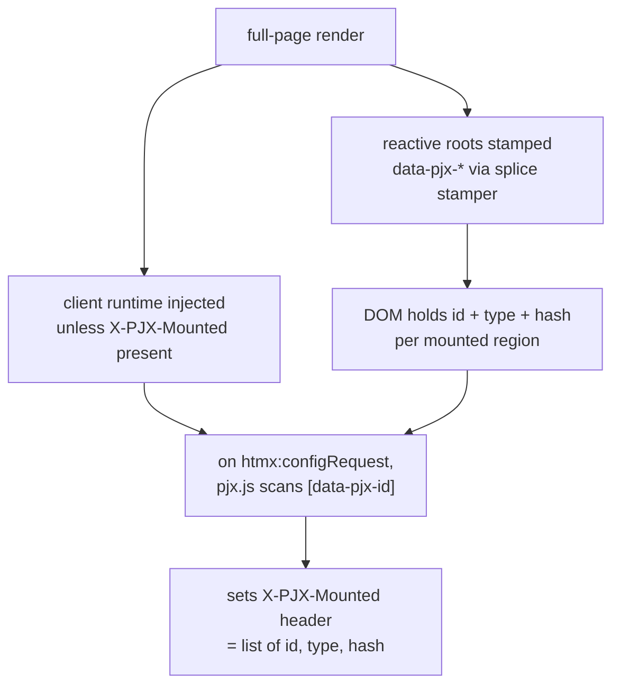
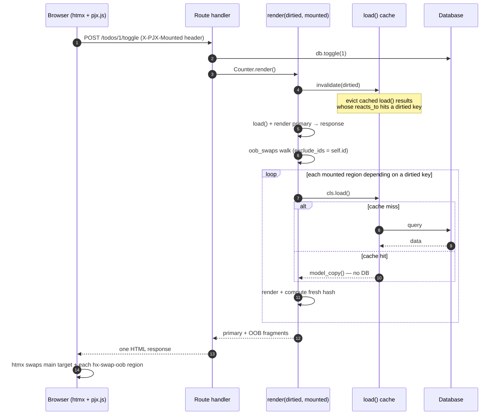
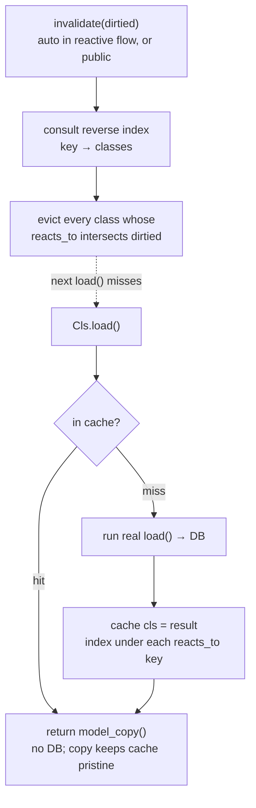

# Reactivity (Dependency-Aware OOB Swaps)

Reactivity is **opt-in**. You can use PyJinHx with `BaseComponent` only — see [Usage tiers](guide/usage-tiers.md). This guide covers Tier 3+: dependency-aware out-of-band HTMX swaps.

!!! info "Prerequisites"
    - HTMX for transport and swap
    - `Registry.request_scope()` on every HTTP request
    - [ClientBackend](api/client-backend.md) in middleware (recommended) so mutation routes need no framework kwargs on `render()`

pyjinhx owns **composition**; HTMX owns **transport and swap**. Between them sits
the **state→view dependency graph** — which regions must change when a piece of
state changes. pyjinhx lets you declare that graph once, on the components, so a
mutation route re-emits exactly the mounted regions that depend on what changed.

A region that depends on a dirtied key is reloaded and re-emitted **only when its
value actually changed** — its freshly computed `state_hash()` is compared against
the hash the client reported, and a matching hash is skipped.

> **Runnable example:** a full FastAPI + htmx todo app lives in
> [`examples/reactive_todo/`](https://github.com/paulomtts/pyjinhx/tree/master/examples/reactive_todo) —
> run `uv run uvicorn examples.reactive_todo.app:app --reload` and watch the counter,
> total, and clear button update out-of-band (and get skipped by hash-gating when their
> value doesn't change).

See the [Public API Index](reference/public-api.md) for every exported reactive symbol.

## 1. Make a component reactive

Subclass `ReactiveComponent` and declare **both** `reacts_to` and a `load()`
classmethod — `ReactiveComponent` enforces both (a missing `load()` can't be
instantiated; a missing `reacts_to` is a definition-time error):

```python
from typing import ClassVar
from pyjinhx import ReactiveComponent

class Counter(ReactiveComponent):
    remaining: int
    reacts_to: ClassVar[set[str]] = {"todos"}

    @classmethod
    def load(cls) -> "Counter":
        return cls(remaining=db.remaining())   # id defaults to "counter"
```

- `reacts_to` — the **state keys** this component derives from. These are arbitrary
  strings *you* choose to name pieces of state (`"todos"`, `"user:42"`) — **not**
  component ids or types, and not client-side watchers. The server simply intersects
  a component's `reacts_to` with the route's `dirtied` keys (and uses them to evict the
  `load()` cache): it's cache invalidation, not signals.
- `load()` — rebuilds the component from the current world, independent of any route.
- `id` — defaults to the **kebab-cased class name** (`Counter` → `"counter"`,
  `TodoCounter` → `"todo-counter"`), since a type-singleton's identity is its type, so
  `load()` need not set one. Pass an explicit `id` only for instance-keyed regions —
  multiple mounted instances of one type, e.g. `cls(id=f"todo-row-{user_id}", ...)`.
- `state_hash()` — canonical SHA-256 of sorted JSON from `model_dump(mode="json")`
  with `state_hash_exclude` applied (`id` is excluded by default). Override for custom
  hashing or add fields to `state_hash_exclude` for ephemeral UI-only state.
- `depends_on()` — optional runtime narrowing for load-cache indexing after `load()`.
  Static `reacts_to` must remain a **superset** of every key `depends_on()`
  may return (dev mode enforces this). `oob_swaps` matches on static `reacts_to` only.

Reactive components are stamped with `data-pjx-id`, `data-pjx-type` (the class
name), and `data-pjx-hash` on their root element automatically.

## 2. Ship the client runtime

On root full-page renders, `pjx.js` is injected automatically unless the request
already carries a valid `X-PJX-Mounted` header (meaning the runtime is active in
the browser). First visits and requests without the header get the runtime; HTMX
requests from a page that already loaded it do not.

```python
from pyjinhx import BaseComponent

class AppShell(BaseComponent):
    ...  # app_shell.html is your full page template
```

For a raw Jinja layout (outside the component render path), drop in `client_script()`:

```python
from pyjinhx import client_script

# in your template context
{"pjx_runtime": client_script()}
```
```html
<body>
  ...
  {{ pjx_runtime }}
</body>
```

The runtime attaches two client manifests to every htmx request:

| Header | Purpose |
|--------|---------|
| `X-PJX-Mounted` | Reactive regions currently in the DOM (`id`, `type`, `hash`, optional `load`) |
| `X-PJX-Assets` | URLs of `<script src>` and `<link rel="stylesheet">` already loaded |
| `X-PJX-Trigger` | `data-pjx-id` of the element that started the HTMX request |

Wire `FastAPIClientBackend` via `setup(app, ...)` — see the
[canonical snippet](integrations/fastapi.md#middleware-recommended) and
[Client Backend](api/client-backend.md). Mutation routes then call
`Cls.render(key)` with no extra kwargs — headers are read from the backend after
`@mutates`. Full-page routes call `.render()` plainly; boosted navigations skip
re-injecting `pjx.js` when `X-PJX-Mounted` is present.

## 3. Emit OOB swaps from your route

A mutation route does exactly one thing: **`return <component>.render(...)`**. You
never call `load()` and never assemble swaps yourself. For a **reactive** primary,
call `render()` on the *class* — it auto-`load()`s the component for you. The
dependent regions ride along as out-of-band swaps:

```python
@app.post("/todos/toggle")
def toggle():
    db.toggle_all()
    return Counter.render()
```

With `@mutates` on the store method, pending dirtied keys drive OOB swaps automatically.

`Cls.render(*args)` loads the primary (`load(*args)` for keyed types, `load()` for
singletons), renders it as the main-target response, then appends OOB swaps for every
*other* mounted reactive region whose `reacts_to` intersects pending mutations from
`@mutates`. Only the primary id is excluded (htmx swaps it as the main-target response);
the region that *initiated* the request still updates out-of-band if it depends on the
dirtied keys — e.g. a "Clear completed (N)" button updates its own count.

A **plain, non-reactive** primary has no `load()` to call, so you build it and render
the instance: `MyFragment(id=..., ...).render()`.

!!! note "Without ClientBackend"
    Wire `ClientBackend` in middleware (via `setup()`) so `render()` reads manifest and asset headers automatically. Without a backend, reactive OOB is skipped when mutations are pending.

### Under the hood: `oob_swaps()`

`render()` delegates its dependency walk to `oob_swaps(dirtied, mounted)` (passing
`exclude_ids={primary.id}`), which returns the concatenated `hx-swap-oob` fragments.
It's exported for tests and advanced composition, but it is **not** how you write a
route — a route returns `render()`, not bare swaps. `oob_swaps`:
- keeps only mounted regions whose `reacts_to` intersects `dirtied`,
- calls each region's `load()` and re-renders it,
- skips a region whose freshly computed `state_hash()` matches the hash the client
  reported (its DOM value is already current); a missing or mismatched hash always
  swaps — *when in doubt, swap*,
- drops any region nested inside another swapped region (the parent already contains it),
- returns concatenated `hx-swap-oob` fragments (empty if nothing changed).

The dependency graph lives in exactly one place — the `reacts_to` declarations —
not smeared across endpoints. Adding a progress bar that declares
`reacts_to = {"todos"}` makes it participate automatically; no endpoint changes.

### Instance-keyed regions (rows)

A reactive type can have **many mounted instances** — table rows, cards, list items.
A component is **instance-keyed iff its `load()` takes one resource parameter after
`cls`**; declare exactly one `PjxLoad` field on the model:

```python
from typing import Annotated
from pyjinhx import PjxLoad, ReactiveComponent

class TodoItemRow(ReactiveComponent):
    todo_id: Annotated[int, PjxLoad()]
    title: str = ""
    done: bool = False
    reacts_to: ClassVar[set[str]] = {"todos"}

    @classmethod
    def load(cls, todo_id: int) -> "TodoItemRow":
        t = store.get(todo_id)
        return cls(
            id=f"row-{todo_id}",
            todo_id=todo_id,
            title=t.text,
            done=t.done,
        )
```

- **`data-pjx-load`** is stamped from the `PjxLoad` field and returned in the manifest
  so OOB reloads call `load(manifest.load)`.
- **Templates** use the field directly: `hx-post="/rows/{{ todo_id }}/toggle"`.
- **`reacts_to`** lists **state keys only** (e.g. `{"todos"}`). Pub-sub OOB reloads
  every mounted row whose `reacts_to` intersects pending mutations; hash-gating skips
  unchanged rows.

```python
@mutates(Keys.TODOS)
def toggle(todo_id: int) -> Todo:
    ...

@app.post("/rows/{todo_id}/toggle")
def toggle_row(todo_id: int):
    store.toggle(todo_id)
    return TodoItemRow.render(todo_id)
```

When a keyed entity is removed but still listed in the client's mounted manifest (e.g.
after **clear completed**), `oob_swaps` catches `LookupError` from `load(manifest.load)`
and emits a delete OOB swap (`delete:[data-pjx-id='…']`) so stale row regions are removed
from the DOM without a server error.

## State keys

Centralize reactive key strings in a `StateKey` enum so `reacts_to`, `dirtied`, and
`@mutates` share one vocabulary:

```python
from pyjinhx import StateKey

class Keys(StateKey):
    TODOS = "todos"

class TodoCounter(ReactiveComponent):
    reacts_to: ClassVar[set[str | Keys]] = {Keys.TODOS}
```

Enums normalize to their `.value` everywhere keys are coerced.

## Runtime dependencies (`depends_on`)

When a component's dependencies depend on loaded state, declare a static **superset**
on `reacts_to` and override `depends_on()` to narrow at runtime:

```python
class AdminPanel(ReactiveComponent):
    is_admin: bool = False
    reacts_to: ClassVar[set[str]] = {"user", "settings"}

    @classmethod
    def load(cls) -> "AdminPanel":
        user = get_current_user()
        return cls(is_admin=user.is_admin)

    def depends_on(self) -> set[str]:
        if self.is_admin:
            return {"user", "settings"}
        return {"settings"}
```

`depends_on()` affects load-cache reverse indexing; `oob_swaps` matches on static
`reacts_to` only.

`dependency_graph()` uses the static superset only. In dev mode,
`enable_reactive_dev()` warns (or raises) when `depends_on()` returns keys outside
the superset.

## Mutation tracking (`@mutates`)

Decorate store mutation methods to invalidate the `load()` cache and accumulate
dirtied keys for the current request. The next reactive `render()` uses pending keys
from `@mutates` for OOB pub-sub:

```python
from pyjinhx import mutates

@mutates(Keys.TODOS)
def toggle(todo_id: int) -> Todo:
    ...

@app.post("/rows/{todo_id}/toggle")
def toggle_row(todo_id):
    store.toggle(todo_id)
    return TodoItemRow.render(todo_id)
```

Use `Registry.request_scope()` on every request when relying on `@mutates` — it
resets mutation tracking per request.

## Load context

Pass request-scoped dependencies into `load()` without global imports:

```python
from dataclasses import dataclass
from pyjinhx import LoadContext

@dataclass(frozen=True)
class AppContext(LoadContext):
    db: Database

class Counter(ReactiveComponent):
    @classmethod
    def load(cls, *, ctx: AppContext | None = None) -> "Counter":
        ctx = ctx or LoadContext.current()
        return cls(remaining=ctx.db.remaining())
```

Set context per request via `setup(app, load_context_factory=...)` or
`Registry.request_scope(load_context=AppContext(db=...))`. Cache keys remain
`(class, load_arg)` — context is not part of the cache identity.

## Development mode

Enable guardrails during local development:

```python
from pyjinhx import enable_reactive_dev

enable_reactive_dev()          # warnings
enable_reactive_dev(strict=True)  # raise instead
```

Checks include:

- mutations recorded via `@mutates` but no reactive `render()` in the same request scope
- mutations pending but no `ClientBackend` active (OOB swaps skipped)
- `depends_on()` keys outside the static `reacts_to` superset

Inspect the dependency graph at startup:

```python
from pyjinhx import dependency_graph, format_dependency_graph

print(format_dependency_graph())
# or format_dependency_graph(as_mermaid=True) for a flowchart
```

## 4. `load()` results are cached

Every reactive component's `load()` is wrapped in a **dependency-keyed cache**.
Repeated reads within the same request return the cached result and skip the database
until the relevant keys are dirtied:

```python
Counter.load()   # first call hits the DB
Counter.load()   # cached: no DB, returns an independent copy
```

### Cache scope

| Scope | Default | Storage | Cross-request | Multi-worker safe |
|-------|---------|---------|---------------|-------------------|
| `REQUEST` | yes | `ContextVar` inside `Registry.request_scope()` | no | yes |
| `PROCESS` | opt-in | module-level dict per worker | yes | needs invalidation fan-out |
| `NONE` | opt-in | disabled | — | yes |

```python
from pyjinhx import CacheScope, setup

setup(app)  # default CacheScope.REQUEST
setup(app, cache_scope=CacheScope.PROCESS, invalidation_backend=...)  # cross-request per worker
setup(app, cache_scope=CacheScope.NONE)
```

Use `Registry.request_scope()` on every HTTP request (middleware) for instance registry
isolation and optional request-tier cache when scope is `REQUEST`.

**Cache identity:** entries are keyed by `(component class, load key)` only. Encode
tenant or user scope in reactive keys (e.g. `"user:7:todos"`) or ensure `LoadContext`
data is stable for all requests sharing a cache entry.

Reactive `render()` (and `oob_swaps`) evicts pending dirtied keys before reloading
dependents. For mutations outside a render — a background job, a webhook — call
`LoadCache.invalidate` yourself:

```python
from pyjinhx import LoadCache

def nightly_recalc():
    db.rebuild_todos()
    LoadCache.invalidate({"todos"})
```

The cache holds one result per `(type, key)` and returns a fresh copy on every call, so
callers can mutate what they get back without affecting the cache.

### Multi-worker invalidation (`PROCESS` scope)

When using `CacheScope.PROCESS` with multiple workers, configure an
`InvalidationBackend` so `invalidate()` fans out to every process:

```python
from pyjinhx import CacheScope, PyJinhxSettings, setup
from pyjinhx.integrations.redis import RedisInvalidationBackend

setup(
    app,
    settings=PyJinhxSettings(
        cache_scope=CacheScope.PROCESS,
        invalidation_backend=RedisInvalidationBackend("redis://localhost:6379/0"),
    ),
)
```

Requires `pip install pyjinhx[redis]`. See [Redis integration](api/integrations-redis.md).

## Loading indicators (in-flight)

A reactive region can show a loading indicator while a reactive update is in flight, then
swap in the fresh HTML when the response arrives. Opt in per component with `loading`:

```python
class TodoCounter(ReactiveComponent):
    remaining: int
    reacts_to: ClassVar[set[str]] = {"todos"}
    loading: ClassVar[str] = "skeleton"   # or "spinner"
```

Two styles:

- **`"skeleton"`** — a silhouette shimmer in place of the region's content (the box keeps
  its shape; the content is hidden while it shimmers).
- **`"spinner"`** — a dim overlay with a centered circular progress indicator; the content
  stays visible underneath and the region is non-interactive while loading. Good for
  buttons (e.g. a "Clear completed" button).

How it works: every reactive root is stamped with `data-pjx-reacts` (its state keys), and
opted-in roots also get `data-pjx-loading="<style>"`. When an htmx request starts, `pjx.js`
reads the target region's `data-pjx-reacts` as the predicted dirtied set and adds a
`.pjx-loading--<style>` class to every mounted opted-in region whose keys intersect it — the
swap target *and* its out-of-band dependents. The class is removed when the response arrives
(swapped regions replace themselves; hash-gated/unchanged and aborted/errored regions are
cleared). It is purely a client affordance: no server reactive semantics change, and it is
off unless you opt in.

## Boundaries

- **Hash gating is a skip-hint, not correctness authority**: a matching client hash
  earns permission to skip; missing/unknown/mismatched always swaps. It saves
  bandwidth and DOM churn; database work is saved separately by the `load()` cache.
  Default `state_hash()` uses canonical sorted JSON with `id` excluded; set
  `state_hash_exclude` or override `state_hash()` for custom fields.
- **Type-singleton and instance-keyed**: zero-arg `load(cls)` is a type-singleton;
  `load(cls, resource)` is instance-keyed with a `PjxLoad` field. See *Instance-keyed
  regions (rows)* above.
- **Reactivity is opt-in via `ReactiveComponent`**, which requires both `load()` and
  `reacts_to`. Reactive class `render()` auto-`load()`s the primary and OOB dependents.
- **`load()` cache scope**: default `REQUEST`. Use `PROCESS` for cross-request caching
  per worker; multi-worker `PROCESS` needs an `InvalidationBackend`. Eviction is
  state-key driven (`@mutates` or `LoadCache.invalidate`).

## How it works (under the hood)

### The ownership split

Neither pyjinhx nor htmx owned the **state→view dependency graph** before. The split
is now explicit: the **server** owns the dependency graph and the data and decides what
changed; the **client** owns what is currently mounted and rides that up on every
request as a manifest. There is no per-session server state.


### Initial render → the manifest

On a full-page render, reactive roots are stamped with `data-pjx-*` and the client
runtime is injected when `X-PJX-Mounted` is absent (or via `client_script()` in
a raw Jinja shell). The runtime reads the already-stamped DOM at request time — it
never watches for changes, because DOM mutation is the *effect* of a swap, not its cause.



### A mutation request, end to end



### Inside `oob_swaps`: the decision pipeline

Every mounted region runs this gauntlet. Ordering matters: **hash-gate before
nesting-dedup**, so an unchanged parent never suppresses a changed child.


The four parent/child cases (regions nested in the rendered HTML):

| Parent | Child | Result |
| --- | --- | --- |
| changed | changed | swap parent only (its fresh HTML already holds the child) |
| changed | unchanged | swap parent only |
| **unchanged** | **changed** | **swap child alone** — only correct because gating removes the parent *before* dedup |
| unchanged | unchanged | swap nothing |

Governing invariant throughout: **when in doubt, swap** — missing, unknown, or
mismatched hashes always send.

### The `load()` cache

`load()` is auto-wrapped at class-definition time so it is cache-aware everywhere it is
called. Reads short-circuit the database; writes evict by dependency through a reverse
index. A `threading.Lock` guards the compound consult-then-mutate operations, while the
real `load()` (the database hit) runs outside the lock.


