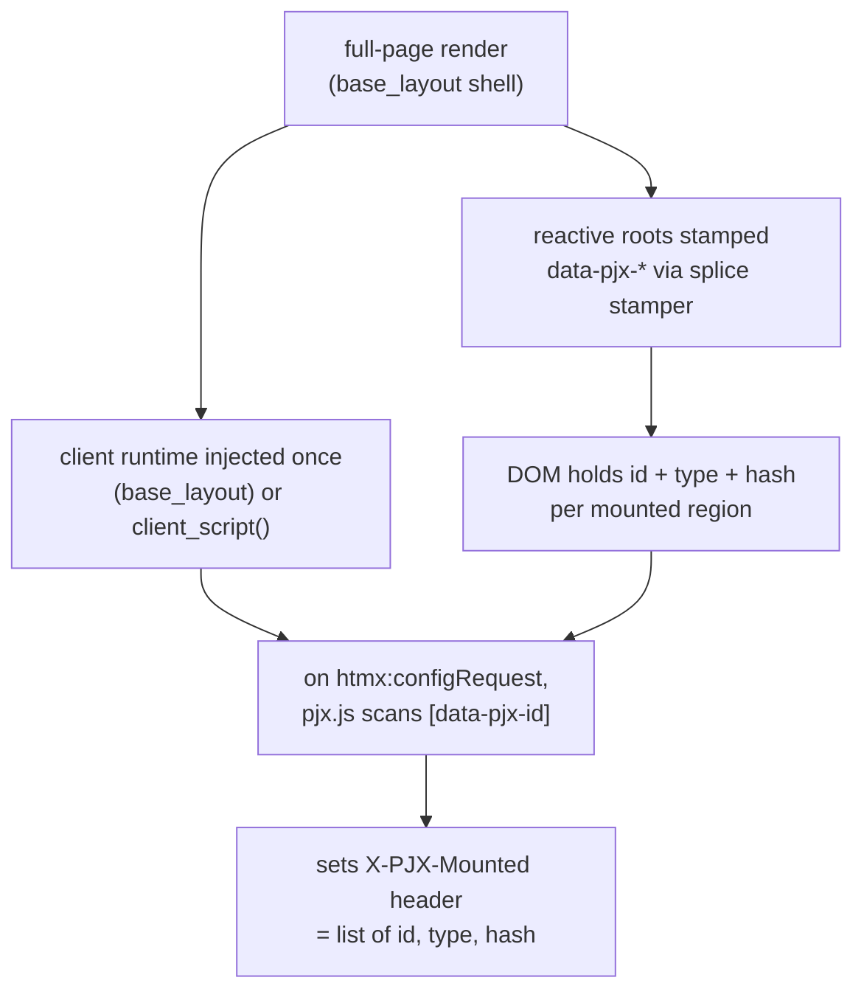
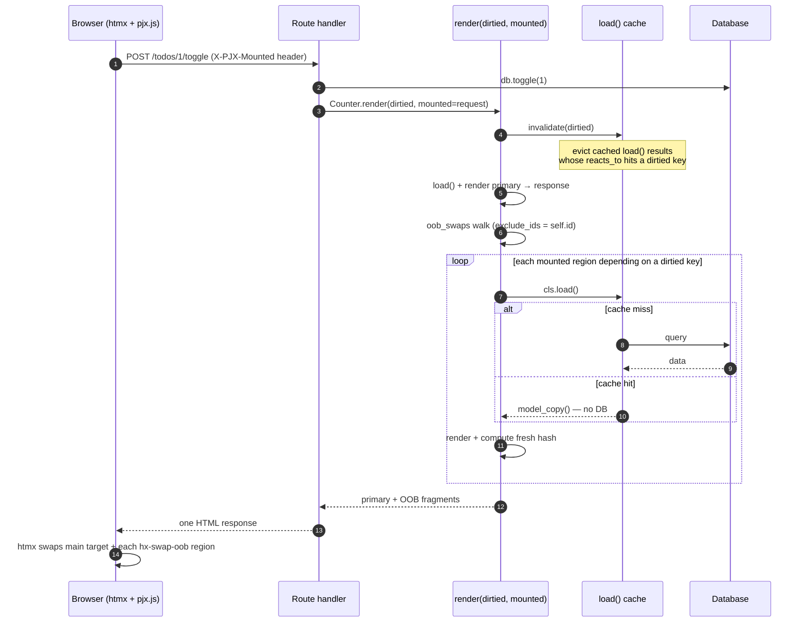
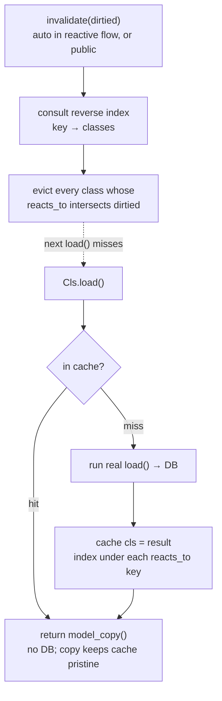

# Reactivity (Dependency-Aware OOB Swaps)

pyjinhx owns **composition**; HTMX owns **transport and swap**. Between them sits
the **state→view dependency graph** — which regions must change when a piece of
state changes. pyjinhx lets you declare that graph once, on the components, so a
mutation route re-emits exactly the mounted regions that depend on what changed.

A region that depends on a dirtied key is reloaded and re-emitted **only when its
value actually changed** — its freshly computed `state_hash()` is compared against
the hash the client reported, and a matching hash is skipped.

> **Runnable example:** a full FastAPI + htmx todo app lives in
> [`examples/reactive_todo/`](https://github.com/paulomtts/pyjinhx/tree/master/examples/reactive_todo) —
> run `uv run uvicorn examples.reactive_todo.app:app --reload` and watch the counter,
> total, and clear button update out-of-band (and get skipped by hash-gating when their
> value doesn't change).

## 1. Make a component reactive

Subclass `ReactiveComponent` and declare **both** `reacts_to` and a `load()`
classmethod — `ReactiveComponent` enforces both (a missing `load()` can't be
instantiated; a missing `reacts_to` is a definition-time error):

```python
from typing import ClassVar
from pyjinhx import ReactiveComponent

class Counter(ReactiveComponent):
    remaining: int
    reacts_to: ClassVar[set[str]] = {"todos"}

    @classmethod
    def load(cls) -> "Counter":
        return cls(remaining=db.remaining())   # id defaults to "counter"
```

- `reacts_to` — the **state keys** this component derives from. These are arbitrary
  strings *you* choose to name pieces of state (`"todos"`, `"user:42"`) — **not**
  component ids or types, and not client-side watchers. The server simply intersects
  a component's `reacts_to` with the route's `dirtied` keys (and uses them to evict the
  `load()` cache): it's cache invalidation, not signals.
- `load()` — rebuilds the component from the current world, independent of any route.
- `id` — defaults to the **kebab-cased class name** (`Counter` → `"counter"`,
  `TodoCounter` → `"todo-counter"`), since a type-singleton's identity is its type, so
  `load()` need not set one. Pass an explicit `id` only for instance-keyed regions —
  multiple mounted instances of one type, e.g. `cls(id=f"todo-row-{user_id}", ...)`.
- `state_hash()` is provided by `ReactiveComponent` (hash of `model_dump_json()`); override only for custom hashing.

Reactive components are stamped with `data-pjx-id`, `data-pjx-type` (the class
name), and `data-pjx-hash` on their root element automatically.

## 2. Ship the client runtime

Mark your page shell with `base_layout=True` — the manifest runtime is injected once
on full-page renders (the marker is inherited, so subclasses of a shell stay layouts):

```python
from pyjinhx import BaseComponent

class AppShell(BaseComponent, base_layout=True):
    ...  # app_shell.html is your full page template
```

Or, in a raw Jinja layout, drop in `client_script()`:

```python
from pyjinhx import client_script

# in your template context
{"pjx_runtime": client_script()}
```
```html
<body>
  ...
  {{ pjx_runtime }}
</body>
```

The runtime attaches a manifest of mounted regions to every htmx request via the
`X-PJX-Mounted` header.

## 3. Emit OOB swaps from your route

A mutation route does exactly one thing: **`return <component>.render(...)`**. You
never call `load()` and never assemble swaps yourself. For a **reactive** primary,
call `render()` on the *class* — it auto-`load()`s the component for you — and pass
what you dirtied plus the incoming request. The dependent regions ride along as
out-of-band swaps:

```python
@app.post("/todos/toggle")
def toggle(request):
    db.toggle_all()
    # render() loads the Counter itself — you don't. dirtied defaults to the
    # primary's own reacts_to; pass dirtied={...} to dirty more.
    return Counter.render(dirtied={"todos"}, mounted=request)
```

`Cls.render(key=None, *, dirtied=, mounted=)` loads the primary (by `key` for an
instance-keyed type, zero-arg for a singleton), renders it as the main-target
response, then appends an OOB swap for every *other* mounted reactive region whose
`reacts_to` intersects `dirtied`, rebuilding each via its own `load()`. The primary's
own region is never double-swapped. (Keyed example: [Instance-keyed regions](#instance-keyed-regions-rows) below.)

A **plain, non-reactive** primary has no `load()` to call, so you build it and render
the instance instead: `MyFragment(id=..., ...).render(dirtied=, mounted=request)`.

`mounted` accepts a request-like object (the `X-PJX-Mounted` header is read off it
without importing any web framework), the raw header string, an already-parsed
list, or `None`. With neither `dirtied` nor `mounted`, `render()` is an ordinary
plain render.

### Under the hood: `oob_swaps()`

`render()` delegates its dependency walk to `oob_swaps(dirtied, mounted)` (passing
`exclude_ids={primary.id}`), which returns the concatenated `hx-swap-oob` fragments.
It's exported for tests and advanced composition, but it is **not** how you write a
route — a route returns `render()`, not bare swaps. `oob_swaps`:
- keeps only mounted regions whose `reacts_to` intersects `dirtied`,
- calls each region's `load()` and re-renders it,
- skips a region whose freshly computed `state_hash()` matches the hash the client
  reported (its DOM value is already current); a missing or mismatched hash always
  swaps — *when in doubt, swap*,
- drops any region nested inside another swapped region (the parent already contains it),
- returns concatenated `hx-swap-oob` fragments (empty if nothing changed).

The dependency graph lives in exactly one place — the `reacts_to` declarations —
not smeared across endpoints. Adding a progress bar that declares
`reacts_to = {"todos"}` makes it participate automatically; no endpoint changes.

### Instance-keyed regions (rows)

A reactive type can have **many independently-reactive instances** — table rows,
cards, list items — each reloaded and swapped on its own. A component is
**instance-keyed iff its `load()` takes a parameter after `cls`** (`load(cls, key)`);
a zero-arg `load(cls)` stays a type-singleton. No identity field or extra flag is
needed — the signature is the switch:

```python
class TodoItemRow(ReactiveComponent):
    title: str = ""
    done: bool = False
    reacts_to: ClassVar[set[str]] = {"todo:{key}"}   # instance-tier dependency

    @classmethod
    def load(cls, key) -> "TodoItemRow":             # a param after cls ⇒ keyed
        t = store.get(int(key))                       # keys are strings; coerce if typed
        return cls(title=t.text, done=t.done)
```

- **`reacts_to` is templated** with the literal placeholder `{key}`. It is
  interpolated with the instance key (`{"todo:{key}"}` → `{"todo:42"}` for row 42),
  so each row depends on its *own* state key.
- **The key flows from `render()` into `load()` automatically**: you pass it to
  `render(key, ...)`, which forwards it to `load()`; it is captured, stashed, and used
  to derive the keyed id `f"{kebab(class)}-{key}"` (e.g. `todo-item-row-42`). It is
  exposed to the template as `{{ key }}` and stamped on the root as `data-pjx-key`,
  so the client manifest carries it back up on every request.
- **Keys are strings framework-side.** The id, `data-pjx-key`, cache key, and
  interpolation all coerce to `str`, and `load()` always *receives* the key as a
  `str` (the manifest is strings) — call `int(key)` in `load()` for a typed DB lookup.

**Two-tier dirtying.** Templated entries are *instance-tier*; plain entries are
*collection-tier* (opt-in, just add one). A mutation route names both as needed:

```python
@app.post("/rows/{todo_id}/toggle")
def toggle_row(request, todo_id):
    store.toggle(todo_id)
    # render(key, ...) loads this row itself — no manual load().
    # "todo:42" swaps just this one row; "todos" updates collection regions
    # (counter, total, …). The row's own region is the primary, never double-swapped.
    return TodoItemRow.render(
        todo_id, dirtied={f"todo:{todo_id}", "todos"}, mounted=request
    )
```

`dirtied={"todo:42"}` reloads/swaps **only** row 42 (siblings are untouched);
`dirtied={"todos"}` reloads **every** mounted row that declares the collection-tier
key. The walk dedups by `(type, key)`, so each row reloads with its own key.

## 4. `load()` results are cached

Every reactive component's `load()` is wrapped in a **process-global, dependency-keyed
cache**. Repeated reads — a page render, several components, successive requests —
return the cached result and skip the database until the relevant keys are dirtied:

```python
Counter.load()   # first call hits the DB
Counter.load()   # cached: no DB, returns an independent copy
```

A reactive `render(dirtied=...)` (and `oob_swaps`) evicts the dirtied keys before
reloading dependents, so swaps always reflect post-mutation state. For mutations that
happen outside a render — a background job, a webhook — call `invalidate` yourself:

```python
from pyjinhx import invalidate

def nightly_recalc():
    db.rebuild_todos()
    invalidate({"todos"})   # evict every cached load() that depends on "todos"
```

The cache holds one result per `(type, key)` — one per type for singletons, one per
instance key for keyed components — and returns a fresh copy on every call, so callers
can mutate what they get back without affecting the cache. **Scope is per-process**:
under multiple workers each process has
its own cache; cross-worker coherence is your application's responsibility (back it
with a shared store if you need it).

## Boundaries

- **Hash gating is a skip-hint, not correctness authority**: a matching client hash
  earns permission to skip; missing/unknown/mismatched always swaps. It saves
  bandwidth and DOM churn; database work is saved separately by the `load()` cache.
- **Type-singleton and instance-keyed**: a zero-arg `load(cls)` is a type-singleton
  (one mounted instance per type is reloaded); a keyed `load(cls, key)` supports many
  independently-reactive instances with instance-tier deps (`"todo:{key}"`). See
  *Instance-keyed regions (rows)* above.
- **`mounted` accepts** a request-like object (header duck-typed out, no framework import), the raw header string, a parsed list, or `None`.
- **Reactivity is opt-in via `ReactiveComponent`**, which requires both `load()` and
  `reacts_to`. A zero-arg `load(cls)` is a type-singleton; `load(cls, key)` is
  instance-keyed. Reactive `render()` auto-`load()`s dependents, so you never call
  `load()` yourself for a reactive render.
- **`load()` cache is per-process**: it saves database work on cache hits; eviction is
  dirtied-key driven (automatically in the reactive flow, or via `invalidate(dirtied)`).
  Cross-worker coherence is the application's responsibility.

## How it works (under the hood)

### The ownership split

Neither pyjinhx nor htmx owned the **state→view dependency graph** before. The split
is now explicit: the **server** owns the dependency graph and the data and decides what
changed; the **client** owns what is currently mounted and rides that up on every
request as a manifest. There is no per-session server state.


### Initial render → the manifest

On a full-page render, reactive roots are stamped with `data-pjx-*` and the client
runtime is injected once (via `base_layout=True`, or `client_script()` in a raw shell). The
runtime reads the already-stamped DOM at request time — it never watches for changes,
because DOM mutation is the *effect* of a swap, not its cause.



### A mutation request, end to end



### Inside `oob_swaps`: the decision pipeline

Every mounted region runs this gauntlet. Ordering matters: **hash-gate before
nesting-dedup**, so an unchanged parent never suppresses a changed child.


The four parent/child cases (regions nested in the rendered HTML):

| Parent | Child | Result |
| --- | --- | --- |
| changed | changed | swap parent only (its fresh HTML already holds the child) |
| changed | unchanged | swap parent only |
| **unchanged** | **changed** | **swap child alone** — only correct because gating removes the parent *before* dedup |
| unchanged | unchanged | swap nothing |

Governing invariant throughout: **when in doubt, swap** — missing, unknown, or
mismatched hashes always send.

### The `load()` cache

`load()` is auto-wrapped at class-definition time so it is cache-aware everywhere it is
called. Reads short-circuit the database; writes evict by dependency through a reverse
index. A `threading.Lock` guards the compound consult-then-mutate operations, while the
real `load()` (the database hit) runs outside the lock.


