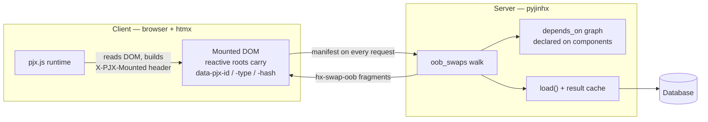
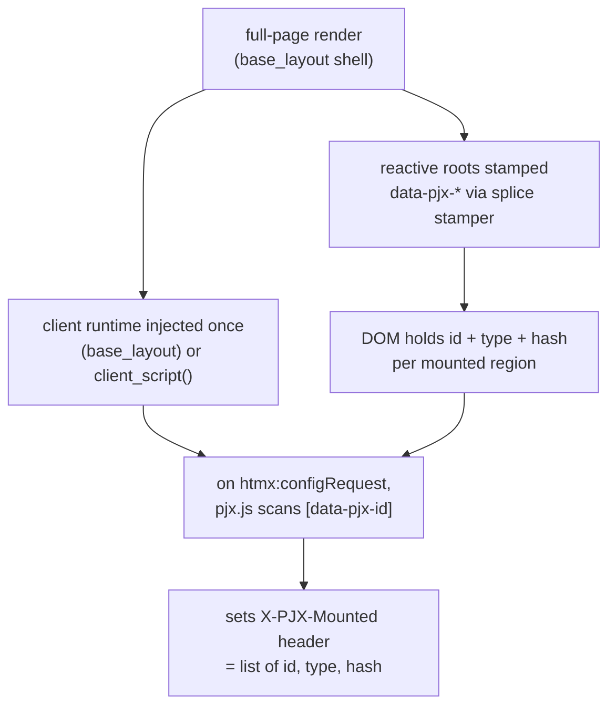
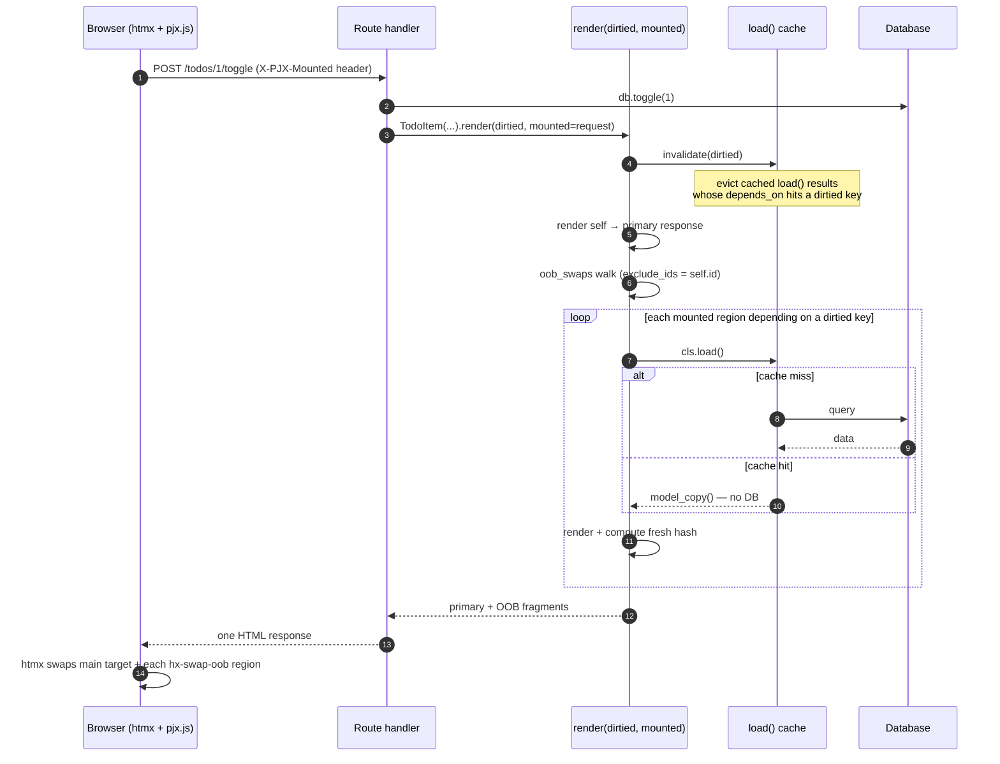
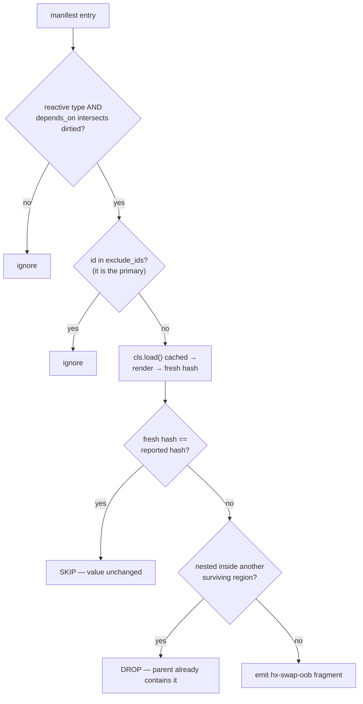
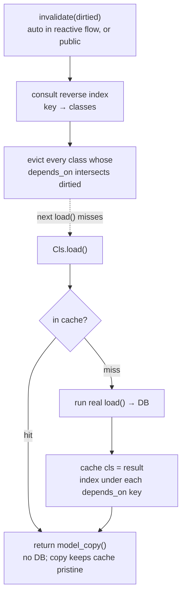

# Reactivity (Dependency-Aware OOB Swaps)

pyjinhx owns **composition**; HTMX owns **transport and swap**. Between them sits
the **state→view dependency graph** — which regions must change when a piece of
state changes. pyjinhx lets you declare that graph once, on the components, so a
mutation route re-emits exactly the mounted regions that depend on what changed.

A region that depends on a dirtied key is reloaded and re-emitted **only when its
value actually changed** — its freshly computed `state_hash()` is compared against
the hash the client reported, and a matching hash is skipped. (`render()`
integration and a `load()` cache are planned follow-ups.)

## 1. Make a component reactive

Subclass `ReactiveComponent` and declare **both** `depends_on` and a `load()`
classmethod — `ReactiveComponent` enforces both (a missing `load()` can't be
instantiated; a missing `depends_on` is a definition-time error):

```python
from typing import ClassVar
from pyjinhx import ReactiveComponent

class Counter(ReactiveComponent):
    remaining: int
    depends_on: ClassVar[set[str]] = {"todos"}

    @classmethod
    def load(cls) -> "Counter":
        return cls(id="counter", remaining=db.remaining())
```

- `depends_on` — the named state keys this component derives from.
- `load()` — rebuilds the component from the current world, independent of any route.
- `state_hash()` is provided by `BaseComponent` (hash of `model_dump_json()`); override only for custom hashing.

Reactive components are stamped with `data-pjx-id`, `data-pjx-type` (the class
name), and `data-pjx-hash` on their root element automatically.

## 2. Ship the client runtime

Mark your page shell with `base_layout=True` — the manifest runtime is injected once
on full-page renders (the marker is inherited, so subclasses of a shell stay layouts):

```python
from pyjinhx import BaseComponent

class AppShell(BaseComponent, base_layout=True):
    ...  # app_shell.html is your full page template
```

Or, in a raw Jinja layout, drop in `client_script()`:

```python
from pyjinhx import client_script

# in your template context
{"pjx_runtime": client_script()}
```
```html
<body>
  ...
  {{ pjx_runtime }}
</body>
```

The runtime attaches a manifest of mounted regions to every htmx request via the
`X-PJX-Mounted` header.

## 3. Emit OOB swaps from your route

Build the primary response from the mutation result and call `render()` with what
you dirtied plus the incoming request — the dependent regions ride along as
out-of-band swaps:

```python
@app.post("/todos/{id}/toggle")
def toggle(id, request):
    db.toggle(id)
    # dirtied defaults to TodoItem's own depends_on, so when the toggled item
    # depends on "todos" you can omit it; pass dirtied={...} to override.
    return TodoItem(id=id, text=..., done=...).render(mounted=request)
```

`render(dirtied=, mounted=)` renders the component itself as the primary response,
then appends an OOB swap for every *other* mounted reactive region whose
`depends_on` intersects `dirtied`, rebuilding each via its own `load()`. The
component's own region is never double-swapped.

`mounted` accepts a request-like object (the `X-PJX-Mounted` header is read off it
without importing any web framework), the raw header string, an already-parsed
list, or `None`. With neither `dirtied` nor `mounted`, `render()` is an ordinary
plain render.

### Lower-level: `oob_swaps()`

If you need the swaps without a primary (or want to compose them yourself), call
`oob_swaps(dirtied, mounted)` directly — it returns the concatenated `hx-swap-oob`
fragments (this is exactly what `render()` delegates to, passing
`exclude_ids={self.id}`):

```python
from pyjinhx import oob_swaps

swaps = oob_swaps(dirtied={"todos"}, mounted=request)
```

`oob_swaps`:
- keeps only mounted regions whose `depends_on` intersects `dirtied`,
- calls each region's `load()` and re-renders it,
- skips a region whose freshly computed `state_hash()` matches the hash the client
  reported (its DOM value is already current); a missing or mismatched hash always
  swaps — *when in doubt, swap*,
- drops any region nested inside another swapped region (the parent already contains it),
- returns concatenated `hx-swap-oob` fragments (empty if nothing changed).

The dependency graph lives in exactly one place — the `depends_on` declarations —
not smeared across endpoints. Adding a progress bar that declares
`depends_on = {"todos"}` makes it participate automatically; no endpoint changes.

## 4. `load()` results are cached

Every reactive component's `load()` is wrapped in a **process-global, dependency-keyed
cache**. Repeated reads — a page render, several components, successive requests —
return the cached result and skip the database until the relevant keys are dirtied:

```python
Counter.load()   # first call hits the DB
Counter.load()   # cached: no DB, returns an independent copy
```

A reactive `render(dirtied=...)` (and `oob_swaps`) evicts the dirtied keys before
reloading dependents, so swaps always reflect post-mutation state. For mutations that
happen outside a render — a background job, a webhook — call `invalidate` yourself:

```python
from pyjinhx import invalidate

def nightly_recalc():
    db.rebuild_todos()
    invalidate({"todos"})   # evict every cached load() that depends on "todos"
```

The cache holds one result per reactive component type (v1 is type-singleton) and
returns a fresh copy on every call, so callers can mutate what they get back without
affecting the cache. **Scope is per-process**: under multiple workers each process has
its own cache; cross-worker coherence is your application's responsibility (back it
with a shared store if you need it).

## Boundaries

- **Hash gating is a skip-hint, not correctness authority**: a matching client hash
  earns permission to skip; missing/unknown/mismatched always swaps. It saves
  bandwidth and DOM churn; database work is saved separately by the `load()` cache.
- **Type-singleton**: one mounted instance per reactive type is reloaded; instance-keyed deps (`"user:42"`) are deferred.
- **`mounted` accepts** a request-like object (header duck-typed out, no framework import), the raw header string, a parsed list, or `None`.
- **Reactivity is opt-in via `ReactiveComponent`**, which requires both `load()` and
  `depends_on`. `load()` is zero-arg in v1 (type-singleton); reactive `render()`
  auto-`load()`s dependents, so you never call `load()` yourself for a reactive render.
- **`load()` cache is per-process**: it saves database work on cache hits; eviction is
  dirtied-key driven (automatically in the reactive flow, or via `invalidate(dirtied)`).
  Cross-worker coherence is the application's responsibility.

## How it works (under the hood)

### The ownership split

Neither pyjinhx nor htmx owned the **state→view dependency graph** before. The split
is now explicit: the **server** owns the dependency graph and the data and decides what
changed; the **client** owns what is currently mounted and rides that up on every
request as a manifest. There is no per-session server state.



### Initial render → the manifest

On a full-page render, reactive roots are stamped with `data-pjx-*` and the client
runtime is injected once (via `base_layout=True`, or `client_script()` in a raw shell). The
runtime reads the already-stamped DOM at request time — it never watches for changes,
because DOM mutation is the *effect* of a swap, not its cause.



### A mutation request, end to end



### Inside `oob_swaps`: the decision pipeline

Every mounted region runs this gauntlet. Ordering matters: **hash-gate before
nesting-dedup**, so an unchanged parent never suppresses a changed child.



The four parent/child cases (regions nested in the rendered HTML):

| Parent | Child | Result |
| --- | --- | --- |
| changed | changed | swap parent only (its fresh HTML already holds the child) |
| changed | unchanged | swap parent only |
| **unchanged** | **changed** | **swap child alone** — only correct because gating removes the parent *before* dedup |
| unchanged | unchanged | swap nothing |

Governing invariant throughout: **when in doubt, swap** — missing, unknown, or
mismatched hashes always send.

### The `load()` cache

`load()` is auto-wrapped at class-definition time so it is cache-aware everywhere it is
called. Reads short-circuit the database; writes evict by dependency through a reverse
index. A `threading.Lock` guards the compound consult-then-mutate operations, while the
real `load()` (the database hit) runs outside the lock.


