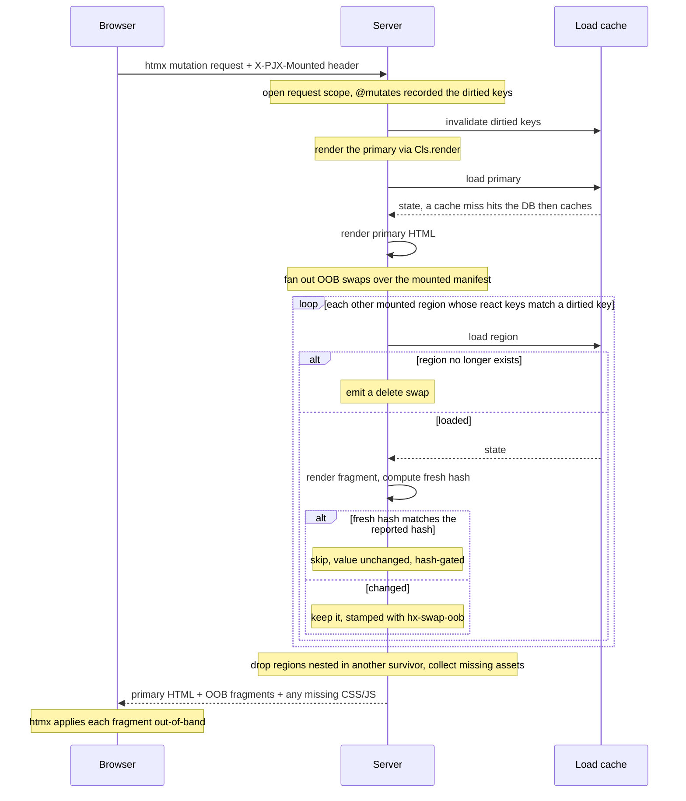
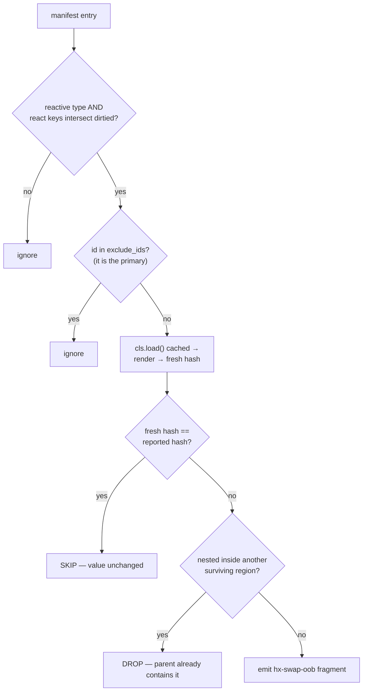

# Reactivity (Dependency-Aware OOB Swaps)

Reactivity is **opt-in**. You can use PyJinHx with `BaseComponent` only — see [Usage tiers](guide/usage-tiers.md). This guide covers Tier 3+: dependency-aware out-of-band HTMX swaps.

!!! info "Prerequisites"
    - HTMX for transport and swap
    - `Registry.request_scope()` on every HTTP request
    - [ClientBackend](api/client-backend.md) in middleware (recommended) so mutation routes need no framework kwargs on `render()`

pyjinhx owns **composition**; HTMX owns **transport and swap**. Between them sits
the **state→view dependency graph** — which regions must change when a piece of
state changes. pyjinhx lets you declare that graph once, on the components, so a
mutation route re-emits exactly the mounted regions that depend on what changed.

A region that depends on a dirtied key is reloaded and re-emitted **only when its
value actually changed** — its freshly computed `state_hash()` is compared against
the hash the client reported, and a matching hash is skipped.

> **Runnable example:** a full FastAPI + htmx todo app lives in
> [`examples/reactive_todo/`](https://github.com/paulomtts/pyjinhx/tree/master/examples/reactive_todo) —
> run `uv run uvicorn examples.reactive_todo.app:app --reload` and watch the counter,
> total, and clear button update out-of-band (and get skipped by hash-gating when their
> value doesn't change).

See the [Public API Index](reference/public-api.md) for every exported reactive symbol.

## Make a component reactive

Subclass `ReactiveComponent` and declare **both** the `react` class keyword and a
`load()` classmethod — `ReactiveComponent` enforces both (a missing `load()` can't be
instantiated; a missing `react` is a definition-time error):

```python
from pyjinhx import ReactiveComponent, MutationKey

class Keys(MutationKey):
    TODOS = "todos"

class Counter(ReactiveComponent, react={Keys.TODOS}):
    remaining: int

    @classmethod
    def load(cls) -> "Counter":
        return cls(remaining=db.remaining())   # id defaults to "counter"
```

- `react` — the **state keys** this component derives from, as a set of `MutationKey`
  members. These are the keys *you* choose to name pieces of state (`Keys.TODOS`,
  `Keys.USER`) — **not** component ids or types, and not client-side watchers. The
  server simply intersects a component's declared keys with the route's `dirtied` keys
  (and uses them to evict the `load()` cache): it's cache invalidation, not signals.
- `load()` — rebuilds the component from the current world, independent of any route.
- `id` — defaults to the **kebab-cased class name** (`Counter` → `"counter"`,
  `TodoCounter` → `"todo-counter"`), since a type-singleton's identity is its type, so
  `load()` need not set one. Pass an explicit `id` only for instance-keyed regions —
  multiple mounted instances of one type, e.g. `cls(id=f"todo-row-{user_id}", ...)`.
- `state_hash()` — canonical SHA-256 of sorted JSON from `model_dump(mode="json")`
  with `state_hash_exclude` applied (`id` is excluded by default). Override for custom
  hashing or add fields to `state_hash_exclude` for ephemeral UI-only state.
- `depends_on()` — optional runtime narrowing for load-cache indexing; the static `react` set must remain a superset. See [Runtime dependencies](#runtime-dependencies-depends_on).

Reactive components are stamped with `data-pjx-id`, `data-pjx-type` (the class
name), and `data-pjx-hash` on their root element automatically.

## Making builtins reactive

Builtins can be subclassed straight into reactive components — a subclass
inherits its ancestor's template and assets through the MRO:

```python
from pyjinhx import MutationKey, ReactiveComponent
from pyjinhx.builtins import PJXBadge

class Keys(MutationKey):
    TASKS = "tasks"

class LiveBadge(ReactiveComponent, PJXBadge, react={Keys.TASKS}):
    @classmethod
    def load(cls) -> "LiveBadge":
        return cls(label=f"{db.open_tasks()} open", color="brand")
```

No template or CSS needed: `LiveBadge` renders PJXBadge's `pjx_badge.html` and ships
`pjx-badge.css`. Resolution is **first found per kind** — ship your own
`live-badge.css` next to the subclass and it replaces `pjx-badge.css` (the
template and JS still come from PJXBadge); ship `live_badge.html` and the
template is yours too. Additions go through the `js=`/`css=` fields.

One rule: **subclass one component at a time.** `class X(PJXBadge, PJXCard)` raises
at class definition — two templates is no template.

Fit: display builtins (PJXBadge, PJXProgress, PJXAvatarStack, PJXEmptyState, PJXCard).
Stateful overlays (PJXModal, PJXDrawer, PJXPopover, PJXDropdown) are a poor fit — an OOB
swap replaces the region's DOM, so an open dialog snaps shut mid-interaction.

## Ship the client runtime

On root full-page renders, `pjx.js` is injected automatically unless the request
already carries a valid `X-PJX-Mounted` header (meaning the runtime is active in
the browser). First visits and requests without the header get the runtime; HTMX
requests from a page that already loaded it do not.

```python
from pyjinhx import BaseComponent

class AppShell(BaseComponent):
    ...  # app_shell.html is your full page template
```

For a raw Jinja layout (outside the component render path), drop in `client_script()`:

```python
from pyjinhx.client import client_script

# in your template context
{"pjx_runtime": client_script()}
```
```html
<body>
  ...
  {{ pjx_runtime }}
</body>
```

## Mounting a reactive component by tag

A reactive component placed as a bare PascalCase tag runs `load()` automatically
on cold render, so state that can't ride scalar tag attributes (e.g. a nested
child built in `load()`) is populated:

```html
<SidebarShell/>            <!-- type-singleton: runs load() -->
<UserCard user_id="42"/>   <!-- keyed: runs load("42"), id "user-card-42" -->
```

Remaining scalar attrs override the loaded values (`<UserCard user_id="42"
highlight="on"/>`). The pre-load-into-the-registry pattern still works and takes
precedence, but is no longer required for the common case.

The runtime attaches these headers to htmx requests:

| Header | Purpose |
|--------|---------|
| `X-PJX-Mounted` | Reactive regions currently in the DOM (`id`, `type`, `hash`, optional `load`) |
| `X-PJX-Assets` | URLs of `<script src>` and `<link rel="stylesheet">` already loaded |
| `X-PJX-Trigger` | `data-pjx-id` of the element that started the request — sent only when a reactive root triggered it |

Wire `FastAPIClientBackend` via `setup(app, ...)` — see the
[canonical snippet](integrations/fastapi.md#middleware-recommended) and
[Client Backend](api/client-backend.md). Mutation routes then call
`Cls.render(key)` with no extra kwargs — headers are read from the backend after
`@mutates`. Full-page routes call `.render()` plainly; boosted navigations skip
re-injecting `pjx.js` when `X-PJX-Mounted` is present.

## Emit OOB swaps from your route

A mutation route does exactly one thing: **`return <component>.render(...)`**. You
never call `load()` and never assemble swaps yourself. For a **reactive** primary,
call `render()` on the *class* — it auto-`load()`s the component for you. The
dependent regions ride along as out-of-band swaps:

```python
@app.post("/todos/toggle")
def toggle():
    db.toggle_all()
    return Counter.render()
```

With `@mutates` on the store method, pending dirtied keys drive OOB swaps automatically.

`Cls.render(*args)` loads the primary (`load(*args)` for keyed types, `load()` for
singletons), renders it as the main-target response, then appends OOB swaps for every
*other* mounted reactive region whose `react` keys intersect pending mutations from
`@mutates`. Only the primary id is excluded (htmx swaps it as the main-target response);
the region that *initiated* the request still updates out-of-band if it depends on the
dirtied keys — e.g. a "Clear completed (N)" button updates its own count.

`X-PJX-Trigger` is **client-only**: `pjx.js` reads it to drive loading indicators (which
region the user clicked). The server reactive walk (`render` / `oob_swaps`) never reads it —
it excludes only the primary id and gates everything else on `react` keys and hashes.

A **plain, non-reactive** primary has no `load()` to call, so you build it and render
the instance: `MyFragment(id=..., ...).render()`.

### OOB swaps ride along any render

The fan-out is not exclusive to `ReactiveComponent.render()`. **Any** component's
`.render()` appends OOB swaps for dirtied mounted reactive regions when a client
backend is active and mutations occurred in the request — including a non-reactive
command-result view. Fan-out happens once per request scope and never double-swaps a
region already present in the response body.

```python
@app.post("/generate")
def generate():
    report = controller.generate()      # @mutates dirties "reports", "quota"
    return ReportSummary(report=report).render()   # non-reactive; counters fan out OOB
```

For a response that renders no component at all (a raw string, a `204`), use
`from pyjinhx.reactive import ReactiveResponse` to attach the same fan-out:

```python
from pyjinhx.reactive import ReactiveResponse

@app.post("/dismiss")
def dismiss():
    controller.dismiss()                # @mutates dirties mounted regions
    return ReactiveResponse()           # no primary; dependents still fan out OOB
```

`ReactiveResponse` can also dirty keys and fan out in one call — pass the
mutation keys positionally, folding the `dirty()` into the response:

```python
@app.post("/dismiss")
def dismiss():
    controller.dismiss()                # plain mutation, no @mutates
    return ReactiveResponse(Keys.TODOS) # dirty TODOS + fan out dependents OOB
```

Pass `html=` for a primary body alongside the keys, e.g.
`ReactiveResponse(Keys.TODOS, html="<p>dismissed</p>")`.

!!! note "Without ClientBackend"
    Wire `ClientBackend` in middleware (via `setup()`) so `render()` reads manifest and asset headers automatically. Without a backend, reactive OOB is skipped when mutations are pending.

### Under the hood: `oob_swaps()`

`render()` delegates its dependency walk to `oob_swaps(dirtied, mounted)` — hash-gate, nesting-dedup, and delete-on-LookupError in one call. It's exported for tests and advanced composition, but routes return `render()`, not bare swaps. Full walk mechanics are in [How it works (under the hood)](#how-it-works-under-the-hood) below.

The dependency graph lives in exactly one place — the `react` class keyword
declarations — not smeared across endpoints. Adding a progress bar that declares
`react={Keys.TODOS}` makes it participate automatically; no endpoint changes.

### Instance-keyed regions (rows)

A reactive type can have **many mounted instances** — table rows, cards, list items.
A component is **instance-keyed iff its `load()` takes one resource parameter after
`cls`**; declare exactly one `PjxKey` field on the model:

```python
from typing import Annotated
from pyjinhx import MutationKey, PjxKey, ReactiveComponent

class Keys(MutationKey):
    TODOS = "todos"

class TodoItemRow(ReactiveComponent, react={Keys.TODOS}):
    todo_id: Annotated[int, PjxKey()]
    title: str = ""
    done: bool = False

    @classmethod
    def load(cls, todo_id: int | str) -> "TodoItemRow":
        resolved_id = int(todo_id)  # cache wrapper passes the key as a string
        t = store.get(resolved_id)
        return cls(
            id=f"row-{resolved_id}",
            todo_id=resolved_id,
            title=t.text,
            done=t.done,
        )
```

The `load()` key arrives as a **string** from the cache wrapper (the manifest serialises to JSON), so annotate `int | str` and convert inside `load()`.

- **`data-pjx-load`** is stamped from the `PjxKey` field and returned in the manifest
  so OOB reloads call `load(manifest.load)`.
- **Templates** use the field directly: `hx-post="/rows/{{ todo_id }}/toggle"`.
- **`react`** lists **state keys only** (e.g. `{Keys.TODOS}`). Pub-sub OOB reloads
  every mounted row whose `react` keys intersect pending mutations; hash-gating skips
  unchanged rows.

```python
@mutates(Keys.TODOS)
def toggle(todo_id: int) -> Todo:
    ...

@app.post("/rows/{todo_id}/toggle")
def toggle_row(todo_id: int):
    store.toggle(todo_id)
    return TodoItemRow.render(todo_id)
```

When a keyed entity is removed but still listed in the client's mounted manifest (e.g.
after **clear completed**), `oob_swaps` catches `LookupError` from `load(manifest.load)`
and emits a delete OOB swap (`delete:[data-pjx-id='…']`) so stale row regions are removed
from the DOM without a server error.

### Parametric per-instance keys

A keyed component's `react={...}` still declares the shared "family" key(s) — dirtying
one reloads and hash-checks *every* mounted instance of that type (unchanged, and still
useful for "refresh everything"). For the common case of "only this one instance
changed," `reactive_key()` derives a per-instance key from that same `MutationKey` and
the instance's own load-key, so only the matching mounted instance is reloaded:

```python
from pyjinhx import MutationKey, PjxKey, ReactiveComponent, dirty
from pyjinhx.keys import reactive_key
from typing import Annotated

class ChatKeys(MutationKey):
    MESSAGE = "chat.message"

class MessageBubble(ReactiveComponent, react={ChatKeys.MESSAGE}):
    message_id: Annotated[str, PjxKey()]
    text: str = ""

    @classmethod
    def load(cls, message_id: str) -> "MessageBubble":
        msg = store.get(message_id)
        return cls(id=f"bubble-{message_id}", message_id=message_id, text=msg.text)

# on settle, after finalizing one message:
dirty(reactive_key(ChatKeys.MESSAGE, message_id))
```

`reactive_key(key, arg)` builds the fixed-format string `f"{key}:{arg}"` — the same
convention `depends_on()`'s default and the OOB dispatch loop both already understand for
any keyed component, with **no override needed**. Dirtying `ChatKeys.MESSAGE` directly
still reloads every mounted `MessageBubble`; dirtying `reactive_key(ChatKeys.MESSAGE,
"42")` reloads only the bubble whose `message_id` is `"42"`.

Avoid declaring a `MutationKey` member whose value itself contains a `:` if you use keyed
reactive components — it could collide with an auto-derived key from a different member.

## State keys

Centralize reactive key strings in a `MutationKey` enum so `react=`, `dirtied`, and
`@mutates` share one vocabulary:

```python
from pyjinhx import MutationKey, ReactiveComponent

class Keys(MutationKey):
    TODOS = "todos"

class TodoCounter(ReactiveComponent, react={Keys.TODOS}):
    ...
```

`react=` only accepts `MutationKey` members — passing a bare string raises `TypeError`
at class-definition time. `@mutates` and `dirty()` accept `MutationKey` members or a
`reactive_key()` value (see [Parametric per-instance keys](#parametric-per-instance-keys)
below) — a bare string still raises `TypeError` at decoration/call time.

## Runtime dependencies (`depends_on`)

When a component's dependencies depend on loaded state, declare a static **superset**
via `react=` and override `depends_on()` to narrow at runtime:

```python
class Keys(MutationKey):
    USER = "user"
    SETTINGS = "settings"

class AdminPanel(ReactiveComponent, react={Keys.USER, Keys.SETTINGS}):
    is_admin: bool = False

    @classmethod
    def load(cls) -> "AdminPanel":
        user = get_current_user()
        return cls(is_admin=user.is_admin)

    def depends_on(self) -> set[str]:
        if self.is_admin:
            return {Keys.USER, Keys.SETTINGS}
        return {Keys.SETTINGS}
```

`depends_on()` narrows or widens load-cache reverse indexing (for a keyed component, its
default already widens to include the per-instance [derived key](#parametric-per-instance-keys)).
`oob_swaps` matches against the static `react` superset *plus* that same per-instance derived
key for keyed components; `dependency_graph()` still shows the static superset only. Dev mode
warns (or raises) when `depends_on()` returns keys outside that widened superset.

If you override `depends_on()` on a *keyed* component, include the derived key yourself (e.g.
`return super().depends_on() | {...}`) — `oob_swaps` still matches it independently of your
override, so omitting it from cache indexing leaves `LoadCache` unaware a per-instance dirty
should evict that instance's cached `load()` result.

## Mutation tracking (`@mutates`)

Decorate store mutation methods to invalidate the `load()` cache and accumulate
dirtied keys for the current request. The next reactive `render()` uses pending keys
from `@mutates` for OOB pub-sub:

```python
from pyjinhx import mutates

@mutates(Keys.TODOS)
def toggle(todo_id: int) -> Todo:
    ...

@app.post("/rows/{todo_id}/toggle")
def toggle_row(todo_id):
    store.toggle(todo_id)
    return TodoItemRow.render(todo_id)
```

Use `Registry.request_scope()` on every request when relying on `@mutates` — it
resets mutation tracking per request.

## Load context

Pass request-scoped dependencies into `load()` without global imports:

```python
from dataclasses import dataclass
from pyjinhx import MutationKey, PjxContext, ReactiveComponent

class Keys(MutationKey):
    TODOS = "todos"

@dataclass(frozen=True)
class AppContext(PjxContext):
    db: Database

class Counter(ReactiveComponent, react={Keys.TODOS}):
    @classmethod
    def load(cls, *, ctx: AppContext | None = None) -> "Counter":
        ctx = ctx or PjxContext.current()
        return cls(remaining=ctx.db.remaining())
```

Set context per request via `setup(app, context_factory=...)` or
`Registry.request_scope(load_context=AppContext(db=...))`. Cache keys remain
`(class, load_arg)` — context is not part of the cache identity.

## Development mode

Enable guardrails during local development:

```python
from pyjinhx.dev import enable_reactive_dev

enable_reactive_dev()          # warnings
enable_reactive_dev(strict=True)  # raise instead
```

Checks include:

- mutations recorded via `@mutates` but no reactive `render()` in the same request scope
- mutations pending but no `ClientBackend` active (OOB swaps skipped)
- `depends_on()` keys outside the static `react` superset

Inspect the dependency graph at startup:

```python
from pyjinhx.dev import dependency_graph, format_dependency_graph

print(format_dependency_graph())
# or format_dependency_graph(as_mermaid=True) for a flowchart
```

## `load()` results are cached

Every reactive component's `load()` is wrapped in a **dependency-keyed cache**.
Repeated reads within the same request return the cached result and skip the database
until the relevant keys are dirtied:

```python
Counter.load()   # first call hits the DB
Counter.load()   # cached: no DB, returns an independent copy
```

### Cache scope

You don't choose a scope — it follows the backend. By default (no `invalidation_backend`),
caching is per request; configuring a cross-worker backend extends it to cross-request per
worker process.

| Backend | Storage | Cross-request | Multi-worker safe |
|---------|---------|---------------|-------------------|
| none (default) | `ContextVar` inside `Registry.request_scope()` | no | yes |
| configured | module-level dict per worker, fanned out on mutation | yes | yes (backend keeps workers consistent) |

```python
from pyjinhx import setup

setup(app)  # per-request caching (default, multi-worker safe)
setup(app, invalidation_backend=...)  # cross-request per worker
```

Use `Registry.request_scope()` on every HTTP request (middleware) for instance registry
isolation and the request-tier cache (which dedups the OOB walk regardless of backend).

**Cache identity:** entries are keyed by `(component class, load key)` only. For per-user
isolation use a `PjxKey`-keyed instance (one entry per user id) or ensure `PjxContext`
data is stable for all requests sharing a cache entry.

Reactive `render()` (and `oob_swaps`) evicts pending dirtied keys before reloading
dependents. For mutations outside a render — a background job, a webhook — call
`LoadCache.invalidate` yourself:

```python
from pyjinhx.cache import LoadCache

def nightly_recalc():
    db.rebuild_todos()
    LoadCache.invalidate({Keys.TODOS})
```

The cache holds one result per `(type, key)` and returns a fresh copy on every call, so
callers can mutate what they get back without affecting the cache.

### Multi-worker invalidation

For multi-worker production, configure an `InvalidationBackend` so `invalidate()` fans out
to every process. This is also what enables cross-request caching per worker:

```python
from pyjinhx import PjxSettings, setup
from pyjinhx.integrations.redis import RedisInvalidationBackend

setup(
    app,
    settings=PjxSettings(
        invalidation_backend=RedisInvalidationBackend("redis://localhost:6379/0"),
    ),
)
```

Requires `pip install pyjinhx[redis]`. See [Redis integration](api/integrations-redis.md).

## Loading indicators (in-flight)

A reactive region can show a loading indicator while an update is in flight, then swap in the
fresh HTML when the response arrives. You opt in **in the template** by adding a
`data-pjx-loading` attribute to whichever element(s) should show the effect — the component
root, or any element inside it:

```html
<!-- item_row.html: shimmer the whole row while it reloads -->
<li class="todo" data-pjx-loading="skeleton">…</li>

<!-- clear_button.html: spin just this button -->
<button class="clear" data-pjx-loading="spinner">Clear completed ({{ completed }})</button>
```

Two built-in styles:

- **`"skeleton"`** — a silhouette shimmer in place of the element's content (the box keeps its
  shape; the content is hidden while it shimmers).
- **`"spinner"`** — a dim, blurred overlay with a centered circular progress indicator; the
  content stays underneath and the element is non-interactive while loading.

**Auto-triggered — no per-route wiring.** Every reactive root is stamped with `data-pjx-reacts`
(its `react` keys). When an htmx request starts, `pjx.js` reads the triggering region's
`data-pjx-reacts` as the predicted dirtied set, then lights the `data-pjx-loading` elements of
**every mounted region whose keys intersect it** — the swap target *and* its out-of-band
dependents. Declaring the `react` class keyword is all it takes for a component's loading
elements to fire on the right mutations; routes don't change.

- A loading element is matched through its **enclosing reactive root**, so it can sit on the
  root or any inner element; the root supplies the reactivity and the instance key.
- **Instance-keyed rows stay scoped:** the template renders per instance, so each instance
  carries the attribute, but only the instance whose `data-pjx-load` matches the trigger (plus
  singleton dependents) lights up — clicking one row doesn't shimmer its siblings.
- Indicators are **ref-counted across overlapping requests** and re-applied across swaps, so a
  shared dependent stays lit until the *last* in-flight request finishes.
- The class clears once the response settles (swapped regions replace themselves; hash-gated,
  aborted, and errored requests are released too). Purely a client affordance — no server
  reactive semantics change, and it is off unless an element opts in.

A trigger can also carry `data-pjx-loading-extra="<css-selector>"` to light regions the
dependency walk can't predict — e.g. the specific rows a bulk action like "clear completed" is
about to remove. Matched regions use their own `data-pjx-loading` style.

### Styling and overrides

Both styles read overridable CSS custom properties (with sensible defaults), so you can restyle
them from your own CSS without touching the runtime — set the tokens on `:root`, a theme
wrapper, or a specific element:

```css
:root {
  /* spinner */
  --pjx-spinner-color: #b8ff4d;             /* the moving arc */
  --pjx-spinner-track: rgba(255, 255, 255, 0.4);
  --pjx-spinner-overlay: rgba(0, 0, 0, 0.45); /* dim/scrim behind it */
  --pjx-spinner-blur: 2px;
  --pjx-spinner-size: 1.1em;
  --pjx-spinner-thickness: 2px;
  --pjx-spinner-speed: 0.6s;
  /* skeleton */
  --pjx-skeleton-color: rgba(127, 127, 127, 0.12);     /* base */
  --pjx-skeleton-highlight: rgba(127, 127, 127, 0.30); /* shimmer sweep */
  --pjx-skeleton-radius: 6px;
  --pjx-skeleton-speed: 1.2s;
}
```

Want a different effect entirely? Use your own value (e.g. `data-pjx-loading="pulse"`) and
style `.pjx-loading--pulse` yourself — `pjx.js` applies `.pjx-loading--<value>` regardless of
the name.

## How it works (under the hood)

**The ownership split.** Neither pyjinhx nor htmx owned the **state→view dependency
graph** before; now it is explicit. The **server** owns the graph and the data and
decides what changed; the **client** owns what is currently mounted and rides that up on
every request as `X-PJX-Mounted`. There is no per-session server state — reactive roots
are stamped with `data-pjx-*` at render time, and `pjx.js` reads the already-stamped DOM
on `htmx:configRequest` (it never watches for changes; a DOM mutation is the *effect* of
a swap, not its cause).

A mutation route returns `Cls.render()`. That invalidates the `load()` cache for the
dirtied keys, renders the primary as the main response, then runs the `oob_swaps` walk
(with `exclude_ids = {primary.id}`) over the mounted manifest — sending the primary plus
every dependent swap back in one response:



Every region in that fan-out runs the same gauntlet — and ordering matters:
**hash-gate before nesting-dedup**, so an unchanged parent never suppresses a changed
child:



The four parent/child cases (regions nested in the rendered HTML):

| Parent | Child | Result |
| --- | --- | --- |
| changed | changed | swap parent only (its fresh HTML already holds the child) |
| changed | unchanged | swap parent only |
| **unchanged** | **changed** | **swap child alone** — only correct because gating removes the parent *before* dedup |
| unchanged | unchanged | swap nothing |

Governing invariant throughout: **when in doubt, swap** — missing, unknown, or
mismatched hashes always send. Hash gating is a *skip-hint*, not correctness authority:
it saves bandwidth and DOM churn, while database work is saved separately by the
`load()` cache (each cached `load()` returns a `model_copy()`, so the DB is hit only on
a miss; writes evict by dependency through a reverse index, guarded by a lock around the
consult-then-mutate while the real `load()` runs outside it).
