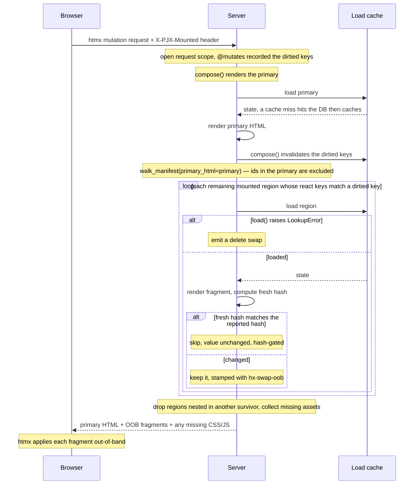
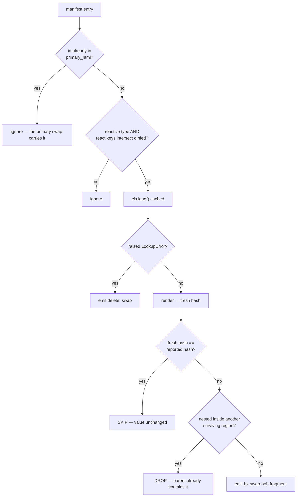

# Reactivity (Dependency-Aware OOB Swaps)

Reactivity is **opt-in**. You can use PyJinHx with `BaseComponent` only — see [Usage tiers](guide/usage-tiers.md). This guide covers Tier 3+: dependency-aware out-of-band HTMX swaps.

!!! info "Prerequisites"
    - HTMX for transport and swap
    - One request scope per HTTP request — `setup(app, ...)` opens it for you
    - [IntegrationBackend](api/client-backend.md) in middleware (via `setup(app, ...)`), which parses the client's headers onto the session and routes handler returns through [`compose()`](api/responses.md)

pyjinhx owns **composition**; HTMX owns **transport and swap**. Between them sits
the **state→view dependency graph** — which regions must change when a piece of
state changes. pyjinhx lets you declare that graph once, on the components, so a
mutation route re-emits exactly the mounted regions that depend on what changed.

A region that depends on a dirtied key is reloaded and re-emitted **only when its
value actually changed** — its freshly computed `state_hash()` is compared against
the hash the client reported, and a matching hash is skipped.

See the [Public API Index](reference/public-api.md) for every exported reactive symbol.

## Make a component reactive

Subclass `ReactiveComponent` and declare the `react` class keyword plus a
`load()` classmethod — `load()` overrides `ReactiveComponent`'s field-default
factory. `react` defaults to `()`, so omitting it is legal: the component is
still reactive (it is stamped, mounted and cached) but no dirtied key ever
reaches it, so it never fans out.

```python
from typing import Self

from pyjinhx import ReactiveComponent, MutationKey


class Keys(MutationKey):
    TODOS = "todos"


class Counter(ReactiveComponent, react={Keys.TODOS}):
    remaining: int = 0

    @classmethod
    def load(cls) -> Self:
        return cls(remaining=db.remaining())
```

Mount it with an explicit, stable id — `<Counter id="counter"/>` — so the region
keeps the same `data-pjx-id` across renders.

- `react` — the **state keys** this component derives from, as a set of `MutationKey`
  members. These are the keys *you* choose to name pieces of state (`Keys.TODOS`,
  `Keys.USER`) — **not** component ids or types, and not client-side watchers. The
  server simply intersects a component's declared keys with the route's `dirtied` keys
  (and uses them to evict the `load()` cache): it's cache invalidation, not signals.
- `load()` — a classmethod factory that returns a freshly populated instance from the
  current world. It runs automatically right before a mounted instance's render,
  memoized per request under the class + load key.
- `id` — an unset `id` gets an auto-generated `pjx-<n>`, which is *not* stable across
  renders. A reactive region has to be addressable by the client's mounted manifest, so
  always give one **where the instance is constructed**: an `id=` attribute at the mount
  site (`<Counter id="counter"/>`), or `id=f"row-{todo_id}"` in the route that builds the
  row. Setting it inside `load()` works only on the tag-mount path — a direct route return
  copies every field *except* `id` off the loaded instance, and OOB fan-out overwrites it
  with the manifest's id — so it is a convenience there, never the thing that makes a
  region addressable.
- `state_hash()` — canonical SHA-256 of sorted JSON from `model_dump(mode="json")`
  with `state_hash_exclude` applied (`id` is excluded by default). Override for custom
  hashing, or add fields to `state_hash_exclude` for ephemeral UI-only state — see
  [Fields that change on every render](#fields-that-change-on-every-render) for the
  fields that *must* go there.

Reactive components are stamped on their root element automatically with four
attributes: `data-pjx-id`, `data-pjx-type` (the **snake_case tag name**, e.g.
`todo_item_row`, not the class name), `data-pjx-hash`, and — only for a class that
declares a `PjxKey` field — `data-pjx-load`.

`data-pjx-reacts` is **not** stamped by the framework; see [Loading
indicators](#loading-indicators-in-flight).

### Fields that change on every render

A field whose value is minted fresh every time the component is built — a
`uuid4().hex` trace or request id, a `datetime.now()` timestamp that is not read
back from persisted data — has to be named in `state_hash_exclude`:

```python
from uuid import uuid4

from pydantic import Field


class OrderPanel(ReactiveComponent, react={Keys.TODOS}):
    state_hash_exclude = frozenset({"id", "trace_id"})

    total: int = 0
    trace_id: str = Field(default_factory=lambda: uuid4().hex)
```

`state_hash()` digests every field that is not excluded, so an unexcluded
per-render value gives that instance a hash that never repeats. The hash gate —
the check that drops a swap when a region's freshly computed hash equals the one
the client reported — then has nothing to match on and can never fire, so every
dirty event on the parent forces an `outerHTML` swap over every nested child
region even when the child's own data did not move. Nothing raises and nothing
warns; the only symptom is over-swapping.

`state_hash_exclude` is a `ClassVar[frozenset[str]]`, and a subclass's value
**replaces** the inherited set rather than adding to it. Writing
`frozenset({"trace_id"})` un-excludes `id`, which puts a per-render auto id back
into the digest and reintroduces the same never-repeating hash. Always repeat
`"id"`.

## Making builtins reactive

Builtins can be subclassed straight into reactive components — a subclass
inherits its ancestor's template and assets through the MRO:

```python
from pyjinhx import MutationKey, ReactiveComponent
from pyjinhx.builtins import PJXBadge


class Keys(MutationKey):
    TASKS = "tasks"


class LiveBadge(ReactiveComponent, PJXBadge, react={Keys.TASKS}):
    @classmethod
    def load(cls) -> "LiveBadge":
        return cls(label=f"{db.open_tasks()} open", color="brand")
```

No template or CSS needed: `LiveBadge` renders PJXBadge's `pjx_badge.pjx` and ships
`pjx_badge.css`. Resolution is **first found per kind** — ship your own
`live_badge.css` next to the subclass and it replaces `pjx_badge.css` (the
template and JS still come from PJXBadge); ship `live_badge.pjx` and the
template is yours too. Additions go through the `js=`/`css=` fields.

One rule: **subclass one component at a time.** `class X(PJXBadge, PJXCard)` does not
raise — MRO resolution simply takes the first base's template and ignores the second, so
`X` silently renders as a badge. Inherit from one component base and compose the rest.

Fit: display builtins (PJXBadge, PJXProgress, PJXAvatarStack, PJXEmptyState, PJXCard).
Stateful overlays (PJXModal, PJXDrawer, PJXPopover, PJXDropdown) are a poor fit — an OOB
swap replaces the region's DOM, so an open dialog snaps shut mid-interaction.

## Ship the client runtime

On root full-page renders, `pjx.js` is injected automatically unless the request
already carries a valid `X-PJX-Mounted` header (meaning the runtime is active in
the browser). First visits and requests without the header get the runtime; HTMX
requests from a page that already loaded it do not.

```python
from pyjinhx import BaseComponent


class AppShell(BaseComponent): ...  # app_shell.pjx is your full page template
```

For a raw Jinja layout (outside the component render path), build the tags yourself. The
readers return **bare JS source** — no `<script>` wrapper — and `pjx.js` needs htmx loaded
first, so assemble them in the same order `inject_runtime()` does and hand the result to the
template as `Markup` (an unwrapped string would be autoescaped into visible page text):

!!! note "Not yet public"
    The `pyjinhx.client` readers below are **not** exported from `pyjinhx` and their
    spelling may change. They are the only way to assemble the runtime by hand today;
    if your page shell is a pyjinhx component, `setup(app)` injects all of this for you
    and you need none of it.

```python
from markupsafe import Markup
from pyjinhx.client import (  # not yet public
    read_loading_indicator_js,
    read_page_loader_js,
    read_pjx_runtime,
    read_pjx_style_css,
    read_vendored_htmx,
)

pjx_runtime = Markup(
    f'<style id="pjx-style">{read_pjx_style_css()}</style>'
    f"<script>{read_vendored_htmx()}{read_pjx_runtime()}"
    f"{read_loading_indicator_js()}{read_page_loader_js()}</script>"
)

# in your template context
{"pjx_runtime": pjx_runtime}
```
```html
<body>
  ...
  {{ pjx_runtime }}
</body>
```

Vendored htmx first (it guards itself, so a page with its own htmx keeps that copy), then
`pjx.js`, then the two loading artifacts, which call `pjx.region`/`pjx.loadingTargets`. Drop
the style tag and the loading artifacts only if you do not use [loading
indicators](#loading-indicators-in-flight).

## Mounting a reactive component by tag

A reactive component placed as a bare PascalCase tag runs `load()` automatically
on cold render, so state that can't ride scalar tag attributes (e.g. a nested
child built in `load()`) is populated:

```html
<SidebarShell id="sidebar"/>                 <!-- type-singleton: runs load() -->
<UserCard id="user-42" user_id="42"/>        <!-- keyed: runs load(user_id=42) -->
```

The key attribute is validated to the field's declared type before `load()` is
called, so a `user_id: Annotated[int, PjxKey()]` arrives as the `int` `42`, not
`"42"`. Give every mounted tag an explicit `id` — nothing derives one from the
class or the key, and an unset `id` becomes a per-render `pjx-<n>`.

Remaining scalar attrs override the loaded values (`<UserCard id="user-42"
user_id="42" highlight="on"/>`). A tag resolves against the process-wide tag → class
registry only; the request-scoped **instance** registry that reactivity uses is never
consulted on the tag path, so pre-loading an instance into it changes nothing. A tag no
class claims is not an error either — it goes back into the stream as literal markup.

The runtime attaches these headers to htmx requests:

| Header | Purpose |
|--------|---------|
| `X-PJX-Mounted` | Reactive regions currently in the DOM (`id`, `type`, `hash`, optional `load`) |
| `X-PJX-Assets` | URLs of `<script src>` and `<link rel="stylesheet">` already loaded |
| `X-PJX-Trigger` | `data-pjx-id` of the element that started the request — sent only when a reactive root triggered it |

Wire `FastAPIBackend` via `setup(app, ...)` — see the
[canonical snippet](integrations/fastapi.md#middleware-recommended) and
[Integration Backend](api/client-backend.md). Mutation routes then **return** the primary
component and the adapter composes the response — headers are read from the request scope
after `@mutates`. Full-page routes return their component the same way; boosted navigations
skip re-injecting `pjx.js` when `X-PJX-Mounted` is present.

## Emit OOB swaps from your route

A mutation route does exactly one thing: **`return <component>`**. You never call
`load()` yourself, never call `.render()`, and never assemble swaps by hand. For a
**reactive** primary, construct the instance (its `PjxKey` field set, if it has one) and
return it — the composer auto-`load()`s it before rendering. The dependent regions ride
along as out-of-band swaps:

```python
@app.post("/todos/toggle")
def toggle():
    db.toggle_all()
    return Counter(id="counter")
```

With `@mutates` on the store method, pending dirtied keys drive OOB swaps automatically.

The render path runs the primary's `load()` (populating it from the current world) and
serializes it as the main-target response; `compose()` then attaches an OOB swap for every
mounted reactive region whose `react` keys intersect pending mutations from `@mutates`.
**Every `data-pjx-id` the serialized primary already carries is excluded** — not just the
primary's own id — because htmx will swap that whole subtree as the main-target response
and a second OOB swap of a region inside it would fight the first. A dependent region that
is *not* in the primary body still updates out of band even if it initiated the request —
e.g. a "Clear completed (N)" button updates its own count.

`X-PJX-Trigger` is **client-only**: `pjx.js` reads it to drive loading indicators (which
region the user clicked). The server reactive walk (`walk_manifest` / `oob_swaps`) never
reads it — exclusion comes from the primary markup, and everything else is gated on
`react` keys and hashes.

A **plain, non-reactive** primary has no `load()` to call, so you build it and return it:
`return MyFragment(id=..., ...)`.

### What the composer accepts, and where fan-out comes from

Fan-out is **not** a property of `.render()`. `.render()` returns one component's markup
and nothing else; it always has. Fan-out belongs to
[`pyjinhx.responses.compose()`](api/responses.md), which every backend funnels handler
returns through, and it is attached on **every** return that produces a body — because
the dirtied keys belong to the request, not to whichever spelling the handler reached
for.

`compose()` recognizes exactly three shapes:

| Handler returns | Primary body |
|-----------------|--------------|
| a `BaseComponent` | that component, rendered |
| `None` | empty (OOB-only response, carries `HX-Reswap: none`) |
| a `str`, a `Markup`, or any object with `__html__` | that markup verbatim |

Anything else — a framework `Response`, a `RedirectResponse`, a dict destined for JSON —
is `PASSTHROUGH`: `compose()` does not touch it and the backend keeps its own value. Such
a return gets **no fan-out**, since there is no pyjinhx body to attach it to.

One thing does happen to a passed-through result on the way out: a response whose status
is 3xx *and* which carries a `Location` header is rewritten to `204` plus `HX-Redirect`
when the request carries `HX-Request`, so htmx performs a real browser navigation instead
of swapping the redirect target's body into the trigger. Detection is duck-typed on that
shape, so hand-built and third-party redirect responses translate too; a non-htmx request
gets the real 3xx untouched. It is always on — there is no pyjinhx `redirect()` helper and
no setting. For `HX-Location` (a client-side "boosted" navigation) return the header
yourself: `Response(status_code=204, headers={"HX-Location": "/x"})`, which passes through
untouched.

So a non-reactive command-result view fans out just by being returned:

```python
@app.post("/generate")
def generate():
    report = controller.generate()  # @mutates dirties "reports", "quota"
    return ReportSummary(report=report)  # non-reactive; counters fan out OOB
```

And a route with no component to show returns `None`:

```python
@app.post("/dismiss")
def dismiss():
    controller.dismiss()  # @mutates dirties mounted regions
    return None  # no primary; dependents still fan out OOB
```

Composing never dirties anything itself. Dirty the keys first — with `@mutates` on the
store method, or `dirty(...)` inline — then return the body:

```python
from pyjinhx import dirty


@app.post("/dismiss")
def dismiss():
    controller.dismiss()  # plain mutation, no @mutates
    dirty(Keys.TODOS)
    return "<p>dismissed</p>"  # str primary; dependents fan out OOB
```

Fan-out happens once per request scope and never double-swaps a region the primary body
already carries.

!!! note "Without an integration backend"
    Fan-out itself is unconditional — `compose()` always attaches it. What a backend
    supplies is the *input*: `PjxScopeMiddleware` (wired by `setup(app, ...)`) parses
    `X-PJX-Mounted` and `X-PJX-Assets` onto the session, registers the root-stamping and
    instance-registration hooks, and routes handler returns through `compose()`. With no
    backend, nothing calls `compose()` and the session's manifest is empty, so there is
    nothing to fan out to.

### Under the hood: `oob_swaps()`

`compose()` — not `render()` — owns the dependency walk. It evicts the dirtied keys from
the `load()` cache, calls `walk_manifest(...)` over the client's mounted manifest, and
passes the surviving `FanoutCandidate`s to `oob_swaps(candidates)`, which turns them into
the response's OOB fragments (hash-gating happens in the walk; `oob_swaps` renders swaps
and delete-fragments). Both are exported for tests and advanced composition, but routes
return a component, not bare swaps. Full walk mechanics are in [How it works (under the
hood)](#how-it-works-under-the-hood) below.

The dependency graph lives in exactly one place — the `react` class keyword
declarations — not smeared across endpoints. Adding a progress bar that declares
`react={Keys.TODOS}` makes it participate automatically; no endpoint changes.

### Instance-keyed regions (rows)

A reactive type can have **many mounted instances** — table rows, cards, list items.
A component is **instance-keyed** by declaring exactly one `PjxKey` field on the model.
That field's value is the instance's load-cache key and is stamped as `data-pjx-load`;
the `id` is still yours to set, and deriving it from the key is the usual way:

```python
from typing import Annotated
from pyjinhx import MutationKey, PjxKey, ReactiveComponent


class Keys(MutationKey):
    TODOS = "todos"


class TodoItemRow(ReactiveComponent, react={Keys.TODOS}):
    todo_id: Annotated[int, PjxKey()]
    title: str = ""
    done: bool = False

    @classmethod
    def load(cls, todo_id: int) -> "TodoItemRow":
        t = store.get(todo_id)  # raises KeyError if the todo is gone — let it out
        return cls(id=f"row-{t.id}", todo_id=t.id, title=t.text, done=t.done)
```

**Write `load()` against the declared type.** `data-pjx-load` round-trips through an HTML
attribute, so the key comes back off the client as the string `"7"` — but the framework
validates it back to the `PjxKey` field's declared type before calling `load()`. A
`todo_id: Annotated[int, PjxKey()]` therefore arrives as the `int` `7`. Never coerce it
yourself, and never widen the signature to `int | str`.

- **`data-pjx-load`** is stamped from the `PjxKey` field and returned in the manifest
  so OOB reloads call `load(<key>)`.
- **Templates** use the field directly: `hx-post="/rows/{{ todo_id }}/toggle"`.
- **`react`** lists **state keys only** (e.g. `{Keys.TODOS}`). Pub-sub OOB reloads
  every mounted row whose `react` keys intersect pending mutations; hash-gating skips
  unchanged rows.

```python
@mutates(Keys.TODOS)
def toggle(todo_id: int) -> Todo: ...


@app.post("/rows/{todo_id}/toggle")
def toggle_row(todo_id: int):
    store.toggle(todo_id)
    return TodoItemRow(todo_id=todo_id, id=f"row-{todo_id}")
```

### `load()` must raise `LookupError` for a region that is gone

When a keyed entity is removed but the client still shows its row (e.g. after **clear
completed**), the row is still in the mounted manifest and the walk will try to reload it.
A raised `LookupError` is the **sole** signal that the region no longer exists:
`walk_manifest` catches it, marks the region `"missing"`, and `oob_swaps` emits

```html
<div hx-swap-oob="delete:[data-pjx-id='row-7']"></div>
```

which takes the stale region out of the DOM without a server error.

Nothing else means "gone". In particular a **miss in the request-scoped instance registry
does not** — that registry is written only by this request's own renders, so any region
outside the primary tree misses it as a matter of course.

!!! warning "Do not swallow your store's `KeyError`"
    This makes raising part of `load()`'s **contract**. A `load()` that catches the store's
    `KeyError` and returns a field-default instance instead suppresses the signal, and the
    region is swapped with a *blank* render instead of being deleted — a silent failure
    that looks like an emptied-out row rather than an error.

    `KeyError` and `IndexError` both subclass `LookupError`, so an ordinary `dict[...]` or
    list index against your own store is already the correct signal. Let it out:

    ```python
    @classmethod
    def load(cls, todo_id: int) -> "TodoItemRow":
        t = store.get(todo_id)  # KeyError -> delete swap. Do not wrap in try/except.
        return cls(id=f"row-{t.id}", todo_id=t.id, title=t.text, done=t.done)
    ```

    If a route wants a 404 for the same missing id, raise it *in the route* — `load()`
    stays a plain lookup.

### Parametric per-instance keys

A keyed component's `react={...}` still declares the shared "family" key(s) — dirtying
one reloads and hash-checks *every* mounted instance of that type (unchanged, and still
useful for "refresh everything"). For the common case of "only this one instance
changed," `reactive_key()` derives a per-instance key from that same `MutationKey` and
the instance's own load-key, so only the matching mounted instance is reloaded:

```python
from typing import Annotated

from pyjinhx import MutationKey, PjxKey, ReactiveComponent, dirty, reactive_key


class ChatKeys(MutationKey):
    MESSAGE = "chat.message"


class MessageBubble(ReactiveComponent, react={ChatKeys.MESSAGE}):
    message_id: Annotated[str, PjxKey()]
    text: str = ""

    @classmethod
    def load(cls, message_id: str) -> "MessageBubble":
        return cls(
            id=f"bubble-{message_id}",
            message_id=message_id,
            text=store.get(message_id).text,
        )


# on settle, after finalizing one message:
dirty(reactive_key(ChatKeys.MESSAGE, message_id))
```

`reactive_key(key, arg)` builds the fixed-format string `f"{key}:{arg}"` — the same
convention the OOB dispatch loop already understands for any keyed component, with
**no override needed**. Dirtying `ChatKeys.MESSAGE` directly still reloads every mounted
`MessageBubble`; dirtying `reactive_key(ChatKeys.MESSAGE, "42")` reloads only the bubble
whose `message_id` is `"42"`.

`@mutates` takes the same idea as a `key=` keyword instead of calling `reactive_key()` yourself:

- `dirty(reactive_key(ChatKeys.MESSAGE, message_id))` dirties exactly one bubble; the caller already has the id, so no `key=` helper is needed. Composition takes no keys at all — dirty first, then return the body.
- `@mutates(ChatKeys.MESSAGE, key=lambda message_id: message_id)` is `key=` as a
  *callable* instead, since `@mutates` runs at decoration time, before any call
  arguments exist — see [Mutation tracking](#mutation-tracking-mutates) below.

It applies to every positional key passed alongside it.

Avoid declaring a `MutationKey` member whose value itself contains a `:` if you use keyed
reactive components — it could collide with an auto-derived key from a different member.

## State keys

Centralize reactive key strings in a `MutationKey` enum so `react=`, `dirtied`, and
`@mutates` share one vocabulary:

```python
from pyjinhx import MutationKey, ReactiveComponent


class Keys(MutationKey):
    TODOS = "todos"


class TodoCounter(ReactiveComponent, react={Keys.TODOS}): ...
```

`react=` is lenient — it stringifies whatever you give it, so a bare `react={"todos"}`
is accepted silently. Use `MutationKey` members anyway: the other side is strict.
`@mutates` and `dirty()` accept `MutationKey` members or a `reactive_key()` value (see
[Parametric per-instance keys](#parametric-per-instance-keys) below) and raise `TypeError`
on a bare string at decoration/call time, so a hand-typed `react=` string can only ever be
dirtied by a key that came from the enum.

## Mutation tracking (`@mutates`)

Decorate store mutation methods to accumulate dirtied keys for the current request.
`@mutates` **only records** — it evicts nothing itself. `compose()` reads the recorded
keys with `get_dirtied()`, calls `invalidate()` on them, and only then walks the manifest
for OOB pub-sub:

```python
from pyjinhx import mutates


@mutates(Keys.TODOS)
def toggle(todo_id: int) -> Todo: ...


@app.post("/rows/{todo_id}/toggle")
def toggle_row(todo_id):
    store.toggle(todo_id)
    return TodoItemRow(todo_id=todo_id, id=f"row-{todo_id}")
```

This dirties `Keys.TODOS` on every call, so it reloads every mounted `TodoItemRow`
regardless of which one changed. `key=` derives a [per-instance
key](#parametric-per-instance-keys) instead — it's called with the wrapped function's
own arguments, and its return value feeds `reactive_key()` for every key passed to
`@mutates`:

```python
@mutates(Keys.TODOS, key=lambda todo_id: todo_id)
def toggle(todo_id: int) -> Todo: ...
```

Now only the mounted `TodoItemRow` whose load-key matches `todo_id` reloads.

`@mutates` needs a request scope on every request — `setup(app)` opens one, which is what
resets mutation tracking per request.

## Load context

Pass request-scoped dependencies into `load()` without global imports. Subclass
`AppContext` (`from pyjinhx import AppContext`) — not `PjxContext`, which is the
framework's own read-only view of request state and is not meant to be
subclassed by apps:

```python
from typing import Self

from pyjinhx import AppContext, MutationKey, ReactiveComponent


class Keys(MutationKey):
    TODOS = "todos"


class MyAppContext(AppContext):
    def __init__(self, db: Database) -> None:
        self.db = db


class Counter(ReactiveComponent, react={Keys.TODOS}):
    remaining: int = 0

    @classmethod
    def load(cls, ctx: MyAppContext | None = None) -> Self:
        return cls(remaining=ctx.db.remaining() if ctx else 0)
```

`ctx` is injected by annotation, not by parameter name — declare it optional
(`ctx: MyAppContext | None = None`) to keep `load()` valid when called outside a request
scope or one with no context configured, in which case `ctx` is `None`. The default also
keeps static type checkers from flagging `Component.load()` call sites, since the runtime
wrapper injects `ctx` and never requires callers to pass it. Set context
per request via `setup(app, context_factory=...)`.
Cache keys remain `(class, load key)` — context is not part of the cache identity.

## Development mode

Enable guardrails during local development with the `reactive_dev` setting — a `setup()`
keyword, or `PJX_REACTIVE_DEV=1` in the environment:

```python
from pyjinhx import setup

setup(app, components_root="./components", reactive_dev=True)
```

!!! note "Not yet public"
    `strict=True` (raise instead of log) has no setting yet; it is only reachable through
    `pyjinhx.dev`, which is not exported from `pyjinhx`:

    ```python
    from pyjinhx.dev import enable_reactive_dev  # not yet public

    enable_reactive_dev(strict=True)
    ```

One check runs today, `warn_unconsumed_mutations()`: it reports keys this request dirtied
that nothing in the request loaded under, so dirtying them evicted nothing — usually a
typo in a key, a key nothing reads any more, or a `dirty()` that fired before the `load()`
which would have registered the dependency. It is observational: it never evicts, dirties
or re-renders anything.

Inspect the dependency graph at startup:

```python
from pyjinhx.dev import dependency_graph, format_dependency_graph  # not yet public

print(format_dependency_graph())
# or format_dependency_graph(as_mermaid=True) for a flowchart
```

## `load()` results are cached

Every reactive component's `load()` is wrapped in a **dependency-keyed cache**.
Repeated reads within the same request return the cached result and skip the database
until the relevant keys are dirtied:

```python
Counter.load()  # first call hits the DB
Counter.load()  # cached: no DB, returns an independent copy
```

### Cache scope

Caching is per request today: entries live in a `ContextVar` bound by the request scope,
so nothing is shared across requests or worker processes.

| Backend | Storage | Cross-request | Multi-worker safe |
|---------|---------|---------------|-------------------|
| none (default, only option today) | `ContextVar` bound by the request scope | no | yes |

`setup(app)` opens that scope on every HTTP request, which is what gives you instance
registry isolation and the request-tier cache (which dedups the OOB walk).

**Cache identity:** entries are keyed by `(component class, load key)` only. For per-user
isolation use a `PjxKey`-keyed instance (one entry per user id) or ensure `PjxContext`
data is stable for all requests sharing a cache entry.

`compose()` evicts the pending dirtied keys — `invalidate(get_dirtied())` — before it
walks the manifest, so a dependent is reloaded from the world rather than from a stale
entry. Neither `render()` nor `oob_swaps()` evicts anything. For mutations outside a
composed response — a background job, a webhook — call `invalidate()` yourself:

```python
from pyjinhx.reactive.cache import invalidate


def nightly_recalc():
    db.rebuild_todos()
    invalidate({Keys.TODOS})
```

The cache holds one result per `(type, key)` and returns a fresh copy on every call, so
callers can mutate what they get back without affecting the cache.

### Multi-worker invalidation

Not yet implemented — today's cache is per request only, and there is no cross-worker
invalidation backend. See [Redis integration](api/integrations-redis.md) for the planned
Redis-backed fan-out.

## Loading indicators (in-flight)

A reactive region can show a loading indicator while an update is in flight, then swap in the
fresh HTML when the response arrives. You opt in **in the template** by adding a
`data-pjx-loading` attribute to whichever element(s) should show the effect — the component
root, or any element inside it:

```html
<!-- item_row.pjx: shimmer the whole row while it reloads -->
<li class="todo" data-pjx-loading="skeleton">…</li>

<!-- clear_button.pjx: spin just this button -->
<button class="clear" data-pjx-loading="spinner">Clear completed ({{ completed }})</button>
```

Two built-in styles:

- **`"skeleton"`** — a silhouette shimmer in place of the element's content (the box keeps its
  shape; the content is hidden while it shimmers).
- **`"spinner"`** — a dim, blurred overlay with a centered circular progress indicator; the
  content stays underneath and the element is non-interactive while loading.

**No per-route wiring — but you must render `data-pjx-reacts` yourself.** When an htmx
request starts, `pjx.js` reads the triggering region's `data-pjx-reacts` (a space-separated
list of `react` keys) as the predicted dirtied set, then lights the `data-pjx-loading`
elements of **every mounted region whose keys intersect it** — the swap target *and* its
out-of-band dependents. Routes never change.

!!! warning "`data-pjx-reacts` is not stamped by the framework"
    The server stamps `data-pjx-id`, `data-pjx-type`, `data-pjx-hash` and (when keyed)
    `data-pjx-load`. It does **not** stamp `data-pjx-reacts` — `pjx.js` only reads it. A
    region without it is invisible to this feature, so its indicators never fire and it is
    never lit as a dependent. Put the attribute on the component root in the template:

    ```html
    <!-- item_row.pjx -->
    <li class="todo" data-pjx-reacts="todos" data-pjx-loading="skeleton">…</li>
    ```

    Use the same key strings your `MutationKey` members carry (exposing them to the
    template as a field is a tidy way to keep the two in step).

- A loading element is matched through its **enclosing reactive root**, so it can sit on the
  root or any inner element; the root supplies the reactivity and the instance key.
- **Instance-keyed rows stay scoped:** the template renders per instance, so each instance
  carries the attribute, but only the instance whose `data-pjx-load` matches the trigger (plus
  singleton dependents) lights up — clicking one row doesn't shimmer its siblings.
- Indicators are **ref-counted across overlapping requests** and re-applied across swaps, so a
  shared dependent stays lit until the *last* in-flight request finishes.
- The class clears once the response settles (swapped regions replace themselves; hash-gated,
  aborted, and errored requests are released too). Purely a client affordance — no server
  reactive semantics change, and it is off unless an element opts in.

A trigger can also carry `data-pjx-loading-extra="<css-selector>"` to light regions the
dependency walk can't predict — e.g. the specific rows a bulk action like "clear completed" is
about to remove. Matched regions use their own `data-pjx-loading` style.

### Styling and overrides

Both styles read overridable CSS custom properties (with sensible defaults), so you can restyle
them from your own CSS without touching the runtime — set the tokens on `:root`, a theme
wrapper, or a specific element:

```css
:root {
  /* spinner */
  --pjx-spinner-color: #b8ff4d;             /* the moving arc */
  --pjx-spinner-track: rgba(255, 255, 255, 0.4);
  --pjx-spinner-overlay: rgba(0, 0, 0, 0.45); /* dim/scrim behind it */
  --pjx-spinner-blur: 2px;
  --pjx-spinner-size: 1.1em;
  --pjx-spinner-thickness: 2px;
  --pjx-spinner-speed: 0.6s;
  /* skeleton */
  --pjx-skeleton-color: rgba(127, 127, 127, 0.12);     /* base */
  --pjx-skeleton-highlight: rgba(127, 127, 127, 0.30); /* shimmer sweep */
  --pjx-skeleton-radius: 6px;
  --pjx-skeleton-speed: 1.2s;
}
```

Want a different effect entirely? Use your own value (e.g. `data-pjx-loading="pulse"`) and
style `.pjx-loading--pulse` yourself — `pjx.js` applies `.pjx-loading--<value>` regardless of
the name.

## How it works (under the hood)

**The ownership split.** Neither pyjinhx nor htmx owned the **state→view dependency
graph** before; now it is explicit. The **server** owns the graph and the data and
decides what changed; the **client** owns what is currently mounted and rides that up on
every request as `X-PJX-Mounted`. There is no per-session server state — reactive roots
are stamped with `data-pjx-*` at render time, and `pjx.js` reads the already-stamped DOM
on `htmx:configRequest` (it never watches for changes; a DOM mutation is the *effect* of
a swap, not its cause).

A mutation route returns `Cls(...)`. `compose()` renders it as the primary, then invalidates
the `load()` cache for the dirtied keys and calls `walk_manifest(entries, dirtied,
session=…, primary_html=<the serialized primary>)` over the mounted manifest. Eviction is
before the walk, never after: the walk consults the load cache to decide clean vs dirty, so
an entry a dirtied key had already staled would otherwise answer "clean". `primary_html` is
how exclusion works — every `data-pjx-id` in that markup is skipped, so no region swaps
twice. `oob_swaps()` then turns the survivors into fragments, and the primary plus every
dependent swap goes back in one response:


```mermaid
sequenceDiagram
    participant B as Browser
    participant S as Server
    participant C as Load cache

    B->>S: htmx mutation request + X-PJX-Mounted header
    Note over S: open request scope, @mutates recorded the dirtied keys

    Note over S: compose() renders the primary
    S->>C: load primary
    C-->>S: state, a cache miss hits the DB then caches
    S->>S: render primary HTML

    S->>C: compose() invalidates the dirtied keys
    Note over S: walk_manifest(primary_html=primary) — ids in the primary are excluded
    loop each remaining mounted region whose react keys match a dirtied key
        S->>C: load region
        alt load() raises LookupError
            Note over S: emit a delete swap
        else loaded
            C-->>S: state
            S->>S: render fragment, compute fresh hash
            alt fresh hash matches the reported hash
                Note over S: skip, value unchanged, hash-gated
            else changed
                Note over S: keep it, stamped with hx-swap-oob
            end
        end
    end
    Note over S: drop regions nested in another survivor, collect missing assets

    S-->>B: primary HTML + OOB fragments + any missing CSS/JS
    Note over B: htmx applies each fragment out-of-band
```

Every region in that fan-out runs the same gauntlet — and ordering matters:
**hash-gate before nesting-dedup**, so an unchanged parent never suppresses a changed
child:


```mermaid
flowchart TD
    M["manifest entry"] --> EX{"id already in<br/>primary_html?"}
    EX -->|yes| X2["ignore — the primary swap carries it"]
    EX -->|no| F{"reactive type AND<br/>react keys intersect dirtied?"}
    F -->|no| X1["ignore"]
    F -->|yes| LOAD["cls.load() cached"]
    LOAD --> ERR{"raised LookupError?"}
    ERR -->|yes| DEL["emit delete: swap"]
    ERR -->|no| REN["render → fresh hash"]
    REN --> GATE{"fresh hash ==<br/>reported hash?"}
    GATE -->|yes| X3["SKIP — value unchanged"]
    GATE -->|no| DED{"nested inside another<br/>surviving region?"}
    DED -->|yes| X4["DROP — parent already contains it"]
    DED -->|no| EMIT["emit hx-swap-oob fragment"]
```

The four parent/child cases (regions nested in the rendered HTML):

| Parent | Child | Result |
| --- | --- | --- |
| changed | changed | swap parent only (its fresh HTML already holds the child) |
| changed | unchanged | swap parent only |
| **unchanged** | **changed** | **swap child alone** — only correct because gating removes the parent *before* dedup |
| unchanged | unchanged | swap nothing |

Governing invariant throughout: **when in doubt, swap** — missing, unknown, or
mismatched hashes always send. Hash gating is a *skip-hint*, not correctness authority:
it saves bandwidth and DOM churn, while database work is saved separately by the
`load()` cache (each cached `load()` returns a `model_copy()`, so the DB is hit only on
a miss; writes evict by dependency through a reverse index, guarded by a lock around the
consult-then-mutate while the real `load()` runs outside it).
