# Architecture overview — pyjinhx v2

The living map of the rebuild: the hard invariants every layer obeys, one node per mechanism, one edge per real produces/consumes/gates relationship between mechanisms, and a worked example showing the model concretely. Not a module or file map — a mechanism that spans files is one node; a file holding two mechanisms is two. Solid edges are hard data dependencies (consumer cannot run without producer's output), dotted edges are keyed/soft lookups (consumer degrades or skips when the lookup misses), thick edges are ownership (producer is the single writer of that state). Companion to [prd.md](./prd.md) (what "done" means) and [adr/](./adr/) (why it's built this way). Updated as layers ship, so it always describes what exists — where this doc and reality disagree, fix this doc.

> **The short version.** Everything hangs off two spines. The **render spine** (L0→L1): a class's `ClassDescriptor` — frozen at registration, holding template path (MRO-resolved), slot fields, asset paths, strict/open mode — feeds a Jinja render whose output gets exactly one parse, producing an ordered segment list with `ChildRef` holes and a recorded root span. Tag expansion fills holes by recursing; children splice in as opaque nodes; every later actor (root-attr stamp, OOB stamp) is string surgery at a recorded offset, and serialization is one join at the top. The **reactive spine** (L2→L3→client): rendering emits an `on_rendered` hook consumed by `RenderSession` (assets) and the minimal instance registry (mounted reactive instances); the client's `pjx.js` reports what's mounted (`X-PJX-Mounted`) and loaded (`X-PJX-Assets`); on mutation, dirtied keys select cache entries to evict, the instance registry + `LoadCache` resolve what to re-render (cached render if keys untouched), state hashing gates what actually swaps, and OOB swaps go out stamped at their recorded root spans with any missing assets riding along. The two spines touch at exactly three points: the `on_rendered` hook, the root span, and the descriptor.

---

## 1. Hard invariants

Every layer obeys these. A PR that violates one is rejected regardless of what it fixes. They exist to make the efficiency goal structural rather than aspirational.

1. **Structure is never re-derived by re-parsing your own output.** The root-tag span of a component's template output is recorded at the moment that output is produced. There is no second `HTMLParser` pass to find it, no opacify tokens, no marker-collision bailout.
2. **Child output is opaque by construction.** A rendered child enters its parent as an opaque node in a segment list — never as a substring that the parent might re-parse, re-escape, or re-expand. This single invariant is what makes render cost linear in components rather than quadratic.
3. **Exactly one root element per component**, enforced at layer 0. Violations raise; there is no silent-stamp fallback (the v0.36 `try/except ValueError` concession does not carry over).
4. **Process-wide mutable state is either built-then-swapped under a lock, or ContextVar-scoped.** No third category. Deliberate exceptions are classified up front in the mutable-state census (§4), not annotated after an audit.
5. **Per-class derived facts are computed once, at registration.** Template path, slot fields, asset paths, header status — one descriptor resolved in `__pydantic_init_subclass__`, following the existing `_pjx_children_target` pattern. No per-render recomputation, no scattered cache retrofits (v0.x accumulated seven cache mechanisms across four lifetimes; v2 has one place per-class facts live, which is also the single dev-reload invalidation point).
6. **Autoescape is on, escape-by-default**, with the Slot exemption as in v0.23+.
7. **One template convention:** `.pjx` extension, snake_case filenames. One filesystem probe per tag. (v0.x's 3 extensions × 2 cases produced 10,524 `get_template` calls for 1,754 components; the cache that papered over it is unnecessary when the probe matrix is 1×1.)
8. **A scaling benchmark exists before layer 1 starts.** `scripts/` gets a v2 variant of `bench_render_scaling.py` in layer 0; each layer's done-criteria include recording its number. Not in CI (timing-sensitive), but never absent for 36 versions again.

---

## 2. The map

```mermaid
graph LR
    subgraph registration["registration time (once per class)"]
        Discovery["Autodiscovery<br/>(.pjx + snake_case)"]
        ClassReg["Class registry<br/>(process-wide)"]
        Descriptor["ClassDescriptor<br/>(template path via MRO,<br/>slot fields, assets, mode)"]
    end

    subgraph L0["L0 kernel (per render level)"]
        Component["Component instance<br/>(strict | open subclass)"]
        Jinja["Jinja render<br/>(autoescape on)"]
        Parse["ONE parse<br/>segments + ChildRefs<br/>+ root_span"]
        Stamp["Root-attr stamp<br/>(offset splice)"]
        Serialize["Serialize<br/>(one join, top only)"]
    end

    subgraph L1["L1 composition"]
        Expand["Tag expansion<br/>(fill ChildRef holes)"]
        Slots["Slots / children<br/>(opaque nodes)"]
        DefHeader["{#def#} headers /<br/>component()"]
    end

    subgraph L2["L2 registry + assets (per request)"]
        Session["RenderSession<br/>(asset accumulation)"]
        InstReg["Instance registry<br/>(minimal, reactive only)"]
    end

    subgraph L3["L3 reactivity"]
        Load["load() + LoadCache<br/>(keyed (class, key))"]
        Dirty["@mutates / dirty()<br/>(dirtied keys)"]
        Hash["State hash"]
        Fanout["OOB fan-out<br/>+ hash gating"]
    end

    subgraph client["client (browser)"]
        Pjx["pjx.js<br/>(manifest headers)"]
    end

    %% ── registration ─────────────────────────────────────────────
    Discovery == "registers classes" ==> ClassReg
    ClassReg -- "class + MRO" --> Descriptor
    DefHeader == "generates open-model class" ==> ClassReg

    %% ── render spine ─────────────────────────────────────────────
    Component -- "validated fields" --> Jinja
    Descriptor -- "template path" --> Jinja
    Jinja -- "own output string" --> Parse
    Parse -- "ChildRef holes" --> Expand
    Expand -. "tag name" .-> ClassReg
    Expand == "recurse render();<br/>splice opaque node" ==> Component
    Slots -- "opaque nodes as<br/>field values" --> Jinja
    Parse -- "root_span" --> Stamp
    Parse -- "segment tree" --> Serialize

    %% ── the three touch points ───────────────────────────────────
    Component -. "on_rendered hook" .-> Session
    Component -. "on_rendered hook<br/>(reactive only)" .-> InstReg
    Descriptor -- "asset_paths" --> Session
    Parse -- "root_span" --> Fanout

    %% ── reactive spine ───────────────────────────────────────────
    Load == "instances +<br/>cached renders" ==> InstReg
    Dirty -- "evicts by<br/>react={} keys" --> Load
    Component -- "model_dump()" --> Hash
    Pjx -- "X-PJX-Mounted<br/>(id, type, load, hash)" --> Fanout
    InstReg -- "resolve name+id;<br/>cached render if clean" --> Fanout
    Hash -- "fresh hash vs<br/>manifest hash: gate" --> Fanout
    Fanout -- "OOB swaps<br/>(stamped at root_span)" --> Pjx
    Fanout -. "missing assets<br/>(candidates' descriptors vs<br/>X-PJX-Assets dedup)" .-> Pjx
```



Edge semantics, restated for this map: **solid** — the consumer cannot produce its output without this input (`Parse` cannot exist without Jinja's string). **Dotted** — keyed lookup or hook; a miss is a defined, non-error path (`Expand` on an unknown tag passes it through verbatim; a non-reactive component never touches `InstReg`). **Thick** — single-writer ownership (`Discovery` is the only writer of `ClassReg`; `Load` is the only writer of `InstReg` entries; `Expand` is the only caller that splices children).

---

## 3. Mechanisms, by layer

### registration time (ships with L0)

- **Autodiscovery** — walks template dirs for `.pjx` files (snake_case only, ADR 0007); registers classes, generates open-model classes for `{#def#}`-headed templates. Runs at import/startup; the only writer of the class registry. Duplicate-name warning and `pjx_replace` shadowing live here.
- **Class registry** — process-wide name→class map. Built-then-swapped under lock (invariant 4); read-only at render time.
- **ClassDescriptor** — the per-class fact sheet, frozen in `__pydantic_init_subclass__` (invariant 5): template path (nearest-ancestor MRO walk per kind, ADR 0010, with provenance), slot-field set, asset paths, strict/open mode (ADR 0006), header status. The single dev-reload invalidation point. Everything downstream *reads* this; nothing recomputes it.

### L0 — kernel

- **Component instance** — strict Pydantic model (open subclass opt-in); validation, JSON-string attr coercion, auto-`pjx-<n>` IDs at construction.
- **Jinja render** — `template.render(context)` with autoescape on (invariant 6); produces this level's markup only, children still unexpanded tags in the string.
- **The one parse** — single `html.parser` feed over own output doing triple duty (ADRs 0002/0005): cut segments at PascalCase tags (→ `ChildRef` holes), record the root-tag span, enforce single-root (raise, no fallback). The only parse this level ever gets.
- **Root-attr stamp** — pass-through attrs, `data-pjx-*`, `hx-swap-oob` all land via one splice at the recorded span. No document parse.
- **Serialize** — one recursive join over the segment tree, at the top of the outermost render. Each output character produced exactly once.

*Ships when:* a single component renders with validated props; root attrs stamped without a document parse; single-root violations raise; v2 scaling benchmark exists and baseline recorded.

### L1 — composition

- **Tag expansion** — walks `ChildRef` holes in order; resolves tag name against the class registry (unknown tags pass through verbatim); instantiates with coerced attrs; recurses `render()`; splices the result back as an opaque node. The cycle guard (nesting/`load()` chains only, post-ADR 0004) lives here.
- **Slots / children** — component-valued fields enter templates as opaque nodes: truthiness + interpolation only, string filters raise (ADR 0003). A component-typed field annotation is a slot by default (#418); `Slot`/`Children` are the escape hatch for raw-capable string fields and for tag-body routing, not required for component-valued fields.
- **`{#def#}` / `component()`** — classless surface; builds on the open subclass and discovery. Stale-header warning lives here.

*Ships when:* nested trees render with linear parse cost (benchmark shows it); generated tags work; classless components work; slot semantics tested including the clear-error path for string filters.

### L2 — registry + assets (per request, ContextVar-scoped)

- **RenderSession** — subscribes to `on_rendered`; set-adds each class's `descriptor.asset_paths`; emits deduped INLINE `<style>`/`<script>` (or NONE) at top-level serialize. Also serves `asset_manifest()`, hashed filenames, `all_assets()`.
- **Instance registry** — minimal (ADR 0009): composite key (`name + id`) → instance/cached render, written only for reactive components, read only by OOB fan-out and cache lookups. Not template-visible (ADR 0004). Reset by `request_scope`.

*Ships when:* a page render produces deduped assets; concurrent requests don't bleed state (tested under a threadpool).

### L3 — reactivity

- **`load()` + LoadCache** — `load()` wrapped at class-definition time; memoized per request under `(class, key)`; reverse-indexed by `react={}` keys. Cross-request scope deferred post-1.0 (ADR 0011).
- **`@mutates` / `dirty()`** — record dirtied keys (incl. parametric `reactive_key(key, arg)`) in request state; eviction selector for the cache and re-render selector for fan-out.
- **State hash** — SHA-256 over sorted `model_dump()` (minus exclusions); stamped as `data-pjx-hash` at the root span.
- **OOB fan-out + gating** — the convergence node. Consumes: client manifest (`X-PJX-Mounted`), dirtied keys, instance registry, LoadCache, fresh hashes. Emits: `outerHTML` OOB swaps (ADR 0001) for dirty+changed regions, delete swaps on `LookupError`, `HX-Reswap: none` when OOB-only, swap-in assets for anything the client hasn't loaded (`X-PJX-Assets` dedup). Nesting dedup is structural: the segment tree already knows containment.

*Ships when:* behavior parity with ADR 0001 and the v0.x reactive test suite; hash gating verified; swap-in assets delivered.

### client (ships with L3)

- **pjx.js** — inlined on cold render (skipped when `X-PJX-Mounted` present); scans DOM for mounted regions, sends manifest headers (`X-PJX-Mounted`/`X-PJX-Assets`/`X-PJX-Trigger`); applies swaps; loading indicators; toast/loader APIs; vendored htmx.

### L4 — builtins

All 60+ components. Pure consumers of everything above — no engine edges of their own, which is the point: if a builtin needs a new edge on this map, that's an engine gap found by the port. Subclassing story rides on MRO resolution (ADR 0010).

*Ships when:* builtin test suite green under v2; published benchmark comparison v0.x vs v2 on the same builtin-heavy page. Closing L4 closes PRD goals G2/G3/G5.

---

## 4. Notes on non-obvious interactions

**The three touch points are the whole coupling between the spines.** The render spine knows nothing about reactivity except that it fires `on_rendered` and records `root_span`; the reactive spine consumes both plus the descriptor. A page with zero reactive components pays: one hook call per component (no-op beyond assets), nothing else.

**Not-dirtied ≠ not-swapped, and the registry is why it's cheap.** On a mutation request, a mounted region whose `react` keys were untouched must still be *considered* (it's in the manifest) but must not be *recomputed*: the instance registry resolves it to its cached render / cached instance, its hash matches the manifest's, gating skips the swap. Three mechanisms (registry, cache, hash) collaborate so the common case — most regions clean — costs lookups, not renders.

**Hash gating and the cache answer different questions.** LoadCache asks "must `load()` re-run?" (answer: only if a `react` key was dirtied). Hash gating asks "did the re-render actually change anything?" (a dirtied key can produce identical output — e.g. a mutation that round-trips to the same state). Both gates must open for bytes to go over the wire.

**Root span is written twice, parsed never.** The stamp mechanism splices pass-through attrs at render time; fan-out splices `hx-swap-oob` at response time. Same offset, same splice primitive, two moments. In v0.36 each of these was a separate document parse.

**Assets flow through two doors.** Cold render: RenderSession → inline tags at serialize. Reactive swap (#490): fan-out compares the surviving candidates' frozen class descriptors — not session accumulation — against `X-PJX-Assets` and ships only the delta as OOB fragments (`pyjinhx/reactive/assets.py`). Nothing subscribes `accumulate_assets` onto the fan-out render's session, so that accumulator is empty on the dirty path; descriptors are already frozen, already carry the paths, and cover clean candidates too (a clean region still needs its CSS if the client never got it). INLINE mode only today — LINK-mode delivery and cold-render `data-pjx-asset` stamping are open follow-ups (`TODO(#490 follow-up)` in `assets.py`).

**Discovery and `{#def#}` are the only writers at import time; everything per-request is ContextVar.** The full mutable-state census (invariant 4): class registry + descriptors (built-then-swap, import/registration time), instance registry + RenderSession + dirtied keys + LoadCache request store + LoadCache reverse index + template-freshness cache + expected-collision key set (ContextVar, reset by `request_scope`). Nothing else. A mechanism needing mutable state not in this census amends this census first.

**Unknown PascalCase passes through.** `Expand`'s dotted edge to the class registry: a miss is not an error — the tag is emitted verbatim (it may be a web component or intentional markup). Only registered names become renders. This is unchanged from v0.x and load-bearing for the builtins' composed families.

---

## 5. Worked example — the segment model concretely

What "segment list", "opaque child", and "recorded root span" mean in practice. Type names are illustrative; real signatures land with the L0 implementation.

### The types layer 0 owns

```python
@dataclass
class RenderedLevel:
    segments: list[str | ChildRef | RenderedLevel]  # own markup, in order
    root_span: tuple[int, int]  # where in segments[0] the root tag sits
    descriptor: ClassDescriptor  # computed once at registration


@dataclass
class ChildRef:  # a <PJXButton .../> found during the one parse
    tag: str
    attrs: dict[str, str]


@dataclass(frozen=True)
class ClassDescriptor:  # per-class facts, never recomputed
    template_path: Path
    slot_fields: frozenset[str]
    asset_paths: tuple[Path, ...]
```

### One parse cuts the output

Template of `Card`:

```html
<div class="card">
  <h2>{{ title }}</h2>
  <PJXButton label="Save"/>
  <p>{{ note }}</p>
  <PJXIcon name="gear"/>
</div>
```

```text
Jinja output (one flat string):

  <div class="card">\n  <h2>Hello</h2>\n  <PJXButton label="Save"/>\n  <p>hi</p>\n  <PJXIcon name="gear"/>\n</div>
  └────────┬────────┘                   └──────────┬───────────┘             └─────────┬─────────┘
       root tag found                       child tag found                      child tag found
       (span recorded)                      (cut point)                          (cut point)

Parse cuts at every PascalCase tag. Result — ordered segment list:

  segments = [
    ①  '<div class="card">\n  <h2>Hello</h2>\n  ',     ← plain markup (str)
    ②  ChildRef("PJXButton", {label: "Save"}),          ← hole, in order
    ③  '\n  <p>hi</p>\n  ',                             ← plain markup (str)
    ④  ChildRef("PJXIcon", {name: "gear"}),             ← hole, in order
    ⑤  '\n</div>',                                      ← plain markup (str)
  ]
  root_span = (0, 18)        ← offsets of <div class="card"> inside segment ①
```

Segments are sequential and positional in two senses: list order IS document order (joining ①②③④⑤ reproduces the page), and `root_span` is a character offset into segment ① — so stamping attributes later is slice + insert at a known position, never a search.

### Holes fill by recursion; children stay whole objects

```text
Card level                          PJXButton level (own render, own parse)
┌──────────────────────────────┐
│ ① "<div…<h2>Hello</h2>…"     │    ┌───────────────────────────┐
│ ② ●──────────────────────────┼──► │ ① "<button class=…>Save…" │  ← no children,
│ ③ "\n  <p>hi</p>\n  "        │    │    root_span=(0,…)        │    list of 1 string
│ ④ ●──────────────────────────┼─┐  └───────────────────────────┘
│ ⑤ "\n</div>"                 │ │
│    root_span=(0,18)          │ │  PJXIcon level
└──────────────────────────────┘ └► ┌───────────────────────────┐
                                    │ ① "<svg …>…</svg>"        │
                                    └───────────────────────────┘
```

② and ④ are *whole objects* in the parent's list. Card never sees the button's markup as text — so Card cannot accidentally re-parse, re-escape, or re-expand it. That is "opaque by construction" (invariant 2). v0.36 instead pasted button HTML into Card's string and re-parsed the combined string — the source of every superlinear term found across two perf campaigns.

### Stamping is a positional edit; serialization is one join

Card reactive? The stamp lands inside segment ① at `root_span`:

```text
before:  <div class="card">\n  <h2>…
after:   <div class="card" data-pjx-id="card-1" hx-swap-oob="outerHTML">\n  <h2>…
```

No parse, no regex, no token dance — string surgery at an offset recorded when the string was made (invariant 1). Then, depth-first at the very top:

```text
join(Card) = ① + join(Button) + ③ + join(Icon) + ⑤   — each character produced exactly once
```

### The engine loop, end to end

Each layer is one function taking lower layers' outputs as plain arguments:

```python
def render(component, session: RenderSession) -> RenderedLevel:
    desc = type(component).__pjx_descriptor__  # L0: read, not compute

    level = render_own_template(component, desc)  # L0: Jinja + ONE parse
    #        └─► RenderedLevel(segments, root_span, desc)

    for i, seg in enumerate(level.segments):  # L1: expand children
        if isinstance(seg, ChildRef):
            child = instantiate(seg.tag, seg.attrs)
            level.segments[i] = render(child, session)  # opaque node. done.

    session.on_rendered(component, desc)  # L2: accumulate assets

    if is_reactive(component):  # L3: stamp at known span
        stamp_at(level, level.root_span, oob_attrs(component, desc))

    return level  # serialize() joins the tree once, at the very top
```

The abstraction stack this code embodies:

```text
  L3   "edit at offset X"        needs: root_span (a position)
  L2   "component rendered"      needs: an event + descriptor
  L1   "fill hole N in order"    needs: segments (positions of holes)
  L0   "string cut into pieces,  produces: all of the above
        positions remembered"
```

Everything above L0 works with *positions L0 remembered*, instead of re-finding them by parsing. That is the whole trick.
