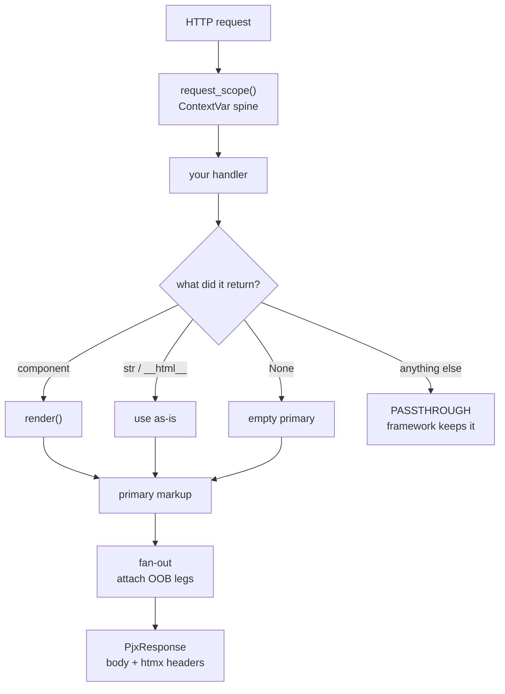
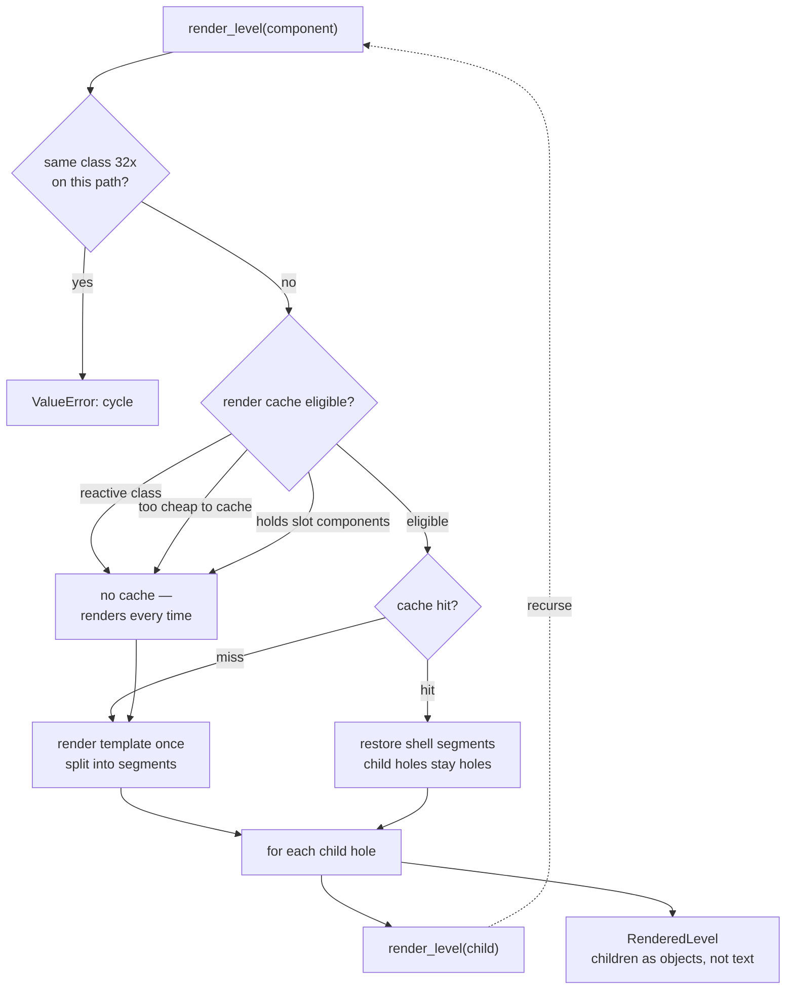
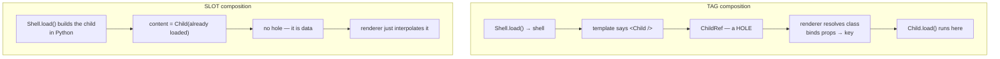
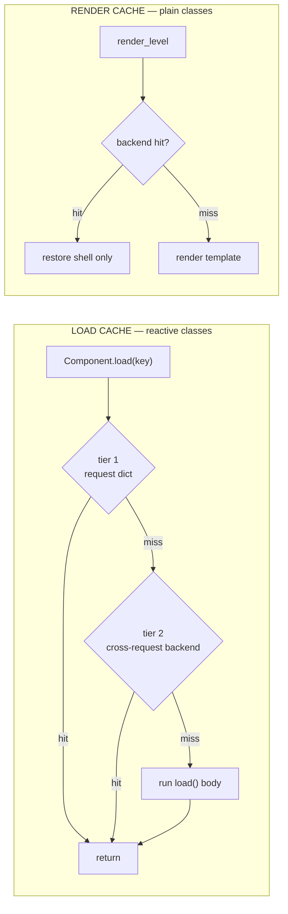

# How pyjinhx works — the runtime in five diagrams

A high-level tour of the request round trip, the render walk, the two composition
forms, the caches, and reactivity. *Living* — where this and reality disagree, fix
the doc.

Published as an artifact: <https://claude.ai/code/artifact/b9e2deec-951e-4c27-82a6-f7c0de56d9b9>

## 1. The round trip

One handler return becomes one response. Everything pyjinhx does happens between
those two points, inside a request scope.



`responses.py` · `compose()` → `_fan_out()`

## 2. Inside one render

`render_level()` is the single recursive path. Every component — page, shell, leaf
— goes through the same gates.



`rendering.py` · `render_level()` · `_finish_cached_level()` · `_fill_children()`

A cache hit restores *only the shell*. Children are still holes, so they resolve
and recurse exactly as on a fresh render. Measured on a cacheable `Shell`
containing `<Leaf/>`:

```text
render #1  templates built: ['Shell', 'Leaf']
render #2  templates built: ['Leaf']
render #3  templates built: ['Leaf']
```

## 3. Two ways a child gets in

This distinction drives most of the runtime's behaviour — and most of its sharp
edges.



**Tag → a hole.** The child is a reference until render time. The runtime knows
its class and its key before it loads, so it can decide what to do with it.

**Slot → already data.** The child is a fully-loaded instance living inside the
parent's return value. There is no decision point left, because there is nothing
to decide about.

## 4. The caches

Two independent stores. A component uses one or the other, never both — and
**neither one ever caches a subtree.** Both stop at the component boundary.



| | stores | children |
|---|---|---|
| **Load cache** | the instance `load()` returned; the cache key *is* the load key | not in it |
| **Render cache** | that component's own shell segments | still holes |

Because neither store holds a composed subtree, a hit can never short-circuit the
descent: there is no cached artifact containing the children, so the renderer must
go and get them.

## 5. Reactivity

Components declare keys. A mutation dirties keys. Everything downstream is that one
match.

```mermaid
sequenceDiagram
  autonumber
  participant C as client
  participant H as handler
  participant K as dirtied keys
  participant X as caches
  participant F as fan-out
  C->>H: htmx request
  H->>K: mutation marks "todos" dirty
  H-->>F: returns primary component
  K->>X: invalidate&lpar;dirtied&rpar; — both tiers
  F->>F: walk client manifest
  F->>F: keep regions whose keys were dirtied
  F->>F: preserve nested regions that were not
  F-->>C: primary + OOB fragments
```

`reactive/cache.py` · `reactive/fanout.py` · `responses.py`

**What keys decide:** which cache entries get evicted, and which client regions get
swapped out-of-band.

**What they don't:** which `load()` bodies actually run. That is decided by cache
residency and by position in the render tree — `get_dirtied()` is read in exactly
one production path (`responses.py:61`), which runs *after* the primary render.

## 6. Where the model leaks

| Intent | Status | What actually happens |
|---|---|---|
| A parent's `load()` never triggers a child's | literally true | No `load()` calls another. But the *renderer* does, at full depth — and a cache hit does not stop it, because no cache holds a subtree. |
| Reactivity follows declared keys | for swaps | True for eviction and for OOB region selection. Not true for which loads execute. |
| A cached shell serves fresh children | tags ✓ slots ✗ | Tag children re-resolve through their holes. Slot children are frozen inside the parent's cached value and never reload. |

The common thread: the runtime knows each parent→child edge at the moment it fills
a hole, but never records it — so anything needing that edge later has to re-derive
it, or fails.

The fix is specified in
[`../specs/2026-08-25-nested-freshness-design.md`](../specs/2026-08-25-nested-freshness-design.md).
